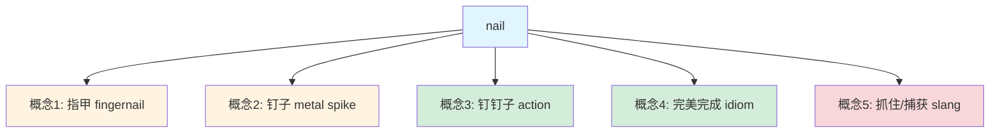
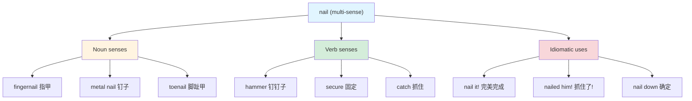
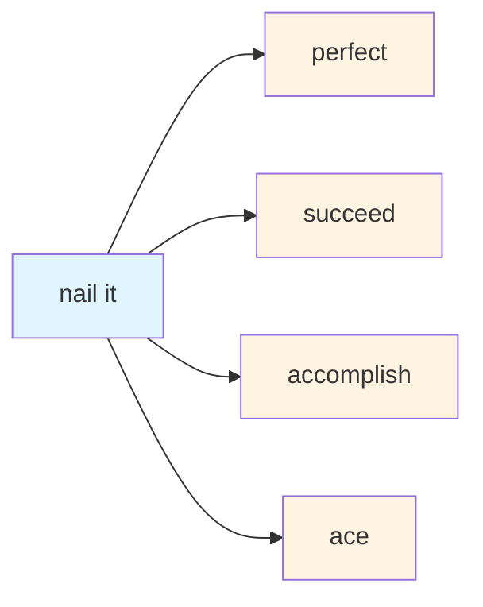

# nail

## 基础信息

**发音**：/neɪl/
**词性**：名词 / 动词
**中文对应**：指甲、钉子、完美完成、准确命中

---

## 词义演化

### 词源起源

**古英语**：*nægl*（指甲、钉子）
**原始日耳曼语**：*naglaz*
**原始印欧语**：*nogh-*（指甲、爪）

**演化路径**：
```
原始印欧语 *nogh- (指甲/爪)
    ↓
原始日耳曼语 *naglaz
    ↓
古英语 nægl (指甲/钉子)
    ↓  ↓
名词: nail (钉子/指甲)
动词: to nail (钉钉子)
    ↓
习语: nail it (完美完成)
```

**核心洞察**：从"指甲"到"钉子"的语义扩展基于**形状相似性**（都是尖锐、细长的物体）

---

## 概念分析

### 一词多义（Polysemy）

**nail** 展现了典型的**一词多义**现象：



**概念关系**：
1. **指甲** (fingernail) - 身体部位
2. **钉子** (metal spike) - 工具（形状隐喻）
3. **钉钉子** (action) - 动作（名词→动词）
4. **完美完成** (idiom: nail it) - 习语（"准确命中"）
5. **抓住/捕获** (slang: nail the suspect) - 俚语

---

## 关系图谱

### 多义词分支



### 英汉对比

| 维度 | 英语 | 汉语 | 差异 |
|------|------|------|------|
| **核心概念** | nail (指甲/钉子合一) | 指甲 / 钉子 (分离) | 英语形状隐喻 |
| **动词化** | to nail (自由转换) | 钉 / 钉钉子 | 英语名词→动词 |
| **习语** | nail it (完成) | 完美搞定 | 英语"命中"隐喻 |
| **俚语** | nail the suspect | 抓住嫌疑人 | 英语"钉住"→"捕获" |
| **精细度** | nail = 多概念合一 | 指甲/钉子/钉/抓住 | 英语概括 vs 汉语精确 |

---

## 实际应用

### 场景 1：身体部位（名词）

```markdown
**English**: "I need to trim my nails."
**Chinese**: 我需要剪指甲。

**English**: "She painted her nails red."
**Chinese**: 她把指甲涂成了红色。
```

**映射**：nail → 指甲（一一对应）

---

### 场景 2：工具（名词）

```markdown
**English**: "Use a hammer to drive the nail into the wall."
**Chinese**: 用锤子把钉子钉进墙里。

**English**: "The nail is rusty."
**Chinese**: 钉子生锈了。
```

**映射**：nail → 钉子（一一对应）

---

### 场景 3：动作（动词）

```markdown
**English**: "Nail the poster to the wall."
**Chinese**: 把海报钉在墙上。

**English**: "She nailed the floorboards down."
**Chinese**: 她把地板钉牢了。
```

**映射**：nail → 钉（动词）

---

### 场景 4：习语 - **完美完成**（Idiom）⭐

```markdown
**English**: "You nailed it! Perfect presentation."
**Chinese**: 你完美搞定！演讲太棒了。

**English**: "I nailed all 5 tasks today."
**Chinese**: 我今天完美完成了所有 5 个任务。

**English**: "She nailed the interview and got the job."
**Chinese**: 她面试表现出色，拿到了工作。
```

**映射**：nail it → 完美完成 / 搞定 / 准确命中

**核心隐喻**：
- "准确命中目标" → "完美完成任务"
- 就像钉子**精准地钉入**目标位置

---

### 场景 5：俚语 - **抓住/捕获**（Slang）

```markdown
**English**: "The police nailed the suspect."
**Chinese**: 警察抓住了嫌疑人。

**English**: "They nailed him for tax evasion."
**Chinese**: 他们抓住他逃税的证据了。
```

**映射**：nail → 抓住 / 捕获 / 定罪

**核心隐喻**：
- "钉住不动" → "抓住不放"
- 就像用钉子**固定**猎物

---

## 核心习语与功能性用法

### 1. "nail it" - 完美完成 ⭐⭐⭐⭐⭐

**使用场景**：高度评价某人的表现

**例句**：
```markdown
A: "How was my presentation?"
B: "You nailed it! Everyone loved it."
```

**中文对应**：完美搞定 / 表现出色 / 一针见血

---

### 2. "nail down" - 确定/弄清楚 ⭐⭐⭐⭐

**使用场景**：明确细节或计划

**例句**：
```markdown
"We need to nail down the details before the meeting."
（我们需要在会议前确定细节。）
```

**中文对应**：敲定 / 确定 / 弄清楚

---

### 3. "nail someone to the wall" - 严厉批评/抓住把柄 ⭐⭐⭐

**使用场景**：强烈批评或抓住某人的错误

**例句**：
```markdown
"The reporter nailed the politician to the wall with tough questions."
（记者用尖锐的问题严厉质问政客。）
```

**中文对应**：严厉质问 / 抓住把柄

---

### 4. "hit the nail on the head" - 一针见血 ⭐⭐⭐⭐

**使用场景**：准确指出问题核心

**例句**：
```markdown
"You hit the nail on the head with that analysis."
（你的分析一针见血。）
```

**中文对应**：一针见血 / 击中要害

---

## 英汉对比深度分析

### 1. 形状隐喻 vs 功能分离

**英语**：
- "nail" = 指甲 + 钉子（**形状相似**）
- 基于视觉特征：尖锐、细长

**汉语**：
- "指甲" vs "钉子"（**功能不同**）
- 基于使用场景：身体部位 vs 工具

**洞察**：英语更注重**形状相似性**，汉语更注重**功能性分类**

---

### 2. 名词→动词转换

**英语**：
- nail (noun) → to nail (verb) - **自由转换**
- "Nail the poster." (钉海报)

**汉语**：
- 钉子 (noun) → 钉 (verb) - **需要补充**
- "用钉子钉海报。" (工具 + 动词)

**洞察**：英语名词动词化更**自由**，汉语需要**上下文支撑**

---

### 3. 习语文化差异

**英语 "nail it"**：
- 核心："精准命中目标"（钉子精准钉入）
- 强调：**准确性** + **完美性**

**汉语 "完美搞定"**：
- 核心："完美处理"（搞定 = handle perfectly）
- 强调：**完成性** + **质量**

**差异**：英语更强调"**命中**"，汉语更强调"**搞定**"

---

## 深度洞察

### 1. 形状隐喻的力量

**nail** 的多义性展示了**形状隐喻**如何驱动语言演化：

- 指甲（身体）→ 钉子（工具）：基于**形状相似**
- 钉子（工具）→ 钉钉子（动作）：基于**功能关联**
- 钉钉子（动作）→ 完美完成（习语）：基于**精准性**

**启示**：英语词汇经常通过**形状/功能隐喻**扩展意义

---

### 2. 习语的文化背景

**"nail it"** 反映了英语文化的**工匠精神**：

- 钉钉子需要**精准**（对准位置）
- 钉钉子需要**力量**（一锤到位）
- 钉钉子需要**技巧**（避免歪斜）

**汉语对应**："一针见血"（医生/针的精准）

**文化差异**：英语建筑文化（钉子），汉语医学文化（针）

---

### 3. "nail" 的褒义色彩

**在习语中，"nail" 几乎总是褒义**：

- ✅ "You nailed it!" - 完美表现
- ✅ "Nailed the interview" - 面试成功
- ⚠️ "Nailed the suspect" - 抓住坏人（正义）

**例外**：
- ❌ "Nailed him to the wall" - 严厉批评（中性偏贬）

**洞察**：习语 "nail" 通常是**积极评价**

---

## 关键要点

### 翻译决策树

```
"nail" 在句中
    ↓
是名词？
    ├─ Yes → 是身体部位？
    │        ├─ Yes → "指甲"
    │        └─ No → "钉子"
    │
    └─ No (动词) → 是习语？
                   ├─ Yes → "nail it" → "完美完成/搞定"
                   │          "nail down" → "确定/敲定"
                   │
                   └─ No → 是俚语？
                            ├─ Yes → "抓住/捕获"
                            └─ No → "钉"（基本动作）
```

---

### 记忆口诀

```
nail 指甲也是钉，
名词动词都好用。
nail it 搞定真完美，
精准命中不放松。
```

---

## 词源衍生句组

**展示从"钉子"到"完美完成"的语义演化**：

1. **基本义**："Use a **nail** to fix the table." (用**钉子**修桌子)
2. **动词化**："**Nail** the board to the wall." (把木板**钉**在墙上)
3. **精准性**："He **nailed** the target perfectly." (他**精准命中**目标)
4. **习语化**："You **nailed** the presentation!" (你**完美搞定**演讲！)

**演化路径**：工具 → 动作 → 精准性 → 完美完成

---

## 相关词汇

### 同义词网络



**同义表达**：
- **ace it** - 完美完成（考试/测试）
- **crush it** - 表现出色
- **kill it** - 表现惊艳
- **smash it** - 大获成功

---

### 相关习语

| 习语 | 中文 | 使用场景 |
|------|------|----------|
| **hit the nail on the head** | 一针见血 | 准确指出问题 |
| **nail-biter** | 紧张刺激的事 | 悬念迭起 |
| **tough as nails** | 坚强不屈 | 形容意志坚定 |
| **nail in the coffin** | 致命一击 | 导致失败的最后因素 |

---

## 实际使用建议

### ✅ 推荐用法

1. **高度赞扬**：
   - "You nailed it!" - 你完美搞定了！

2. **确定细节**：
   - "Let's nail down the plan." - 我们把计划确定下来。

3. **描述成功**：
   - "She nailed the interview." - 她面试表现出色。

---

### ❌ 避免用法

1. **不要用于正式文件**：
   - ❌ "The company nailed the contract." (太口语)
   - ✅ "The company secured the contract."

2. **不要用于负面评价**：
   - ❌ "You nailed it... badly." (自相矛盾)
   - ✅ "You messed it up."

---

## 总结

**nail** 是一个展现英语**形状隐喻**和**名词动词化**的典型词汇：

1. **形状驱动**：指甲 → 钉子（形状相似）
2. **功能扩展**：钉子 → 钉（工具→动作）
3. **习语演化**：钉→ 完美完成（精准性）
4. **文化映射**：工匠文化（精准命中）

**核心记忆**：
- 基本义：指甲 / 钉子
- 习语：**nail it** = 完美完成 / 搞定
- 隐喻：**精准性** + **完美性**

---

**Created**: 2026-02-15
**Word**: nail
**Type**: Multi-sense (noun + verb + idiom)
**Frequency**: ⭐⭐⭐⭐⭐ (Very High)
**Difficulty**: ⭐⭐ (Low-Medium)

**Special Note**: 在刚才的对话中，我用 "nailed all 5 tasks" 来表达"完美完成了所有 5 个任务"，这是 **nail it** 习语的典型用法，强调**精准**和**完美**。

---
# Related
![[Backlinks.base]]
