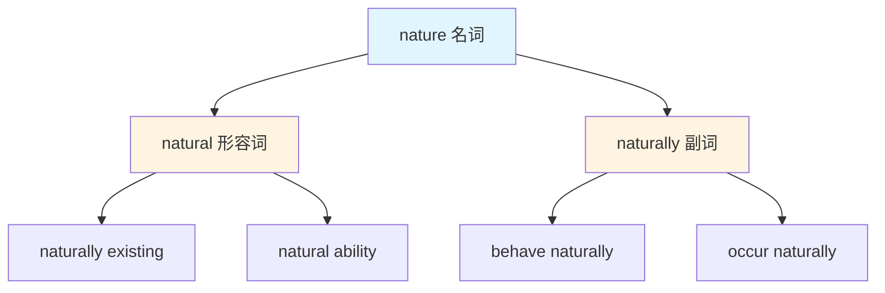
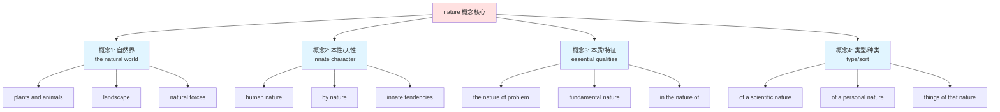

# nature

## 基础信息

| 项目 | 内容 |
|------|------|
| **英文** | nature /ˈneɪtʃər/ |
| **词性** | 名词 |
| **中文对应** | 自然、本性、本质、类型 |

## 概念分析

### 一词多义（核心特征）

**nature** 是典型的一词多义词，包含 4 个主要概念分支：

1. **自然界**（the natural world）
   - 指非人为创造的物质世界
   - 包括动植物、山川、气候等

2. **本性/天性**（innate character）
   - 与生俱来的特质
   - 人或动物的本能行为

3. **本质/基本特征**（essential qualities）
   - 事物的根本属性
   - 决定事物之所以为该事物的特征

4. **类型/种类**（type/sort）
   - 主要用于 "of a ... nature" 结构
   - 表示事物的类别

### 词族关系



### 概念分支图谱



## 英汉对比

| 维度 | 英语特征 | 汉语特征 |
|------|----------|----------|
| **词汇统一性** | 一个词覆盖多个相关概念 | 需要不同词汇区分（自然/本性/本质） |
| **概念边界** | 概念间有隐含联系（都含"原初性"） | 词汇间无形式联系 |
| **语义覆盖** | 广义覆盖，由上下文确定具体含义 | 精确表达，词汇本身限定含义 |
| **哲学层面** | nature 作为哲学核心概念 | 本性/本质分开表达 |

**核心差异**：
- 英语 **nature** 通过"原初、未加修饰"这一核心义素，将自然界、人的本性、事物本质统一在一个词下
- 汉语需要用 **自然**（external）、**本性**（internal）、**本质**（abstract）分别表达

## 实际应用

### 场景 1：描述自然环境

**英文**：
> "We need to protect nature from pollution."
> （我们需要保护自然免受污染。）

**分析**：
- nature = 自然界（物质世界）
- 不需要加 "the"，作为不可数抽象名词使用

**对比**：
> "The beauty of nature surrounds us."
> （大自然的美环绕着我们。）
> - 此时可用 "the nature" 或 "nature"

---

### 场景 2：描述人的性格

**英文**：
> "She is very kind by nature."
> （她天性很善良。）

**分析**：
- by nature = 天生、生来如此
- nature = 本性、与生俱来的特质

**对比**：
> "Human nature is complex."
> （人性是复杂的。）
> - human nature 固定搭配，指"人的本性"

---

### 场景 3：分析问题本质

**英文**：
> "What is the nature of this problem?"
> （这个问题的本质是什么？）

**分析**：
- the nature of = ...的本质/基本特征
- 抽象概念，用于分析事物的根本属性

**对比**：
> "The fundamental nature of the conflict remains unchanged."
> （冲突的根本性质仍未改变。）
> - 强调"根本的、基础的"本质

---

### 场景 4：表示事物类型

**英文**：
> "Questions of a technical nature."
> （技术性质的问题。）

**分析**：
- of a ... nature = ...类型的/...性质的
- 主要用于正式、学术语境

**对比**：
> "Matters of a personal nature should be handled privately."
> （个人性质的事情应该私下处理。）
> - 用于描述事物的类别或属性

---

### 场景 5：哲学/科学语境

**英文**：
> "The nature versus nurture debate."
> （先天与后天的争论。）

**分析**：
> nature = 先天因素（遗传、基因）
> nurture = 后天因素（环境、教育）

**对比**：
> "Second nature"（第二天性/习惯）
> "It became second nature to him."
> （这已成为他的第二天性/习惯。）
> - 表示通过练习达到的熟练程度

## 深度洞察

### 1. 概念统一性背后的哲学思维

**英语的 "nature" 体现了一种哲学统一性**：
- 自然界（外在世界）
- 人的本性（内在世界）
- 事物的本质（抽象世界）

这三者在西方哲学中都被视为"原初的、固有的、未加修饰的"状态。

**汉语的表达则体现了分类思维**：
- **自然** = 外界物质世界
- **本性** = 生物内在特质
- **本质** = 抽象根本属性

### 2. "Nature" 的不可数特性

**关键语法点**：nature 通常作为不可数名词使用

✅ 正确：
- "We must protect nature."
- "Human nature is complex."
- "What is the nature of the problem?"

❌ 常见错误：
- "We must protect **the** nature."（通常不加 the，除非特指）
- "**Natures** are different."（极少用复数）

**例外**：
- "human natures"（极少见，通常用 human nature）
- "the natures of different species"（学术语境下的复数）

### 3. 固定搭配的重要性

**nature 的含义很大程度上由搭配决定**：

| 搭配 | 含义 | 中文 |
|------|------|------|
| **Mother Nature** | 自然界（拟人化） | 大自然母亲 |
| **by nature** | 天生地 | 天性地 |
| **human nature** | 人性 | 人的本性 |
| **second nature** | 习惯/熟练 | 第二天性 |
| **in the nature of** | 类似于/近乎 | 类似...的事物 |
| **of a ... nature** | ...类型的 | ...性质的 |

**关键要点**：不要死记 "nature = 自然"，要根据搭配判断含义。

## 关键要点

### 翻译决策树

```
遇到 nature
│
├─ 主语是"自然环境"？
│   └─ 是 → 翻译为"自然/大自然"
│
├─ 出现"by nature"？
│   └─ 是 → 翻译为"天性/生性"
│
├─ 出现"human nature"？
│   └─ 是 → 翻译为"人性"
│
├─ 出现"of a ... nature"？
│   └─ 是 → 翻译为"...类型的/...性质的"
│
├─ 出现"the nature of"？
│   └─ 是 → 翻译为"本质/性质"
│
└─ 哲学/抽象语境？
    └─ 是 → 翻译为"本质/本性"
```

### 记忆口诀

```
Nature 一词多义大，
自然本性本质跨。
By nature 天生不用怕，
Human nature 人性化。
Of a ... nature 类型话，
本质特征要记下。
```

### 常见错误清单

| 错误 | 正确 | 原因 |
|------|------|------|
| 保护 the nature | 保护 nature | nature 作不可数名词，不加 the |
| 不同的 natures | 不同的自然类型 | 极少用复数 |
| by the nature | by nature | 固定搭配，不加 the |
| of nature type | of a ... nature | 固定句型 |

## 词源与演变

### 词根追踪

```
Latin: natura（出生、本性）
    ↓
Old French: nature
    ↓
Middle English: nature
    ↓
Modern English: nature
```

### 同源概念

- **native**（本土的、天生的）← 同根
- **natal**（出生的）← 同根
- **prenatal**（出生前的）← 复合词
- **innate**（天生的）← 概念对应

### 哲学意义演变

1. **古希腊**：physis = 自然、生长、涌现
2. **拉丁语**：natura = 出生、本性
3. **现代英语**：nature = 自然界 + 本性 + 本质

**哲学影响**：
- **Nature vs. Convention**（自然与约定）
- **State of Nature**（自然状态）
- **Laws of Nature**（自然法则）

---

## 相关概念

- [[Natural]]（形容词形式）
- [[Nurture]]（后天培养）
- [[Essence]]（本质）
- [[Character]]（性格）
- [[Environment]]（环境）

## 延伸阅读

- **Human Nature**（人性论）
- **Philosophy of Nature**（自然哲学）
- **Nature vs. Nurture**（先天与后天）
