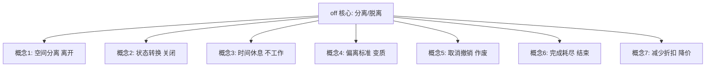
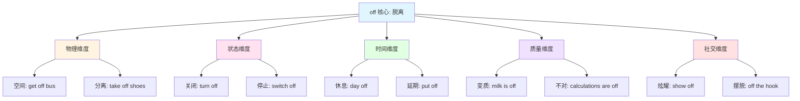
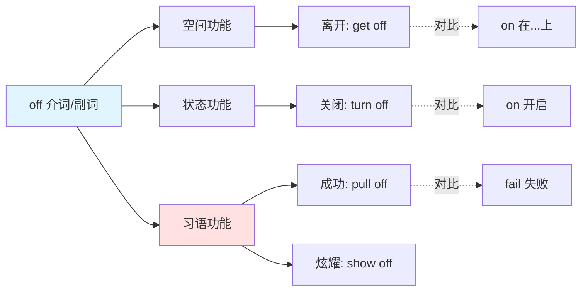
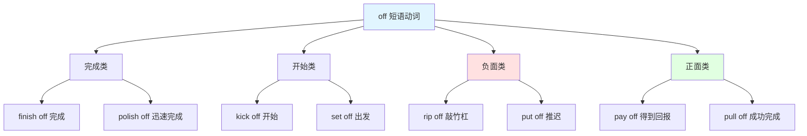

off :: 
<!--ID: 1769504334796-->


# off

## 基础信息

- **英文**：off /ɔːf/ (英式) 或 /ɔf/ (美式)
- **中文**：离开、关闭、休息、偏离、取消、完成
- **词性**：介词 (Preposition) / 副词 (Adverb) / 形容词 (Adjective)

## 词义演化

**词源起源**：
- 古英语 "of"，原意为 "away, from"（离开、从...）
- 印欧语系词根 *apo-（远离、分开）
- 与德语 "ab"、拉丁语 "ab" 同源

**意义演变路径**：
1. **空间分离阶段**（古英语）：away from（离开）→ "get off the horse"（从马上下来）
2. **状态转换阶段**（中古英语）：not on（不开）→ "turn off the light"（关灯）
3. **时间休息阶段**（近代英语）：not working（不工作）→ "day off"（休息日）
4. **偏离标准阶段**（现代英语）：deviated（偏离）→ "milk is off"（牛奶变质）
5. **完成耗尽阶段**（现代英语）：completed（完成）→ "finish off"（完成）

**核心转变**：从 "物理空间的分离" 扩展至 "状态、时间、质量" 等抽象维度的 "脱离常态"。

## 概念分析

### 一词多义



### 核心义项

| 义项 | 英文概念 | 中文对应 | 例句 |
|------|----------|----------|------|
| **空间分离** | away from | 离开、脱离 | Get off the bus（下车） |
| **状态转换** | not functioning | 关闭、停止 | Turn off the TV（关电视） |
| **时间休息** | not working | 休息、不上班 | I have a day off（我休息一天） |
| **偏离标准** | not fresh/correct | 变质、不对 | The milk is off（牛奶坏了） |
| **取消撤销** | cancelled | 取消、作废 | The deal is off（交易取消） |
| **完成耗尽** | completed | 完成、用完 | Finish off the work（完成工作） |
| **减少折扣** | reduced | 降价、打折 | 20% off（打8折） |

### 核心习语与功能性用法

**社交/功能性用法**：
- **"off the record"** = 非正式的、不公开的（新闻/政治用语）
- **"off the hook"** = 摆脱困境、不再有责任
- **"off the top of my head"** = 凭直觉、不经深思
- **"better off"** = 境况更好（比较状态）
- **"worse off"** = 境况更差
- **"well off"** = 富裕的、生活优渥

**隐喻固化**：
- **"pull off"** = 成功完成（困难任务）
- **"show off"** = 炫耀、卖弄
- **"pay off"** = 得到回报、还清债务
- **"kick off"** = 开始（活动/比赛）
- **"take off"** = 起飞、突然成功
- **"write off"** = 注销、认为无价值

**情感色彩**：
- **中性**：turn off（关闭）、day off（休息）
- **负面**：rip off（敲竹杠）、piss off（激怒，粗俗）
- **正面**：pay off（得到回报）、pull off（成功）

### 同义词对比

| 词汇 | 核心差异 | 使用场景 |
|------|----------|----------|
| **off** | 最通用，涵盖空间/状态/时间 | 所有 "分离/脱离" 场景 |
| **away** | 强调距离、远离 | away from home（远离家） |
| **out** | 强调从内到外 | get out（出去） |
| **down** | 强调向下、停止运行 | shut down（关闭系统） |
| **closed** | 仅指关闭状态（形容词） | The store is closed（商店关门） |

### 反义词

| 词汇 | 关系 | 示例 |
|------|------|------|
| **on** | 状态相反 | on（开）↔ off（关） |
| **on** | 位置相反 | on the table（在桌上）↔ off the table（离开桌子） |

## 关系图谱

### 多义词概念分支



### 介词/副词功能网络



### 短语动词网络（Phrasal Verbs）



## 英汉对比

| 维度 | 英语 off | 汉语对应 |
|------|----------|----------|
| **概念范围** | 单一词汇涵盖 7+ 概念 | 需 6+ 词汇分别表达（离/关/休/坏/消/完） |
| **语法功能** | 介词/副词/形容词三重身份 | 需动词/形容词/副词混合表达 |
| **短语动词** | 形成 50+ 短语动词（take off, show off） | 需完整动词短语翻译 |

**核心差异**：
- **英语特征**：off 是 "状态转换核心词"，表达 "从常态脱离"
- **汉语特征**：根据具体脱离类型选择精确动词（离开/关闭/休息/变质）
- **翻译挑战**：短语动词（phrasal verbs）常形成固定搭配，直译无法传达真实含义

## 实际应用

### 场景 1：空间分离（介词）

**英文**：Please get **off** the train at the next stop.  
**中文**：请在下一站**下**火车。  
**分析**：off 表示空间分离，汉语用 "下" 或 "离开"。

### 场景 2：状态转换（副词）

**英文**：Turn **off** the lights before you leave.  
**中文**：离开前请**关**灯。  
**分析**：off 表示从 "开启" 到 "关闭" 的状态转换，汉语用 "关"。

### 场景 3：时间休息（形容词）

**英文**：I'm taking a day **off** tomorrow.  
**中文**：我明天**休息**一天。  
**分析**：off 表示不工作状态，汉语用 "休息" 或 "请假"。

### 场景 4：偏离标准（形容词）

**英文**：This milk smells **off**. Don't drink it.  
**中文**：这牛奶**变质**了，别喝。  
**分析**：off 表示偏离正常状态（变质），汉语用 "坏了" 或 "变质"。

### 场景 5：取消撤销

**英文**：The wedding is **off**. They broke up.  
**中文**：婚礼**取消**了，他们分手了。  
**分析**：off 表示计划取消，汉语用 "取消" 或 "作废"。

### 场景 6：习语用法（成功完成）

**英文**：She really **pulled off** a great performance.  
**中文**：她真的**成功完成**了一场精彩的演出。  
**分析**：短语动词 "pull off" 表示成功完成困难任务，不能直译为 "拉离"。

### 场景 7：习语用法（炫耀）

**英文**：Stop **showing off** your new car!  
**中文**：别再**炫耀**你的新车了！  
**分析**：短语动词 "show off" 表示炫耀，不能直译为 "展示离开"。

### 场景 8：习语用法（非正式）

**英文**：This is **off the record**, but the CEO is resigning.  
**中文**：这是**非正式**的消息，但 CEO 要辞职了。  
**分析**：习语 "off the record" 表示不公开、非正式，常用于新闻/政治场景。

### 场景 9：折扣降价

**英文**：Get 30% **off** on all items this weekend.  
**中文**：本周末所有商品**打7折**。  
**分析**：off 表示折扣，"30% off" = 打7折（100% - 30% = 70%）。

## 深度洞察

### 核心要点

1. **"脱离常态" 的多维度表达**  
   off 的核心语义是 "从常态脱离"，这种脱离可以是：空间的（离开）、状态的（关闭）、时间的（休息）、质量的（变质）。英语用单一词汇统一表达，汉语则需根据具体维度选择不同动词。

2. **短语动词的固化与隐喻**  
   off 形成 50+ 短语动词（pull off, show off, pay off），这些搭配已固化为独立语义单元，不能按字面拆解。学习者需整体记忆：pull off ≠ "拉离"，而是 "成功完成"。

3. **与 on 的对立系统**  
   off 与 on 构成英语中最基础的 "开/关" 对立系统，涵盖物理开关（turn on/off）、位置关系（on/off the table）、工作状态（on/off duty）。这种对立在汉语中需用不同词对表达（开/关、在/离、上班/休息）。

## 关键要点

### 翻译决策树

```
遇到 off 时：
├─ 是否为短语动词？
│  ├─ 是 → 查固定搭配
│  │  ├─ pull off（成功完成）
│  │  ├─ show off（炫耀）
│  │  ├─ pay off（得到回报）
│  │  └─ kick off（开始）
│  └─ 否 → 继续判断
├─ 是否为习语？
│  ├─ 是 → off the record（非正式）/ off the hook（摆脱困境）
│  └─ 否 → 继续判断
├─ 修饰设备/电器？
│  ├─ 是 → 关闭（turn off TV）
│  └─ 否 → 继续判断
├─ 描述时间/工作？
│  ├─ 是 → 休息（day off）
│  └─ 否 → 继续判断
├─ 描述食物/气味？
│  ├─ 是 → 变质（milk is off）
│  └─ 否 → 继续判断
├─ 描述计划/活动？
│  ├─ 是 → 取消（wedding is off）
│  └─ 否 → 空间分离（get off bus）
```

### 记忆口诀

**"离关休，坏消完，短语习语要记全"**

- **离**：空间分离（get off）
- **关**：状态关闭（turn off）
- **休**：时间休息（day off）
- **坏**：偏离标准（milk is off）
- **消**：取消撤销（deal is off）
- **完**：完成耗尽（finish off）
- **短语**：pull off（成功）、show off（炫耀）
- **习语**：off the record（非正式）、off the hook（摆脱困境）

### 学习者常见错误

| 错误类型 | 错误示例 | 正确表达 | 原因 |
|----------|----------|----------|------|
| **短语动词直译** | pull off = 拉离 | 成功完成 | 忽略固化搭配 |
| **习语直译** | off the record = 离开记录 | 非正式的 | 未识别习语 |
| **状态误判** | day off = 离开的一天 | 休息日 | 混淆空间/时间 |
| **折扣计算** | 30% off = 30折 | 打7折（70%） | 理解反向 |
| **变质忽略** | milk is off = 牛奶离开了 | 牛奶变质了 | 未识别质量义 |

### 高频短语动词速查

| 短语动词 | 中文 | 例句 |
|----------|------|------|
| **take off** | 起飞、脱下、突然成功 | The plane took off（飞机起飞） |
| **put off** | 推迟 | Put off the meeting（推迟会议） |
| **call off** | 取消 | Call off the event（取消活动） |
| **go off** | 爆炸、响起、变质 | The alarm went off（警报响了） |
| **set off** | 出发、引爆 | Set off on a journey（出发旅行） |
| **break off** | 中断、折断 | Break off the conversation（中断对话） |
| **cut off** | 切断、中断 | Cut off the power（切断电源） |
| **knock off** | 下班、快速完成 | Knock off work at 5（5点下班） |

---

**生成时间**：2026-01-27  
**主题标签**：[[Vocabulary]] [[Preposition]] [[Phrasal Verbs]] [[Cross-linguistic Analysis]]  
**相关词汇**：[[on]] [[away]] [[out]] [[down]] [[with]]