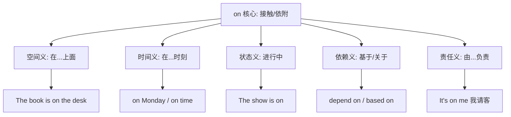
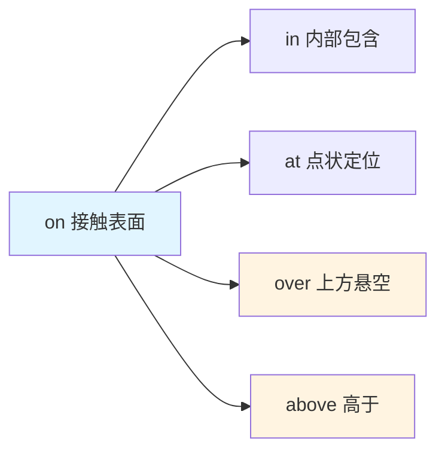
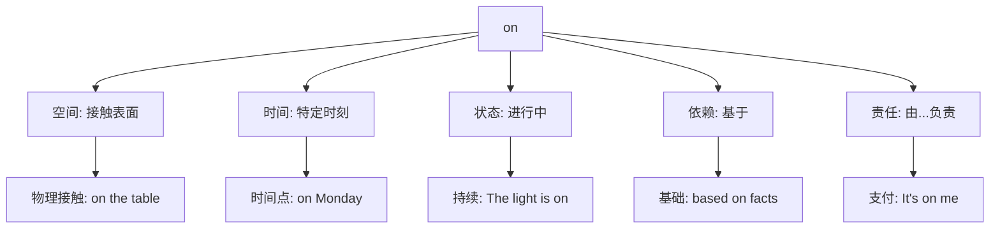

on :: 
<!--ID: 1769502992475-->

# on

## 基础信息

**英文**：on  
**音标**：/ɒn/ (英) /ɑːn/ (美)  
**中文**：在...上；关于；由...负责  
**词性**：介词 (preposition)

---

## 词义演化

**词源起源**：  
源自古英语 *on*，原始日耳曼语 *ana*（在...上），印欧语系 *an-*（在...上）。最初表示物理接触关系，后通过隐喻扩展到时间、状态、责任等抽象领域。

**意义演变路径**：
1. **物理接触**（公元前5世纪）：表示物体与表面的接触关系  
   → *The book is on the table.*
2. **时间定位**（中古英语时期）：从空间隐喻到时间点  
   → *on Monday*, *on arrival*
3. **状态持续**（16世纪）：表示动作或状态的进行  
   → *The meeting is on.*, *go on*
4. **依赖关系**（17世纪）：表示依靠、基于  
   → *depend on*, *based on*
5. **责任承担**（19世纪）：社交功能性用法固化  
   → *It's on me.* (我来付账), *on the house* (免费)

---

## 概念分析

### 一词多义（Polysemy）

**核心概念**：接触与依附  
**语义扩展**：



### 核心习语与功能性用法

| 习语 | 字面义 | 功能义 | 例句 |
|------|--------|--------|------|
| **on me** | 在我身上 | 由我负责/我请客 | *Dinner is on me tonight.* |
| **on the house** | 在房子上 | 免费（店家请客） | *The drinks are on the house.* |
| **go on** | 继续上 | 继续/发生 | *What's going on?* |
| **on purpose** | 在目的上 | 故意地 | *He did it on purpose.* |
| **on fire** | 在火上 | 表现出色/热情高涨 | *The team is on fire!* |

### 上下义关系

**上义词**：preposition（介词）  
**同类词**：
- **at**：点状定位（at the corner）
- **in**：包含关系（in the box）
- **by**：邻近关系（by the river）

**语义对比**：
- **on** 强调接触表面（*on the wall*）
- **in** 强调内部包含（*in the room*）
- **at** 强调精确位置（*at the door*）

---

## 关系图谱

### 介词网络：空间关系对比



### 多义词概念分支



---

## 英汉对比

| 维度 | 英语 on | 汉语对应 |
|------|---------|----------|
| **概念范围** | 单一词汇覆盖空间/时间/状态/责任 | 需要多个词汇：在...上/在...时/关于/由...负责 |
| **隐喻扩展** | 从物理接触扩展到抽象关系（责任、依赖） | 汉语倾向于使用具体动词或介词组合 |
| **社交功能** | 固化习语表达责任（on me = 我请客） | 汉语需要完整动词短语（由我负责/我来付） |

---

## 实际应用

### 场景 1：空间关系

**英文**：*The picture is on the wall.*  
**中文**：画挂在墙上。  
**分析**：表示物理接触，汉语需要动词"挂"补充动作信息。

### 场景 2：时间定位

**英文**：*We'll meet on Friday at 3 PM.*  
**中文**：我们周五下午3点见。  
**分析**：英语用 *on* 定位具体日期，汉语省略介词直接用时间词。

### 场景 3：责任承担（习语）

**英文**：*Don't worry about the bill—it's on me.*  
**中文**：别担心账单——我来付。  
**分析**：*on me* 是固化习语，表示支付责任，汉语需要完整动词"付"。

### 场景 4：状态持续

**英文**：*Is the meeting still on?*  
**中文**：会议还继续吗？  
**分析**：*on* 表示活动进行状态，汉语用动词"继续"表达。

### 场景 5：依赖关系

**英文**：*Success depends on hard work.*  
**中文**：成功取决于努力工作。  
**分析**：*depend on* 表示依赖，汉语用"取决于"对应。

---

## 深度洞察

### 核心要点

1. **从具体到抽象的隐喻路径**  
   *on* 的核心义是"接触表面"，通过隐喻扩展到时间（on Monday）、状态（on fire）、责任（on me）。这种扩展体现了英语介词的高度抽象化能力。

2. **社交功能性用法的固化**  
   *on me*（我请客）、*on the house*（免费）等习语已脱离字面义，成为表达社交责任的固定表达。汉语需要完整动词短语才能对应这些功能。

3. **汉语的动词依赖性**  
   英语用单一介词 *on* 覆盖多种关系，汉语则需要根据语境选择不同动词或介词组合（挂在/取决于/由...负责），体现了汉语的动词中心特征。

---

## 关键要点

### 翻译决策树

```
on + 名词
├─ 物理接触？
│  ├─ 是 → 在...上（on the table → 在桌上）
│  └─ 否 → 继续判断
├─ 时间表达？
│  ├─ 是 → 在...时（on Monday → 周一）
│  └─ 否 → 继续判断
├─ 状态描述？
│  ├─ 是 → 进行中/开着（The light is on → 灯开着）
│  └─ 否 → 继续判断
├─ 习语表达？
│  ├─ on me → 我请客/我负责
│  ├─ on the house → 免费
│  ├─ go on → 继续/发生
│  └─ on purpose → 故意
└─ 依赖关系？
   └─ 是 → 基于/关于（based on → 基于）
```

### 记忆口诀

**"接触生依附,时空责任化"**

- **接触**：物理接触是核心义（on the desk）
- **依附**：扩展到依赖关系（depend on）
- **时空**：时间和空间定位（on Monday, on the wall）
- **责任**：社交功能固化（on me = 我请客）

---

## 使用建议

### 学习策略

1. **掌握核心空间义**：先理解"接触表面"的基本概念
2. **识别隐喻扩展**：从空间→时间→状态→责任的演变路径
3. **记忆高频习语**：*on me*, *on the house*, *go on* 等固定搭配
4. **对比汉语表达**：注意汉语需要动词补充的场景

### 常见错误

❌ **错误**：*The picture is hanging on the wall.* → 画在墙上挂着。  
✅ **正确**：*The picture is on the wall.* → 画挂在墙上。  
**说明**：汉语需要动词"挂"，英语 *on* 已包含位置关系。

❌ **错误**：*It's on me.* → 它在我身上。  
✅ **正确**：*It's on me.* → 我来付/我请客。  
**说明**：习语需要理解功能义，而非字面义。

---

## 扩展阅读

**相关词汇**：
- [[in]] - 内部包含关系
- [[at]] - 点状精确定位
- [[over]] - 上方悬空
- [[upon]] - *on* 的正式变体

**主题链接**：
- [[Prepositions]] - 介词系统
- [[Spatial Metaphor]] - 空间隐喻
- [[Idioms]] - 英语习语