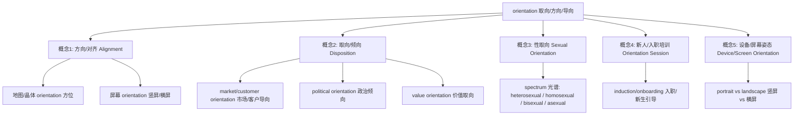

# orientation

## 1. 基础信息

- **音标**: /ˌɔːriənˈteɪʃn/ （美）/ˌɔːriɛnˈteɪʃən/
- **词性**: 名词 (Noun)
- **核心英义**:
  1. 朝向/对齐/方位（alignment/direction）
  2. 取向/倾向/导向（preference/disposition，常见于市场/客户/政治）
  3. 性取向（sexual orientation）
  4. 新人/入职/新生培训（orientation session/induction）
  5. 设备/屏幕姿态（device/screen orientation）
- **中文对应**: 方向/定向/方位；取向/倾向/导向；性取向；入职/新生培训；（设备）朝向/姿态

## 2. 概念分析

- **一词多义**（英语独立名词，汉语常需修饰词）:
  - 方向/对齐：地图/晶体/屏幕的朝向与方位
  - 取向/导向：价值/政治/市场/客户导向（组织或个人的倾向）
  - 性取向：对性/情感对象的稳定偏好
  - 培训/引导：为新人提供环境认识与流程熟悉
  - 设备姿态：竖屏/横屏、三维姿态
- **同义/相关**:
  - direction, alignment, bearing（方向/方位）
  - preference, tendency, leaning, disposition（倾向/取向）
  - induction, onboarding（培训/引导）
  - attitude/pose（技术语境中的姿态）
- **上下义**:
  - 上义：positioning/alignment（定位与对齐）、preference/disposition（偏好与倾向）
  - 下义：sexual orientation、political orientation、market/customer orientation、time orientation、screen orientation 等

## 3. 关系图谱（Mermaid）

## 4. 英汉对比

| 维度 | 英语 (orientation) | 汉语（常用表达） |
| :--- | :--- | :--- |
| **独立 vs 组合** | 独立名词可直接充当核心 | 常以“X + 导向/取向/倾向”组合（如 客户导向） |
| **静态 vs 动态** | 强名词化，概念静态化 | 偏动词/结构表达：“以 X 为导向” |
| **精细度** | 细分域明确（sexual/political/market） | 依赖修饰词界定范围（性/政治/市场/客户等） |

> 提示：中文单说“取向”常显泛化，推荐使用“性取向/市场导向/客户导向”等带修饰的精确表述。

## 5. 实际应用（≥2 场景）

### 场景 A：入职/新生培训
- English: The company offers a two-day **orientation** for new hires.
- Chinese: 公司为新员工提供两天的**入职培训**。
- Note: training/induction 语境下，orientation = 引导新人熟悉环境与流程。

### 场景 B：组织/产品策略的导向
- English: Our **customer orientation** drives product decisions.
- Chinese: 我们的**客户导向**决定了产品的取舍。
- Note: 组织层面的倾向与价值主张，用“X 导向/X 取向”更自然。

### 场景 C：性取向
- English: She discussed her **sexual orientation** openly.
- Chinese: 她坦率地谈论了自己的**性取向**。
- Note: 正式语域；避用含混表达以免造成语义与语境误差。

### 场景 D：设备/屏幕姿态
- English: The app adapts to **screen orientation** changes.
- Chinese: 该应用可适配**屏幕朝向**的变化。
- Note: 技术语境下常译为“朝向/姿态/横竖屏”。

## 6. 深度洞察

1. **英语名词化 vs 汉语组合化**：orientation 在英语中作为稳定名词使用；汉语更倾向“以 X 为导向/X 取向”的组合表达，需补齐域修饰词以避免泛化。
2. **语域与精度**：在正式/政策/学术文本中，orientation 前的修饰词界定范围很关键（如 political orientation 与 ideological stance 存在细微差异）。
3. **技术与社会学双栖**：orientation 同时出现在工程（设备姿态/晶体取向）与社会科学（性/政治/市场/客户）语域，跨域使用时要注意语义切换与读者预期。

## 7. 关键要点（决策树 + 口诀）

- **决策树**：
  - 说“新人引导/培训”？→ orientation session/induction → 入职/新生培训
  - 说“偏好/价值/策略倾向”？→ X orientation（political/market/customer）→ X 导向/取向/倾向
  - 说“设备/屏幕朝向/姿态”？→ device/screen orientation → 朝向/姿态/横竖屏
  - 说“性倾向”？→ sexual orientation → 性取向

- **记忆口诀**：
  > orient（朝向）+ -ation（名词化）= “面向之性”  
  > 加域修饰更精确：客户导向、政治倾向、性取向、屏幕朝向。

## 8. 词源与演化（简述）

- **orient** 源自拉丁语 oriens（东方，日出），含“朝向/面向”之意；orientation 为名词化，表示“确立面向/对齐/倾向/引导”的状态或过程。

