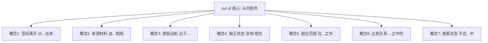
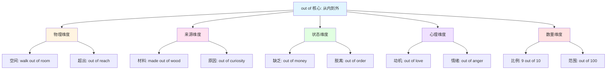
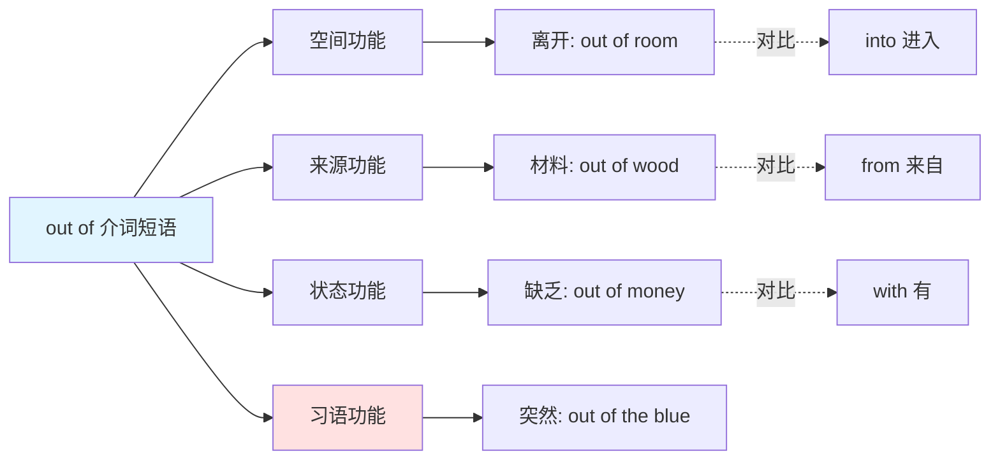
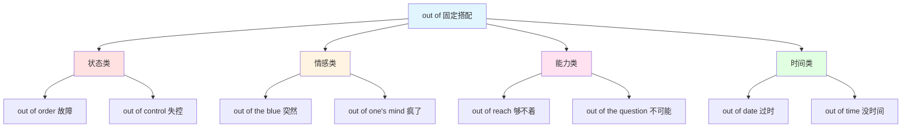

out of :: 
<!--ID: 1769507345356-->

# out of

## 基础信息

- **英文**：out of /aʊt əv/ 或 /aʊt ə/（弱读）
- **中文**：从...出来、由...制成、出于...、没有、超出、...之中
- **词性**：介词短语 (Prepositional Phrase / Compound Preposition)

## 词义演化

**词源起源**：
- 由 "out"（外部、向外）+ "of"（从、属于）组合而成
- out：古英语 "ūt"（向外、在外）
- of：古英语 "of"（从、离开、关于）
- 组合意义：从内部向外部的运动（movement from inside to outside）

**意义演变路径**：
1. **空间离开阶段**（古英语）：physical exit（物理离开）→ "walk out of the house"（走出房子）
2. **来源材料阶段**（中古英语）：origin/material（来源）→ "made out of wood"（由木头制成）
3. **原因动机阶段**（近代英语）：reason/motive（原因）→ "out of curiosity"（出于好奇）
4. **缺乏状态阶段**（近代英语）：lack/depletion（缺乏）→ "out of money"（没钱了）
5. **超出范围阶段**（现代英语）：beyond（超出）→ "out of reach"（够不着）
6. **比例关系阶段**（现代英语）：proportion（比例）→ "9 out of 10"（10个中的9个）

**核心转变**：从 "物理空间的离开" 扩展至 "来源、原因、状态、范围、比例" 等多重抽象关系。

## 概念分析

### 一词多义



### 核心义项

| 义项 | 英文概念 | 中文对应 | 例句 |
|------|----------|----------|------|
| **空间离开** | movement from inside | 从...出来、离开 | Walk out of the room（走出房间） |
| **来源材料** | origin/material | 由...制成、来自 | Made out of wood（由木头制成） |
| **原因动机** | reason/motive | 出于...、因为 | Out of curiosity（出于好奇） |
| **缺乏状态** | lack/depletion | 没有、用完 | Out of money（没钱了） |
| **超出范围** | beyond reach | 超出、在...之外 | Out of reach（够不着） |
| **比例关系** | proportion | ...之中的 | 9 out of 10（10个中9个） |
| **脱离状态** | not in a state | 不在...状态 | Out of order（故障） |

### 核心习语与功能性用法

**社交/功能性用法**：
- **"out of the blue"** = 突然、出乎意料（隐喻：从晴朗天空突然出现）
- **"out of luck"** = 运气不好、不走运
- **"out of one's mind"** = 疯了、失去理智（口语）
- **"out of the question"** = 不可能、办不到
- **"out of place"** = 不合适、格格不入
- **"out of touch"** = 脱节、不了解情况

**隐喻固化**：
- **"out of order"** = 故障、不按顺序（双重含义）
- **"out of date"** = 过时的、过期的
- **"out of control"** = 失控
- **"out of hand"** = 失控、立即（双重含义）
- **"out of sight"** = 看不见、极好的（俚语）
- **"out of this world"** = 极好的、非凡的

**情感色彩**：
- **中性**：out of the house（离开房子）、out of wood（由木头制成）
- **负面**：out of control（失控）、out of luck（倒霉）
- **正面**：out of this world（极好）、out of sight（很棒，俚语）

### 同义词对比

| 词汇 | 核心差异 | 使用场景 |
|------|----------|----------|
| **out of** | 最通用，涵盖空间/来源/原因/状态 | 所有 "从内到外" 场景 |
| **from** | 强调起点、来源 | from home（从家里） |
| **outside** | 强调外部位置 | outside the box（在盒子外面） |
| **beyond** | 强调超越、超出 | beyond reach（超出范围） |
| **without** | 强调缺乏、没有 | without money（没有钱） |

### 反义词

| 词汇 | 关系 | 示例 |
|------|------|------|
| **into** | 方向相反 | out of（离开）↔ into（进入） |
| **in** | 位置相反 | out of the room（在房间外）↔ in the room（在房间里） |
| **within** | 范围相反 | out of reach（够不着）↔ within reach（够得着） |

## 关系图谱

### 多义词概念分支



### 介词短语功能网络



### 固定搭配网络（Fixed Collocations）



## 英汉对比

| 维度 | 英语 out of | 汉语对应 |
|------|-------------|----------|
| **概念范围** | 单一短语涵盖 7+ 概念 | 需 6+ 词汇分别表达（从/由/因/没/超/之中） |
| **语法功能** | 复合介词，后接名词 | 需介词/动词/形容词混合表达 |
| **固定搭配** | 形成 50+ 固定搭配（out of order, out of the blue） | 需完整短语翻译 |

**核心差异**：
- **英语特征**：out of 是 "离开核心词"，表达 "从内到外" 的多重关系
- **汉语特征**：根据具体关系类型选择精确词汇（离开/来自/出于/缺乏）
- **翻译挑战**：固定搭配（out of the blue = 突然）和习语需整体记忆，不可直译

## 实际应用

### 场景 1：空间离开（物理运动）

**英文**：He walked **out of** the building.  
**中文**：他**走出**大楼。  
**分析**：out of 表示从内部离开到外部，汉语用 "走出" 或 "离开"。

### 场景 2：来源材料

**英文**：This table is made **out of** solid oak.  
**中文**：这张桌子是**由**实心橡木**制成**的。  
**分析**：out of 表示材料来源，汉语用 "由...制成"。

### 场景 3：原因动机

**英文**：I asked **out of** curiosity, not suspicion.  
**中文**：我是**出于**好奇才问的，不是怀疑。  
**分析**：out of 表示行为动机，汉语用 "出于" 或 "因为"。

### 场景 4：缺乏状态

**英文**：We're **out of** milk. Can you buy some?  
**中文**：我们**没有**牛奶了，你能买点吗？  
**分析**：out of 表示用完、缺乏，汉语用 "没有" 或 "用完"。

### 场景 5：超出范围

**英文**：The ball is **out of** reach for the child.  
**中文**：球对孩子来说**够不着**。  
**分析**：out of 表示超出能力范围，汉语用 "够不着" 或 "超出"。

### 场景 6：比例关系

**英文**：Nine **out of** ten doctors recommend this product.  
**中文**：十个医生中**有**九个推荐这款产品。  
**分析**：out of 表示比例关系，汉语用 "...之中" 或 "...中有..."。

### 场景 7：习语用法（突然）

**英文**：The news came **out of the blue**.  
**中文**：这消息来得**很突然**。  
**分析**：习语 "out of the blue" 表示突然、出乎意料，不能直译为 "从蓝色中出来"。

### 场景 8：习语用法（故障）

**英文**：The elevator is **out of order**.  
**中文**：电梯**坏了**。  
**分析**：固定搭配 "out of order" 表示故障、不工作，汉语用 "坏了" 或 "故障"。

### 场景 9：习语用法（失控）

**英文**：The situation is getting **out of control**.  
**中文**：局势正在**失控**。  
**分析**：固定搭配 "out of control" 表示失控，汉语直接用 "失控"。

### 场景 10：习语用法（不可能）

**英文**：A vacation this year is **out of the question**.  
**中文**：今年度假是**不可能**的。  
**分析**：习语 "out of the question" 表示不可能、办不到，不能直译为 "在问题之外"。

## 深度洞察

### 核心要点

1. **"从内到外" 的多维度映射**  
   out of 的核心语义是 "从内部到外部的运动或关系"，这种关系可以是：物理的（走出房间）、材料的（由木头制成）、心理的（出于好奇）、状态的（没钱了）。英语用单一短语统一表达，汉语则需根据具体维度选择不同词汇。

2. **空间隐喻的抽象化**  
   out of 的演变体现了 "容器隐喻"（container metaphor）：物理容器（房间）→ 抽象容器（状态、情绪、能力范围）。"out of money"（没钱）将 "拥有" 比喻为容器，"out of control"（失控）将 "控制" 比喻为容器。这种隐喻在英语中极为常见。

3. **固定搭配的高频性与固化**  
   out of 形成 50+ 固定搭配，部分保留字面意义（out of the room = 离开房间），部分已完全固化（out of the blue = 突然，与 "蓝色" 无关）。学习者需警惕：同一结构可能有多重含义（out of order = 故障 / 不按顺序）。

## 关键要点

### 翻译决策树

```
遇到 out of 时：
├─ 是否为固定搭配/习语？
│  ├─ 是 → 查固定含义
│  │  ├─ out of the blue（突然）
│  │  ├─ out of order（故障/不按顺序）
│  │  ├─ out of control（失控）
│  │  ├─ out of date（过时）
│  │  ├─ out of the question（不可能）
│  │  ├─ out of one's mind（疯了）
│  │  └─ out of luck（倒霉）
│  └─ 否 → 继续判断
├─ 描述物理运动？
│  ├─ 是 → 从...出来、离开（walk out of room）
│  └─ 否 → 继续判断
├─ 描述材料/来源？
│  ├─ 是 → 由...制成、来自（made out of wood）
│  └─ 否 → 继续判断
├─ 描述原因/动机？
│  ├─ 是 → 出于...、因为（out of curiosity）
│  └─ 否 → 继续判断
├─ 描述缺乏状态？
│  ├─ 是 → 没有、用完（out of money）
│  └─ 否 → 继续判断
├─ 描述超出范围？
│  ├─ 是 → 超出、够不着（out of reach）
│  └─ 否 → 比例关系（9 out of 10）
```

### 记忆口诀

**"从由因，没超比，固定搭配要牢记"**

- **从**：空间离开（walk out of）
- **由**：来源材料（made out of）
- **因**：原因动机（out of curiosity）
- **没**：缺乏状态（out of money）
- **超**：超出范围（out of reach）
- **比**：比例关系（9 out of 10）
- **固定搭配**：out of the blue（突然）、out of order（故障）、out of control（失控）

### 学习者常见错误

| 错误类型 | 错误示例 | 正确表达 | 原因 |
|----------|----------|----------|------|
| **习语直译** | out of the blue = 从蓝色中 | 突然、出乎意料 | 忽略固化搭配 |
| **固定搭配直译** | out of order = 在顺序之外 | 故障/不按顺序 | 未识别双重含义 |
| **缺乏状态误判** | out of money = 在钱之外 | 没钱了 | 未识别缺乏义 |
| **原因动机遗漏** | out of curiosity = 从好奇出来 | 出于好奇 | 未识别动机义 |
| **比例关系误解** | 9 out of 10 = 9从10出来 | 10个中9个 | 未识别比例义 |

### 高频固定搭配速查

| 固定搭配 | 中文 | 例句 |
|----------|------|------|
| **out of order** | 故障、不按顺序 | The machine is out of order（机器坏了） |
| **out of date** | 过时的、过期的 | This passport is out of date（护照过期了） |
| **out of control** | 失控 | The fire is out of control（火势失控） |
| **out of the blue** | 突然、出乎意料 | He called out of the blue（他突然打电话来） |
| **out of the question** | 不可能、办不到 | That's out of the question（那不可能） |
| **out of one's mind** | 疯了、失去理智 | Are you out of your mind?（你疯了吗？） |
| **out of luck** | 运气不好、不走运 | We're out of luck today（我们今天运气不好） |
| **out of place** | 不合适、格格不入 | I feel out of place here（我觉得格格不入） |
| **out of touch** | 脱节、不了解 | He's out of touch with reality（他脱离现实） |
| **out of reach** | 够不着、超出范围 | The goal is out of reach（目标遥不可及） |
| **out of hand** | 失控、立即 | The situation got out of hand（局势失控） |
| **out of sight** | 看不见、极好的 | Out of sight, out of mind（眼不见心不烦） |

### out of vs from 关键区别

| 对比 | out of（从内到外） | from（起点/来源） |
|------|-------------------|------------------|
| **空间** | Walk **out of** the room（走出房间，强调从内到外） | Come **from** Beijing（来自北京，强调起点） |
| **材料** | Made **out of** wood（由木头制成，强调材料转换） | Made **from** wood（由木头制成，强调原材料） |
| **原因** | **Out of** curiosity（出于好奇，强调动机） | Die **from** hunger（死于饥饿，强调原因） |

**记忆要点**：out of 强调 "从内到外的运动/转换"，from 强调 "起点/来源"

---

**生成时间**：2026-01-27  
**主题标签**：[[Vocabulary]] [[Preposition]] [[Fixed Collocations]] [[Cross-linguistic Analysis]]  
**相关词汇**：[[into]] [[from]] [[outside]] [[beyond]] [[without]] [[off]]