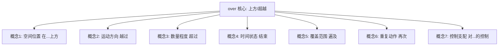
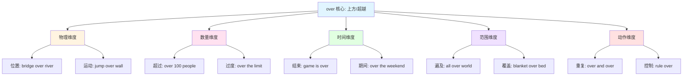
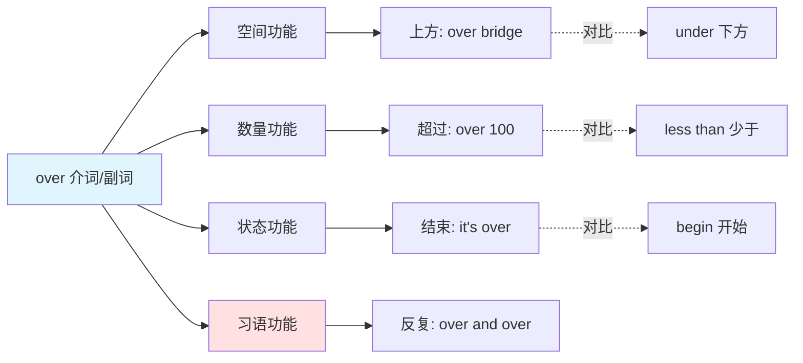
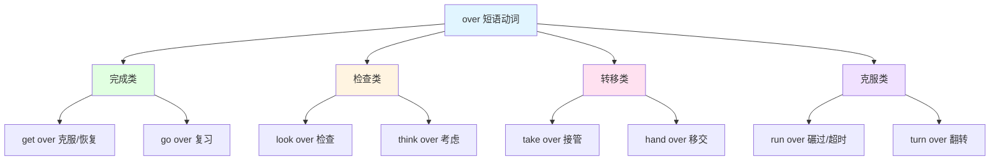

over :: 
<!--ID: 1769531701603-->

# over

## 基础信息

- **英文**：over /ˈəʊvə(r)/ (英式) 或 /ˈoʊvər/ (美式)
- **中文**：在...上方、越过、超过、结束、遍及、再次
- **词性**：介词 (Preposition) / 副词 (Adverb) / 形容词 (Adjective) / 前缀 (Prefix)

## 词义演化

**词源起源**：
- 古英语 "ofer"，原意为 "above, beyond"（在上方、超越）
- 印欧语系词根 *uper-（在上、超过）
- 与德语 "über"、拉丁语 "super" 同源

**意义演变路径**：
1. **空间位置阶段**（古英语）：above（在上方）→ "fly over the city"（飞越城市上方）
2. **运动方向阶段**（中古英语）：across（越过）→ "jump over the fence"（跳过栅栏）
3. **数量程度阶段**（近代英语）：more than（超过）→ "over 100 people"（超过100人）
4. **时间状态阶段**（近代英语）：finished（结束）→ "the game is over"（比赛结束）
5. **覆盖范围阶段**（现代英语）：throughout（遍及）→ "all over the world"（遍及全世界）
6. **重复动作阶段**（现代英语）：again（再次）→ "do it over"（重做）

**核心转变**：从 "物理空间的上方位置" 扩展至 "运动、数量、时间、范围、重复" 等多重维度。

## 概念分析

### 一词多义



### 核心义项

| 义项 | 英文概念 | 中文对应 | 例句 |
|------|----------|----------|------|
| **空间位置** | above | 在...上方 | The bridge over the river（河上的桥） |
| **运动方向** | across | 越过、跨越 | Jump over the wall（跳过墙） |
| **数量程度** | more than | 超过、多于 | Over 1000 people（超过1000人） |
| **时间状态** | finished | 结束、完成 | The meeting is over（会议结束了） |
| **覆盖范围** | throughout | 遍及、覆盖 | All over the world（遍及全世界） |
| **重复动作** | again | 再次、重新 | Do it over（重做） |
| **控制支配** | control | 对...的控制 | Rule over the kingdom（统治王国） |

### 核心习语与功能性用法

**社交/功能性用法**：
- **"over and over"** = 反复、一再（强调重复）
- **"all over"** = 到处、遍及、结束
- **"over the moon"** = 欣喜若狂（英式口语）
- **"over the top"** = 过分、夸张（缩写：OTT）
- **"it's over"** = 结束了（关系/事件）
- **"over my dead body"** = 除非我死了（强烈反对）

**隐喻固化**：
- **"get over"** = 克服、恢复（情感/疾病）
- **"think over"** = 仔细考虑
- **"look over"** = 检查、浏览
- **"take over"** = 接管、接手
- **"go over"** = 复习、检查
- **"hand over"** = 移交、交出
- **"run over"** = 碾过、超时

**情感色彩**：
- **中性**：over the bridge（在桥上）、over 100（超过100）
- **正面**：over the moon（欣喜若狂）、get over it（克服）
- **负面**：over the top（过分）、it's over（结束，暗示失败）

### 同义词对比

| 词汇 | 核心差异 | 使用场景 |
|------|----------|----------|
| **over** | 最通用，涵盖空间/数量/时间/状态 | 所有 "上方/超越" 场景 |
| **above** | 仅指空间上方（静态） | above the clouds（在云层上方） |
| **across** | 强调从一边到另一边 | across the street（穿过街道） |
| **beyond** | 强调超出范围/能力 | beyond imagination（超出想象） |
| **more than** | 仅指数量超过 | more than 100（超过100） |

### 反义词

| 词汇 | 关系 | 示例 |
|------|------|------|
| **under** | 空间相反 | over（在上方）↔ under（在下方） |
| **below** | 位置相反 | over the line（在线上方）↔ below the line（在线下方） |
| **less than** | 数量相反 | over 100（超过100）↔ less than 100（少于100） |

## 关系图谱

### 多义词概念分支



### 介词/副词功能网络



### 短语动词网络（Phrasal Verbs with over）



## 英汉对比

| 维度 | 英语 over | 汉语对应 |
|------|-----------|----------|
| **概念范围** | 单一词汇涵盖 7+ 概念 | 需 6+ 词汇分别表达（在/越/超/完/遍/再） |
| **语法功能** | 介词/副词/形容词/前缀四重身份 | 需介词/动词/形容词/副词混合表达 |
| **短语动词** | 形成 40+ 短语动词（get over, take over） | 需完整动词短语翻译 |

**核心差异**：
- **英语特征**：over 是 "上方/超越核心词"，表达 "从下到上、从少到多、从始到终"
- **汉语特征**：根据具体维度选择精确词汇（在上方/越过/超过/结束/遍及）
- **翻译挑战**：短语动词（get over = 克服）和习语（over the moon = 欣喜若狂）需整体记忆

## 实际应用

### 场景 1：空间位置（静态）

**英文**：There's a painting **over** the fireplace.  
**中文**：壁炉**上方**挂着一幅画。  
**分析**：over 表示静态的上方位置，汉语用 "在...上方" 或 "上面"。

### 场景 2：运动方向（动态）

**英文**：The cat jumped **over** the fence.  
**中文**：猫**跳过**了栅栏。  
**分析**：over 表示从一边到另一边的跨越运动，汉语用 "跳过" 或 "越过"。

### 场景 3：数量程度

**英文**：There were **over** 500 people at the concert.  
**中文**：音乐会有**超过** 500 人。  
**分析**：over 表示数量超过，汉语用 "超过" 或 "多于"。

### 场景 4：时间状态（结束）

**英文**：The party is **over**. Everyone has left.  
**中文**：派对**结束**了，大家都走了。  
**分析**：over 表示时间结束，汉语用 "结束" 或 "完了"。

### 场景 5：时间期间

**英文**：I'll finish this project **over** the weekend.  
**中文**：我会**在**周末完成这个项目。  
**分析**：over 表示时间期间，汉语用 "在...期间" 或 "在...时"。

### 场景 6：覆盖范围

**英文**：She traveled **all over** Europe last summer.  
**中文**：她去年夏天**游遍**了欧洲。  
**分析**：all over 表示遍及、到处，汉语用 "遍及" 或 "到处"。

### 场景 7：重复动作

**英文**：He played the song **over and over** again.  
**中文**：他**一遍又一遍**地播放这首歌。  
**分析**：习语 "over and over" 表示反复、重复，汉语用 "一遍又一遍" 或 "反复"。

### 场景 8：习语用法（克服）

**英文**：It took her months to **get over** the breakup.  
**中文**：她花了几个月才**走出**分手的阴影。  
**分析**：短语动词 "get over" 表示克服、恢复，不能直译为 "得到上方"。

### 场景 9：习语用法（欣喜若狂）

**英文**：She was **over the moon** when she got the job.  
**中文**：她得到这份工作时**欣喜若狂**。  
**分析**：习语 "over the moon" 表示极度高兴，不能直译为 "在月亮上方"。

### 场景 10：习语用法（过分）

**英文**：His reaction was a bit **over the top**.  
**中文**：他的反应有点**过分**了。  
**分析**：习语 "over the top" 表示过分、夸张，不能直译为 "在顶部上方"。

### 场景 11：控制支配

**英文**：The king ruled **over** the land for 40 years.  
**中文**：国王**统治**这片土地 40 年。  
**分析**：over 表示对...的控制或支配，汉语用 "统治" 或 "管理"。

## 深度洞察

### 核心要点

1. **"上方/超越" 的多维度扩展**  
   over 的核心语义是 "在上方或超越某个参照点"，这种关系可以是：空间的（桥在河上方）、数量的（超过100人）、时间的（会议结束）、范围的（遍及全世界）。英语用单一词汇统一表达，汉语则需根据具体维度选择不同词汇。

2. **从具体到抽象的隐喻映射**  
   over 的演变体现了 "垂直方向隐喻"（vertical metaphor）：物理上方（桥在河上）→ 数量超越（超过100）→ 时间完成（结束）→ 心理克服（get over 克服）。这种 "上方 = 更多 = 完成 = 超越" 的隐喻链在英语中极为常见。

3. **短语动词的高频性与多义性**  
   over 形成 40+ 短语动词，部分保留字面意义（jump over = 跳过），部分已固化为独立语义（get over = 克服，take over = 接管）。学习者需警惕：同一短语动词可能有多重含义（go over = 复习 / 检查 / 超过）。

## 关键要点

### 翻译决策树

```
遇到 over 时：
├─ 是否为短语动词？
│  ├─ 是 → 查固定搭配
│  │  ├─ get over（克服/恢复）
│  │  ├─ take over（接管）
│  │  ├─ look over（检查）
│  │  ├─ think over（考虑）
│  │  ├─ go over（复习/检查）
│  │  ├─ hand over（移交）
│  │  └─ run over（碾过/超时）
│  └─ 否 → 继续判断
├─ 是否为习语？
│  ├─ 是 → 查固定含义
│  │  ├─ over and over（反复）
│  │  ├─ over the moon（欣喜若狂）
│  │  ├─ over the top（过分）
│  │  ├─ all over（到处/结束）
│  │  └─ it's over（结束了）
│  └─ 否 → 继续判断
├─ 描述空间位置？
│  ├─ 静态 → 在...上方（bridge over river）
│  └─ 动态 → 越过、跨越（jump over wall）
├─ 描述数量？
│  ├─ 是 → 超过、多于（over 100）
│  └─ 否 → 继续判断
├─ 描述时间？
│  ├─ 结束 → 结束、完成（game is over）
│  └─ 期间 → 在...期间（over the weekend）
├─ 描述范围？
│  ├─ 是 → 遍及、覆盖（all over world）
│  └─ 否 → 重复动作（do it over 重做）
```

### 记忆口诀

**"在越超，完遍再，短语习语细分辨"**

- **在**：空间位置（over the bridge）
- **越**：运动方向（jump over）
- **超**：数量程度（over 100）
- **完**：时间结束（it's over）
- **遍**：覆盖范围（all over）
- **再**：重复动作（over and over）
- **短语**：get over（克服）、take over（接管）
- **习语**：over the moon（欣喜若狂）、over the top（过分）

### 学习者常见错误

| 错误类型 | 错误示例 | 正确表达 | 原因 |
|----------|----------|----------|------|
| **习语直译** | over the moon = 在月亮上方 | 欣喜若狂 | 忽略固化搭配 |
| **短语动词直译** | get over = 得到上方 | 克服、恢复 | 未识别固化语义 |
| **时间状态误判** | it's over = 它在上方 | 结束了 | 混淆空间/状态 |
| **数量表达混淆** | over 100 = 在100上方 | 超过100 | 未识别数量义 |
| **over/above 混淆** | The plane is over clouds | The plane is above clouds | 混淆动态/静态 |

### 高频短语动词速查

| 短语动词 | 中文 | 例句 |
|----------|------|------|
| **get over** | 克服、恢复 | Get over the illness（恢复健康） |
| **take over** | 接管、接手 | Take over the company（接管公司） |
| **look over** | 检查、浏览 | Look over the document（检查文件） |
| **think over** | 仔细考虑 | Think it over（好好考虑） |
| **go over** | 复习、检查、超过 | Go over the notes（复习笔记） |
| **hand over** | 移交、交出 | Hand over the keys（交出钥匙） |
| **run over** | 碾过、超时 | Run over the time limit（超时） |
| **turn over** | 翻转、移交 | Turn over the page（翻页） |
| **come over** | 过来、顺便来访 | Come over for dinner（过来吃饭） |
| **pull over** | 靠边停车 | Pull over to the side（靠边停） |

### over vs above 关键区别

| 对比 | over（动态/覆盖） | above（静态/上方） |
|------|------------------|-------------------|
| **空间** | The bridge is **over** the river（桥横跨河流，有覆盖感） | The plane is **above** the clouds（飞机在云层上方，纯粹位置） |
| **运动** | Jump **over** the wall（跳过墙，强调跨越） | ❌ 不用 above 表示运动 |
| **数量** | **Over** 100 people（超过100人） | ❌ 不用 above 表示数量 |
| **接触** | Put a blanket **over** the bed（毯子覆盖床，有接触） | Hang a lamp **above** the table（灯悬在桌上方，无接触） |

**记忆要点**：over 强调 "覆盖、跨越、超过"，above 仅表示 "静态的上方位置"

### 高频习语速查

| 习语 | 中文 | 例句 |
|------|------|------|
| **over and over** | 反复、一再 | Say it over and over（反复说） |
| **all over** | 到处、遍及、结束 | It's all over（全部结束） |
| **over the moon** | 欣喜若狂 | She's over the moon（她欣喜若狂） |
| **over the top** | 过分、夸张 | That's over the top（太过分了） |
| **over my dead body** | 除非我死了 | Over my dead body!（休想！） |
| **over the hill** | 过了巅峰期、老了 | He's over the hill（他老了） |

---

**生成时间**：2026-01-27  
**主题标签**：[[Vocabulary]] [[Preposition]] [[Phrasal Verbs]] [[Cross-linguistic Analysis]]  
**相关词汇**：[[under]] [[above]] [[across]] [[beyond]] [[with]] [[off]] [[into]]