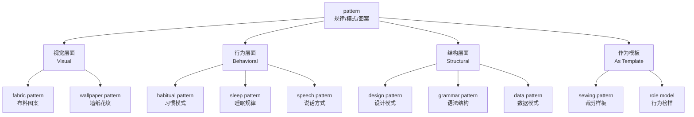

# pattern

## 1. 基础信息 (Basic Info)

| 属性 | 内容 |
|------|------|
| **音标** | /ˈpætərn/ (英), /ˈpætərn/ (美) |
| **词性** | n. / v. |
| **核心定义** | A regular, repeated form or design; a model or template used for making things |
| **中文释义** | 模式；图案；范式；规律；榜样 |

**多义词义解析:**
1. *(n.)* **图案/花样** - 重复的装饰性设计 (decorative design)
2. *(n.)* **模式/方式** - 可识别的行为或事件规律 (regular way things happen)
3. *(n.)* **范例/样板** - 模仿或复制的原型 (model/template)
4. *(n.)* **模式/结构** - 系统性的组织方式 (structural arrangement)
5. *(v.)* **模仿/复制** - 以...为榜样 (to model/copy after)

---

## 2. 词源与演变 (Etymology & Evolution)

**词源追溯:**
- 源自中古英语 *patron* (patron 的变体)
- 古法语 *patron* → 拉丁语 *patronus* (保护者、赞助人)
- 最初含义: "守护神、保护者"

**语义演变:**
```
保护者 / 赞助人 (patron)
    ↓
被赞助的艺术家作品 (样板/模范作品)
    ↓
可复制的"模范"、"样板" (pattern)
    ↓
现代的"模式"、"图案"含义
```

**核心逻辑:** 从"被推崇的样板"演变为"可被复制的模板/规律"

---

## 3. 核心概念图谱 (Concept Graph)



---

## 4. 扩展词汇 (Vocabulary Expansion)

### 4.1 近义词 (Synonyms) — 含细微差别

| 单词 | 核心区别 | 使用场景 |
|------|---------|---------|
| **model** | 侧重"标准/典范"，可供学习模仿 | role model(榜样), business model(商业模式) |
| **template** | 侧重"可复制的模板"，技术味较浓 | website template, document template |
| **sample** | 侧重"样本/例子"，代表整体的一部分 | blood sample, fabric sample |
| **structure** | 侧重"结构安排"，强调系统性 | organizational structure, sentence structure |
| **design** | 侧重"设计意图"，强调艺术性 | graphic design, interior design |
| **trend** | 侧重"趋势/走向"，强调时间变化 | market trend, fashion trend |
| **routine** | 侧重"日常惯例"，强调重复性 | daily routine, morning routine |

**辨析要点:**
- **pattern** → 强调"可识别的规律/重复出现的形式" (最通用)
- **model** → 强调"可以模仿的典范/标准"
- **template** → 强调"可直接套用的模具"

### 4.2 反义词 (Antonyms)

| 单词 | 含义 |
|------|------|
| **chaos** | 混乱，无规律 |
| **randomness** | 随机性，无模式 |
| **irregularity** | 不规律，反常 |
| **anomaly** | 异常，特例 |

### 4.3 派生词 (Derivatives)

| 形式 | 词性 | 含义 |
|------|------|------|
| **patterned** | adj. | 有图案的，有花纹的 |
| **patternless** | adj. | 无图案的，无规律的 |
| **patterning** | n. | 图案设计；模式形成 |
| **patterned after** | phrase | 模仿...，以...为榜样 |

---

## 5. 搭配与用法 (Collocations & Usage)

### 5.1 高频搭配 (Collocations)

**形容词 + pattern:**
- *regular/irregular* pattern (规律/不规律的模式)
- *distinctive/unique* pattern (独特的模式)
- *complex/simple* pattern (复杂的/简单的图案)
- *geometric/floral* pattern (几何/花卉图案)
- *behavioral/consumption* pattern (行为/消费模式)

**动词 + pattern:**
- *establish/form* a pattern (建立模式)
- *break/disrupt* a pattern (打破规律)
- *follow/conform to* a pattern (遵循模式)
- *detect/identify* a pattern (识别规律)
- *repeat* a pattern (重复模式)

**名词 + pattern:**
- *sleep/eating* pattern (睡眠/饮食规律)
- *weather/rainfall* pattern (天气/降雨模式)
- *speech/language* pattern (说话/语言模式)
- *trading/traffic* pattern (交易/交通模式)

### 5.2 典型例句 (Examples)

1. **日常生活 (Daily Life):**
   > "She noticed a *pattern* in her daughter's sleep disturbances."
   > (她注意到了女儿睡眠问题的规律。)

2. **商业场景 (Business):**
   > "Consumer *patterns* have shifted dramatically since the pandemic."
   > (自疫情以来，消费模式发生了巨大转变。)

3. **科技/数据 (Tech/Data):**
   > "Machine learning algorithms excel at recognizing *patterns* in large datasets."
   > (机器学习算法擅长识别大数据集中的规律。)

4. **设计/艺术 (Design/Art):**
   > "The wallpaper features an intricate floral *pattern* inspired by Victorian designs."
   > (这款墙纸采用了受维多利亚设计启发的复杂花卉图案。)

5. **社会科学 (Social Science):**
   > "Researchers are studying migration *patterns* across urban areas."
   > (研究人员正在研究城市间的人口迁移模式。)

6. **动词用法 (Verb Usage):**
   > "The new building was *patterned after* classical Greek architecture."
   > (新建筑模仿了古希腊建筑风格。)

---

## 6. 易混淆点与辨析 (Analysis & Confusing Points)

### 6.1 pattern vs. model vs. template

| 维度 | pattern | model | template |
|------|---------|-------|----------|
| **核心含义** | 可识别的规律/重复形式 | 可供模仿的典范/标准 | 可直接套用的模具 |
| **使用领域** | 通用，跨学科 | 商业、科学、人物 | 技术、设计、文档 |
| **可变性** | 可被识别但未必可复制 | 可被学习但未必可直接复制 | 通常可直接复制使用 |
| **例句** | "behavior pattern" | "role model" | "PowerPoint template" |

### 6.2 pattern vs. trend

- **pattern** → 强调"已有的、可识别的规律" (可以是横向的、当下的)
- **trend** → 强调"随时间变化的方向" (一定是纵向的、演进的)

> "There's a *pattern* of late payments" (有规律可循)
> "There's a *trend* toward late payments" (有变化趋势)

### 6.3 pattern 作动词的特殊用法

**pattern after/on/upon** = 模仿，以...为榜样
> "He *patterned* his career *after* his mentor's."

**易错点:** 不要与"patron"(赞助人/顾客)混淆！
- **patron** /ˈpeɪtrən/ → 赞助人、老顾客
- **pattern** /ˈpætərn/ → 模式、图案

---

## 7. 总结与记忆 (Summary & Memory)

### 口诀 (Mnemonic)

> **"PAT重复出现，规律可循"**
> 
> P - Pattern (模式)
> A - Arrangement (排列)
> T - Template (模板) 
> 重复 → Recognition (识别)

### 决策树 (Decision Tree)

**当你想表达"规律/模式"时:**

```
强调"可识别的重复"
    ↓
    pattern ✓ (最通用)
    
强调"可以模仿的标准"
    ↓
    model ✓ (榜样、范例)

强调"可直接套用的格式"
    ↓
    template ✓ (模板)

强调"随时间的变化趋势"  
    ↓
    trend ✓ (趋势)

强调"系统性的结构设计"
    ↓
    structure ✓ (结构)
```

### 核心记忆点

1. **三字概括:** 图-式-范 (图案、模式、范式)
2. **跨领域高频词:** 从布料花纹到数据规律都可以用
3. **词性扩展:** 可作动词"pattern after"表示"模仿"

---

## 相关笔记

- [[synonyms]]
- [[collocation notes]]
- [[design pattern]]
