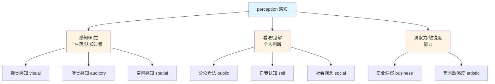
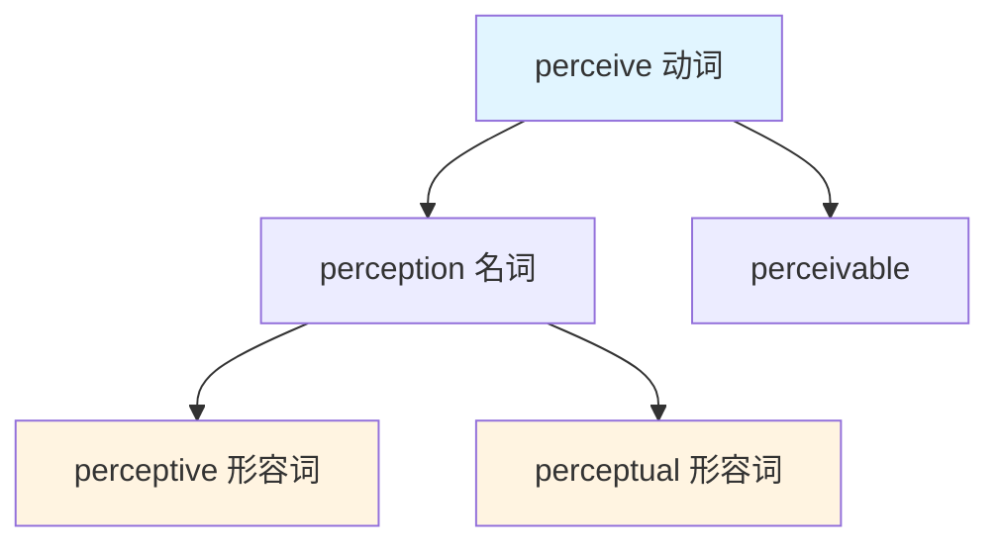

perception :: 
<!--ID: 1767799499850-->

# Perception

## 基础信息

**英文**：perception `/pərˈsepʃən/`
**中文**：感知、知觉、看法、认识、洞察力
**词性**：名词

## 概念分析

### 一词多义（Polysemy）

perception 是一个典型的**多义词**，核心含义沿着"通过感官/心智获取信息"这一认知过程扩展：

| 含义 | 英语场景 | 汉语对应 | 示例 |
|------|----------|----------|------|
| **感知/知觉** | 生理/认知过程 | 感知、知觉 | visual perception（视觉知觉） |
| **看法/见解** | 个人观点或判断 | 看法、认识、观念 | public perception（公众看法） |
| **洞察力/敏锐度** | 觉察能力 | 洞察力、敏锐度 | have good perception（有洞察力） |

### 上下义关系

- **上义词**：cognitive process（认知过程）、awareness（意识）
- **下义词**：
  - sensation（感觉，更基础的生理层面）
  - intuition（直觉，非理性的感知）
  - observation（观察，更主动的感知）
  - insight（洞察，更深层的认知）

### 同义词辨析

| 同义词 | 细微差异 | 使用场景 |
|--------|----------|----------|
| **perspective** | 强调"角度/立场" | From my perspective（从我的角度） |
| **viewpoint** | 强调"观点" | Different viewpoints（不同观点） |
| **understanding** | 强调"理解程度" | Deep understanding（深刻理解） |
| **insight** | 强调"深刻洞察" | Valuable insights（有价值的洞察） |
| **awareness** | 强调"意识状态" | Environmental awareness（环保意识） |

## 关系图谱



## 英汉对比

| 维度 | 英语特征 | 汉语特征 |
|------|----------|----------|
| **概念连续性** | perception 覆盖从感官到认知的连续谱 | 需根据层次选择：感知/看法/洞察 |
| **静态 vs 动态** | 名词化，可独立表示不同场景 | 更常用动词短语：感知到、认识到 |
| **搭配灵活性** | 可直接修饰：perception management | 需要明确类型：舆论管理、认知引导 |

**核心差异**：英语的 perception 保持概念连贯性（都是"获取信息的方式"），汉语则根据认知层次区分词汇（低层次用"感知"，高层次用"认识/洞察"）。

## 实际应用

### 场景 1：产品/商业语境

**English**: Customer perception of our brand has improved after the rebranding.

**中文**: 品牌重塑后，**客户对我们品牌的看法**有所改善。

> 💡 **注意**：这里不能用"客户感知"，因为指的是对品牌的主观评价，不是感官体验。

### 场景 2：认知科学/心理学

**English**: Visual perception is the process of interpreting visual information.

**中文**: 视觉**知觉**是解释视觉信息的过程。

> 💡 **注意**：心理学中常用"知觉"表示对感官信息的组织和解释。

### 场景 3：表达个人观点

**English**: My perception is that the market will recover next quarter.

**中文**: 我的**看法**是市场下季度会复苏。

> 💡 **注意**：这里 perception = 个人判断，用"看法"或"预期"更自然。

### 场景 4：描述洞察力

**English**: She has excellent perception for spotting market opportunities.

**中文**: 她**洞察市场机会的能力**很强。

> 💡 **注意**：这里 perception 作为能力，汉语需要明确化"洞察力"。

## 深度洞察

### 1. 感知的主客观双重性

perception 的核心悖论：它既是获取客观信息的途径，又必然受主观经验塑造。

- **客观层面**：Perception reflects reality（感知反映现实）
- **主观层面**：Perception is filtered by experience（感知被经验过滤）

**英语优势**：perception 一词同时包含这两个层面，便于讨论"主观构建的认知"。

**汉语挑战**：需要区分"感知"（偏客观）vs"看法"（偏主观）。

### 2. 从感觉到认知的连续谱

英语用 perception 统一了从低级到高级的认知过程：

```
感觉（sensation）→ 知觉（perception）→ 认知（cognition）
```

汉语则需要分段表达，导致在某些学术语境下难以保持概念连贯性。

### 3. 感知管理与现实

商业和政界中的 "perception management"（认知管理）揭示了：

- **Perception ≠ Reality**：看法不等于事实
- **Perception creates reality**：看法可以塑造现实（如自证预言）

汉语中"舆论引导"、"认知战"等词汇都涉及这一概念。

## 关键要点

### 翻译决策树

```
perception
│
├─ 生理/心理学语境？
│   └─ 是 → 知觉/感知
│
├─ 表达个人/群体观点？
│   └─ 是 → 看法/认识/观念
│
├─ 描述能力/敏锐度？
│   └─ 是 → 洞察力/敏锐度
│
└─ 商业/营销语境（抽象）？
    └─ 是 → 认知/印象
```

### 记忆口诀

```
低层感官用"感知"
心理过程用"知觉"
个人观点是"看法"
深刻洞察是"洞察力"
商业管理用"认知"
```

## 词族衍生



**形容词辨析**：
- **perceptive**：有洞察力的、敏锐的（描述人）
  - *She is very perceptive.*（她很敏锐。）
- **perceptual**：感知的、知觉的（描述过程/能力）
  - *perceptual skills*（感知技能）

## 常见搭配

| 搭配 | 含义 | 汉语 |
|------|------|------|
| **public perception** | 大众看法 | 公众看法/舆论 |
| **self-perception** | 自我认知 | 自我认知/自我评价 |
| **visual perception** | 视觉感知 | 视觉知觉 |
| **perception of reality** | 对现实的认知 | 现实感/对现实的认知 |
| **heighten perception** | 提高感知力 | 提升敏锐度 |
| **distorted perception** | 扭曲的认知 | 扭曲的看法/错觉 |
| **change perception** | 改变看法 | 改变认知/转变观念 |
