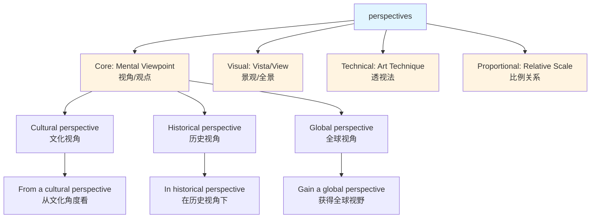
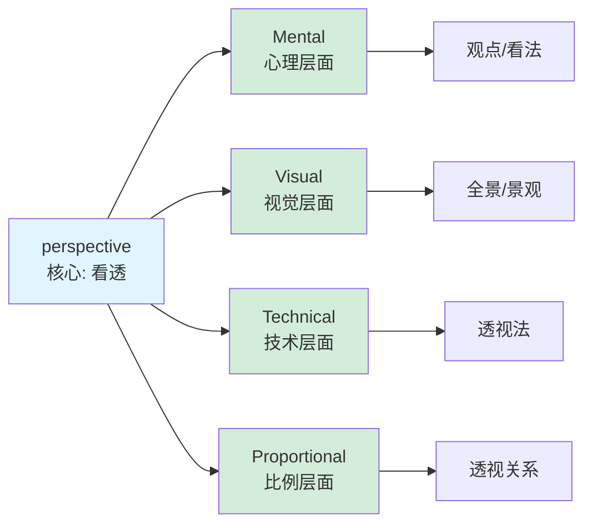

perspectives :: 
<!--ID: 1771045344954-->

# perspectives

## Basic Information

**Pronunciation**: /pərˈspek.tɪvz/ (noun, plural)

**Chinese**: 观点、视角、看法、透视法、全景

**Part of Speech**: Noun (plural of *perspective*)

**Frequency**: ★★★★☆ (Common in academic, business, and everyday contexts)

---

## Semantic Evolution

### Etymology

**Origin**: Latin *perspectiva* ( optics, science of sight) ← *perspicere* (to look through, see clearly)

**Root breakdown**:
- *per-* (through) + *specere* (to look) + *-tiva* (suffix forming nouns)

**Historical development**:
1. **1590s**: Optical term - art of drawing solid objects on a flat surface (透视图)
2. **1650s**: Extended meaning - appearance of things relative to one another (相对位置)
3. **1760s**: Abstract meaning - mental view, outlook, way of regarding things (看法、观点)

**Evolution path**: Optical technique → Visual appearance → Mental viewpoint → Abstract framework

---

## Conceptual Analysis

### Polysemy Branches

**1. Viewpoint / Outlook** (视角、观点)
- Definition: A particular way of considering something
- Example: "From a historical perspective, this event was significant."
- Chinese: 从历史角度来看

**2. Vista / View** (景观、全景)
- Definition: A view or prospect, especially one extending over a distance
- Example: "The mountain top offered stunning perspectives of the valley."
- Chinese: 山顶提供了山谷的绝美全景

**3. Proportion / Relative importance** (透视关系、比例)
- Definition: The relationship or proportion of the parts of a whole to each other
- Example: "Keep the problem in perspective - it's not that serious."
- Chinese: 客观看待这个问题

**4. Technique in art** (透视法)
- Definition: The art of drawing solid objects on a two-dimensional surface
- Example: "Renaissance artists mastered linear perspective."
- Chinese: 文艺复兴艺术家掌握了线性透视法

### Hypernymy & Hyponymy

**Hypernyms** (上位词):
- Viewpoint (观点)
- Standpoint (立场)
- Framework (框架)
- Outlook (展望)

**Hyponyms** (下位词):
- **Cultural perspective** (文化视角)
- **Historical perspective** (历史视角)
- **Global perspective** (全球视角)
- **Fresh perspective** (新视角)
- **First-person perspective** (第一人称视角)

### Synonym Network

**Near synonyms**:
- **Viewpoint**: More focused on the position from which something is observed
- **Angle**: Emphasizes the approach or method of considering something
- **Outlook**: Suggests future orientation or general attitude
- **Standpoint**: Implies a firm position or set of beliefs
- **Frame of reference**: More technical, suggests a system of measurement

**Nuance differences**:
- "Perspective" implies depth, context, and comparative understanding
- "Viewpoint" is more about the vantage point
- "Angle" is about the approach strategy

---

## Mermaid Relationship Graph



**Polysemy Branching Graph**:


---

## Cross-Linguistic Comparison

| Dimension | English | Chinese | Analysis |
|-----------|---------|---------|----------|
| **Conceptual Breadth** | Broad: includes optical, mental, visual senses | Narrower: separate terms for each sense | English uses one word for related concepts |
| **Metaphor Direction** | Concrete → Abstract (sight → understanding) | Mixed: 视角 borrows from vision, 观点 is mental | Both languages use vision metaphors for understanding |
| **Usage Frequency** | High in academic/professional contexts | 观点 common, 视角 growing in formal contexts | "Perspective" more versatile than any single Chinese term |
| **Static vs Dynamic** | Static noun (can be held) | Can be both static (观点) and dynamic process (审视角度) | Chinese distinguishes the view vs the viewing process |
| **Grammatical Category** | Only noun | 视角(n), 观看(v-n), 从...角度看(v) | Chinese allows verbal usage more naturally |
| **Idiomatic Usage** | "In perspective", "keep in perspective" | "客观看待", "从...角度" | English has fixed prepositional phrases |

**Key Insight**: English "perspective" has **conceptual unity** - all senses relate to "seeing through" or "understanding clearly". Chinese uses **separate lexical items** for different senses (观点, 视角, 透视法), lacking the unified metaphor.

---

## Practical Usage Examples

### Scenario 1: Academic Discussion

**Context**: Research methodology
**English**: "This study provides new perspectives on climate change by combining historical data with modern analysis."
**Chinese**: 本研究通过结合历史数据和现代分析，为气候变化提供了新的视角。
**Key phrase**: *provide new perspectives on* (为...提供新视角)

### Scenario 2: Business Strategy

**Context**: Market analysis
**English**: "We need to consider the problem from multiple perspectives before making a decision."
**Chinese**: 我们需要从多个角度考虑这个问题，然后再做决定。
**Key phrase**: *from multiple perspectives* (从多个角度/视角)

### Scenario 3: Conflict Resolution

**Context**: Team disagreement
**English**: "Try to see things from her perspective - she's under a lot of pressure."
**Chinese**: 试着从她的角度看问题 - 她压力很大。
**Key phrase**: *from someone's perspective* (从某人的角度/立场)

### Scenario 4: Art & Design

**Context**: Architecture critique
**English**: "The building's design ignores the principles of linear perspective."
**Chinese**: 这座建筑的设计忽视了线性透视原理。
**Key phrase**: *principles of linear perspective* (线性透视原理)

### Scenario 5: Emotional Management

**Context**: Advice giving
**English**: "Keep things in perspective - this is just one setback, not a total failure."
**Chinese**: 客观看待这件事 - 这只是一个挫折，不是彻底失败。
**Key phrase**: *keep things in perspective* (客观看待/保持正确的看法)

---

## Deep Insights

### 1. The Power of Metaphorical Unity

**Observation**: English preserves the metaphorical connection between "seeing" and "understanding" in a single word.

**Example**:
- "I see what you mean" (visual = mental)
- "From my perspective" (spatial = conceptual)

**Chinese equivalent**: Uses different words:
- 视觉: 看 (see)
- 理解: 理解/明白 (understand)
- 视角: 视角/角度 (perspective/angle)

**Implication**: English speakers think about understanding as a form of "seeing", reinforcing the connection between perception and cognition.

### 2. Context Determines Meaning

**The chameleon nature of "perspectives"**:

| Context | Dominant Meaning | Chinese Translation |
|---------|------------------|---------------------|
| Academic | Theoretical framework | 理论视角/研究视角 |
| Visual art | Drawing technique | 透视法 |
| Personal disagreement | Point of view | 观点/立场 |
| Landscape description | View/vista | 景观/全景 |
| Emotional regulation | Proportional understanding | 客观看法/正确认识 |

**Learning strategy**: Don't memorize definitions in isolation. Learn the **collocations** that signal each meaning:
- "gain/offer/provide perspectives" → understanding/viewpoint
- "linear perspective" → art technique
- "stunning perspectives" → visual view
- "keep in perspective" → proportional importance

### 3. The Western Bias Toward "Objectivity Through Distance"

**Cultural observation**: The word "perspective" implies that **distance creates clarity**.

- "Historical perspective" = looking back from a distance
- "Keep things in perspective" = step back emotionally
- "Global perspective" = view from a wider position

**Chinese contrast**: Chinese uses 角度 (angle) and 视角 (visual angle), which emphasize **position**, not distance.

**Implication**: Western thinking values "stepping back" for objectivity; Chinese thinking values "choosing the right angle" for insight.

---

## Key Takeaways

### Decision Tree for Translation

```
Is it about:
├─ Mental viewpoint/opinion?
│  └─ Use: 观点 (general) / 视角 (more formal/academic)
│
├─ Visual view/vista?
│  └─ Use: 景观 / 全景 / 视野
│
├─ Art technique?
│  └─ Use: 透视法
│
├─ Relative importance/proportion?
│  └─ Use: 正确看待 / 客观认识
│
└─ Academic framework?
   └─ Use: 研究视角 / 理论视角
```

### Memory Mnemonics

**English**:
- "PERspective" = PERsonal + SPECTacle (personal way of seeing)
- Or: "SPECT" root = to look (spectacles, inspect, prospect)

**Chinese mapping**:
- 视角 (shì jiǎo) = 视 + 角
- 观点 (guān diǎn) = 观 + 点

**Mnemonic phrase**: "Per-SPECT-ive emphasizes the SPECTator's SPECTacles (how they SEE things)."

### Critical Collocations to Master

**High-value phrases** (in order of frequency):

1. **from someone's perspective** (从某人的角度/立场)
2. **gain a new perspective** (获得新视角)
3. **put things in perspective** (客观看待事物)
4. **from a historical/cultural/global perspective** (从历史/文化/全球视角)
5. **offer/provide a fresh perspective** (提供新视角)
6. **multiple perspectives** (多角度/多视角)
7. **broaden one's perspective** (拓宽视野)
8. **keep in perspective** (保持正确看法/客观对待)
9. **linear perspective** (线性透视法 - art term)
10. **in the right/wrong perspective** (从正确/错误的角度)

---

## Advanced Usage Patterns

### Academic Register

**Pattern**: "This paper/article/study + offers/provides/presents + a [adjective] perspective + on [topic]"

**Examples**:
- "This chapter offers a feminist perspective on modern architecture."
- "The research presents a cross-cultural perspective on business ethics."

### Professional/Business

**Pattern**: "We need to consider/examine/look at + [issue] + from multiple perspectives"

**Examples**:
- "We should examine the market from multiple perspectives before launching."
- "The solution requires considering all stakeholder perspectives."

### Emotional Intelligence

**Pattern**: "[Action] + in perspective" or "from someone else's perspective"

**Examples**:
- "Let's keep this in perspective - it's not life-threatening."
- "Try to see the situation from her perspective."

---

## Related Word Family

### Root Family: SPECT (to look)

| Word | Chinese | Connection to perspective |
|------|---------|---------------------------|
| **inspect** | 检查 | Look closely at |
| **respect** | 尊重 | Look back at with favor |
| **prospect** | 前景 | Look forward |
| **circumspect** | 慎重的 | Look around carefully |
| **spectacle** | 景象 | Something to look at |
| **aspect** | 方面 | Way of looking at something |
| **retrospect** | 回顾 | Looking backward |

**Connection**: All share the concept of "looking" in different directions and contexts.

### Derived Forms

- **perspectival** (adj): of or relating to a perspective (rare, academic)
- **perspectively** (adv): from a particular perspective (very rare)

---

## Common Errors & How to Avoid Them

### Error 1: Overusing "perspective" for "opinion"

❌ "What's your perspective on this movie?" (Too formal)
✅ "What's your opinion of this movie?" (Natural)

**Rule**: Use "perspective" when implying a **framework** or **way of seeing**, not just casual opinion.

### Error 2: Wrong Chinese mapping

❌ "This art uses good perspective" → 这幅画用了好的观点
✅ "This art uses good perspective" → 这幅画透视法运用得当

**Rule**: In art context, "perspective" = 透视法, not 观点.

### Error 3: Missing the preposition

❌ "From my perspective this is wrong." (Missing comma)
✅ "From my perspective, this is wrong."

**Rule**: When starting a sentence with "from X perspective", use a comma.

---

## Cultural Notes

### Western Individualism in Language

**Observation**: English often says "from MY perspective", emphasizing individual viewpoint.

**Chinese contrast**: More likely to say "从客观角度来看" (from an objective angle), emphasizing shared standard.

### Academic vs Everyday Usage

**Academic English**: "perspective" is very common (theoretical frameworks)
**Chinese academic**: "视角" (perspective angle) increasingly common in academic writing

**Everyday English**: Can sound overly formal if used too much
**Everyday Chinese**: "角度" (angle) or "看法" (view) is more natural

---

## Summary

**perspectives** is a **polysemous word** with four main senses united by the metaphor of "seeing clearly through":

1. **Mental viewpoint** (观点/视角) - most common
2. **Visual view** (全景/景观)
3. **Art technique** (透视法)
4. **Proportional understanding** (客观看法)

**Key insight**: The word embodies Western thinking about **objectivity through distance** and **understanding as a form of seeing**.

**Translation strategy**: Don't look for a single Chinese equivalent. Map to:
- 观点/视角 (opinion/viewpoint)
- 景观/全景 (visual view)
- 透视法 (art technique)
- 客观看法 (proportional understanding)

**Learning focus**: Master the **collocations** that signal each meaning, not just definitions.

---

**Created**: 2026-02-14
**Word**: perspectives
**Difficulty**: ★★★☆☆ (Intermediate-Advanced)
**Priority**: High (very common in academic and professional contexts)

---
# Related
![[Backlinks.base]]
