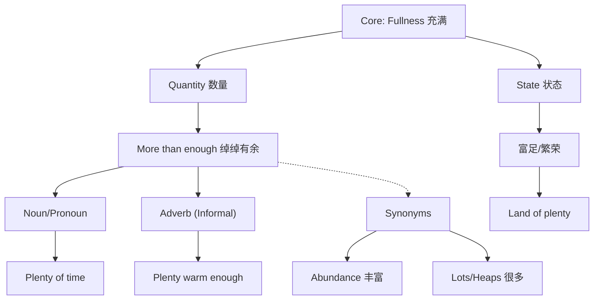

plenty :: 
<!--ID: 1771725387962-->

# plenty

## 1. 基础信息 (Basic Info)

- **词性**: Noun / Pronoun / Adverb / Adjective (Informal)
- **音标**: /ˈplɛnti/
- **释义**:
    - **n./pron.**: 丰富，大量，充足 (a large or sufficient amount or quantity; more than enough)
    - **adv.**: 足够地，充分地 (informal - *plenty big enough*)

## 2. 词源与演变 (Etymology & Evolution)

- **词源**: 源自古法语 *plenté*，最终源自拉丁语 *plenitas* (fullness)，词根是 *plenus* (full)。
- **核心逻辑**: **"Fullness" (充满/满盈)**。
- **演变路径**:
    - 最初指“充满的状态” (State of being full)。
    - 引申为“富足、繁荣” (Abundance/Prosperity)。
    - 现代常用作“足够多，甚至有余” (More than enough)。

## 3. 核心概念图谱 (Concept Graph)

## 4. 扩展词汇 (Vocabulary Expansion)

### 近义词 (Synonyms)
- **Abundance**: 丰富，充裕 (比 *plenty* 更正式，强调富足)。
- **Lots of / A lot of**: 很多 (最口语化)。
- **Ample**: 充裕的，足够的 (强调不仅够，还很宽裕)。
- **Profusion**: 极其丰富，甚至过量 (挥霍感)。
- **Galore**: (放在名词后) 丰富的，大量的 (*bargains galore*)。

### 反义词 (Antonyms)
- **Scarcity**: 缺乏，稀缺。
- **Lack**: 缺失，不足。
- **Dearth**: 饥荒般的缺乏 (正式)。
- **Shortage**: 短缺。

### 派生词 (Derivatives)
- **Plentiful** (adj.): 丰富的，大量的。(*A plentiful supply*)
- **Plenteous** (adj.): 富饶的 (文学/诗歌用语)。

## 5. 搭配与用法 (Collocations & Usage)

### 高频搭配 (Collocations)
- **Plenty of + Noun**:
    - *plenty of time* (充足的时间)
    - *plenty of food* (充足的食物)
    - *plenty of room* (宽敞的空间)
- **In plenty**:
    - *money in plenty* (大量的钱 - 较老式用法)
- **Adv. (Informal)**:
    - *plenty big enough* (足够大)
    - *plenty warm* (足够暖和)
- **Idioms**:
    - *Horn of plenty* (丰饶角 - 象征富庶)
    - *Land of plenty* (鱼米之乡/富饶之地)

### 典型例句 (Examples)
- **日常口语 (General)**:
    > "Don't rush, we have **plenty of time**."
    > 别急，我们有**充足的时间**。
- **表示富足 (Prosperity)**:
    > "They live in a land of **plenty**, yet many go hungry."
    > 他们生活在**富饶**之地，却仍有许多人挨饿。
- **非正式副词 (Informal Adverb)**:
    > "That car is **plenty** fast for me."
    > 那辆车对我来说**够**快了。

## 6. 易混淆点与辨析 (Analysis & Confusing Points)

- **Plenty vs. Enough**:
    - *Enough* 是“刚刚好，够了” (Sufficiency)。
    - *Plenty* 是“绰绰有余，多于需求” (More than enough)。
    - 语气上 *Plenty* 更积极，暗示轻松、无压力。
- **Plenty of vs. Many/Much**:
    - *Plenty of* 既可以接可数名词，也可以接不可数名词，非常灵活。
    - 它比 *Many/Much* 更强调“满足需求后的富余”。
- **语法误区**:
    - **错误**: *We have plenty.* (最好说 *We have plenty of it.* 或上下文明确)
    - **注意**: *Plenty* 作副词 (*plenty good*) 是非正式口语，写作中应避免，改用 *quite* or *sufficiently*。

## 7. 总结与记忆 (Summary & Memory)

### 💡 口诀 (Mnemonic)
> **Plenty 源自“满” (Full)，**
> **绰绰有余心不烦。**
> **口语常用加 of，**
> **副词用法要慎选。**

### 🌳 决策树 (Decision Tree)
- 强调“不仅够，还多”？ -> **Plenty**。
- 强调“刚刚好满足”？ -> **Enough**。
- 正式场合形容“丰富”？ -> **Abundance** 或 **Plentiful**。
- 口语形容“非常” (e.g., fast)？ -> **Plenty** (慎用) -> 改用 **Very/Quite**。
