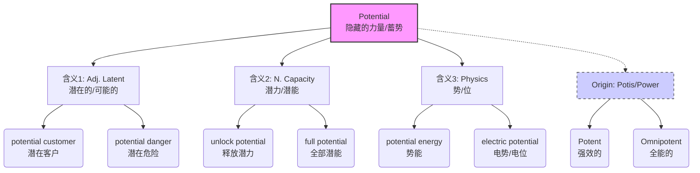

# potential

> [!info] 基础信息
> - **音标**: /pəˈtenʃl/
> - **词性**: adj. / n.
> - **含义**: 潜在的；可能的；潜力；电势

## 词源演化 (Etymology)

源自拉丁语 *potentia* (power, force)，词根是 *potis* (able, powerful)。
- **pot-** (能力/力量) → **poss-** (能) → **possible** (可能的)。
- **pot-** (能力/力量) → **potent** (强有力的) → **potential** (有力量但未释放的)。
- **核心意象**: **Hidden Power** (隐藏的力量)。它不是“不存在”，而是“存在但尚未显现/使用”。
- **演变路径**: 有能力的 (Able) → 有可能发生的 (Possible) → 潜在的/潜力 (Latent power)。

## 概念分析 (Concept Analysis)

### 1. 核心概念：蓄势待发 (Stored Capability)
Potential 描述的是一种**“未实现的现实”**。
- 作为形容词，指“将来可能成为事实的” (existing in possibility)。
- 作为名词，指“尚未被利用的能力” (latent qualities)。
- 物理学中，指“势能/电势” (储存在位置或状态中的能量，释放后变动能)。

### 2. 辨析：Potential vs. Possible

| 词汇 | 侧重点 | 汉语对应 | 隐喻 |
| :--- | :--- | :--- | :--- |
| **Possible** | 概率性 | 可能的 | 有机会发生 (May or may not happen) |
| **Probable** | 概然性 | 很可能的 | 发生几率大 (Likely to happen) |
| **Potential** | 发展性/潜能 | 潜在的 | 具备发生的条件/力量 (Has the capacity to become) |

*例句对比*:
- *It is possible to rain.* (天气不可控，只是概率)
- *He is a potential leader.* (他具备成为领导的素质/力量，只待发展)

## 关系图谱 (Relationship Graph)

## 英汉对比 (Comparative Analysis)

- **“潜”与“势”**:
  - 中文完美对应了 *Potential* 的两个侧面：
  - **潜 (Hidden)**: 对应形容词 *potential* (潜在的风险)。
  - **势 (Power/Position)**: 对应物理名词 *potential* (电势/势能) 和抽象名词 (潜力)。
- **High Potential (HiPo)**:
  - 企业HR常用语，指“高潜人才”。中文常说“这人有**潜力**”，英文说 *He has potential*。

## 场景应用 (Usage Scenarios)

### 1. 商业/市场 (Business)
> "They are **potential** customers."
> 他们是**潜在**客户 (还没买，但有购买力/意向)。

### 2. 个人发展 (Growth)
> "You need to realize your full **potential**."
> 你需要实现你全部的**潜能**。

### 3. 风险评估 (Risk)
> "We must be aware of the **potential** side effects."
> 我们必须意识到**潜在的**副作用。

## 深度洞察 (Deep Insights)

1.  **Potential Energy vs. Kinetic Energy**:
    - 物理学隐喻：**Potential** 是拉满的弓 (蓄势)，**Kinetic** 是射出的箭 (动能)。
    - 人生建议：不要永远只做 *potential* (有才华但未施展)，要转化为 *kinetic* (行动和成果)。
2.  **Potent vs. Potential**:
    - **Potent**: 药效猛的、强有力的 (Power is active)。
    - **Potential**: 有潜力的 (Power is stored)。

## 关键要点 (Key Takeaways)

> [!tip] 决策树：Potential 怎么用？
> - 是指还没发生但具备条件的事？→ **Potential** (Adj.)
> - 是指人内在未开发的能力？→ **Potential** (Noun)
> - 是指物理上的“势能/电位”？→ **Potential** (Noun)
> - 是指单纯的概率（也许会）？→ **Possible**

> [!example] 记忆口诀
> **Pot-** 是力量 **-ent** 存，
> **Potential** 潜力藏得深。
> 形容词用**潜在的**，
> 名词**势能**聚在身。
> 只要条件由于备，
> 终将爆发惊世人。
