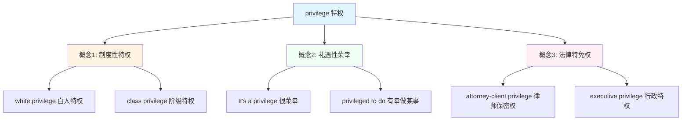

# privilege

## 基础信息

**英文**：privilege /ˈprɪvəlɪdʒ/  
**中文**：特权、荣幸、优待  
**词性**：名词（noun）/ 动词（verb）

## 概念分析

### 一词多义

**privilege** 在英语中包含三个核心概念：

1. **制度性特权**（institutional advantage）  
   → 中文：特权、优惠待遇  
   → 语境：社会阶层、权力结构  
   → 例：white privilege（白人特权）

2. **礼遇性荣幸**（honored opportunity）  
   → 中文：荣幸、荣耀  
   → 语境：正式场合、感谢表达  
   → 例：It's a privilege to meet you（很荣幸见到您）

3. **法律特免权**（legal immunity）  
   → 中文：特免权、豁免权  
   → 语境：法律程序、职业保护  
   → 例：attorney-client privilege（律师-客户保密特权）

### 上下义关系

- **上义词**：advantage（优势）、right（权利）
- **下义词**：immunity（豁免）、exemption（免除）
- **同义词**：prerogative（特权）、entitlement（应得权利）
- **反义词**：disadvantage（劣势）、burden（负担）

## 关系图谱



## 英汉对比

| 维度 | 英语 privilege | 汉语对应 |
|------|----------------|----------|
| **静态 vs 动态** | 名词化概念，强调状态 | 需要动词化："享有特权"、"感到荣幸" |
| **独立 vs 组合** | 单一词汇涵盖多层含义 | 需要语境区分："特权"（贬义）vs"荣幸"（褒义） |
| **精细度** | 一词三义（制度/礼遇/法律） | 汉语用不同词汇精确表达：特权/荣幸/豁免权 |

## 实际应用

### 场景 1：社会学讨论

**英文**：Understanding your privilege is the first step toward equity.  
**中文**：认识到自己的特权是实现公平的第一步。  
**分析**：此处 privilege 指制度性优势，汉语用"特权"对应。

### 场景 2：正式致辞

**英文**：It's been a privilege working with such a talented team.  
**中文**：能与如此优秀的团队共事是我的荣幸。  
**分析**：此处 privilege 表达感激，汉语用"荣幸"更贴切。

### 场景 3：法律语境

**英文**：The journalist invoked reporter's privilege to protect her source.  
**中文**：记者援引新闻保密特权来保护消息来源。  
**分析**：此处 privilege 指法律豁免权，汉语需加"特权"或"豁免权"明确。

## 深度洞察

### 核心要点

1. **概念边界差异**  
   英语 privilege 是中性词，可褒可贬；汉语"特权"带贬义色彩，"荣幸"是褒义表达。翻译时需根据语境选择对应词汇。

2. **语用功能分化**  
   - 制度批判语境 → 特权（privilege as systemic advantage）
   - 礼貌表达语境 → 荣幸（privilege as honor）
   - 法律专业语境 → 特免权（privilege as immunity）

3. **文化认知差异**  
   英语国家将 privilege 作为社会学核心概念（如 white privilege、male privilege），汉语中"特权"更多指向权力滥用，缺乏英语中的反思性用法。

## 关键要点

### 翻译决策树

```
privilege 出现时
├─ 语境是社会批判？
│  └─ 是 → 特权（privilege as systemic advantage）
├─ 语境是礼貌表达？
│  └─ 是 → 荣幸（It's a privilege = 很荣幸）
├─ 语境是法律程序？
│  └─ 是 → 特免权/豁免权（legal privilege）
└─ 语境是日常优待？
   └─ 是 → 优待/优惠（享有优待）
```

### 记忆口诀

**特权制度要批判，荣幸礼遇表感激；  
法律豁免加"特免"，语境决定译法异。**

---

**关联笔记**：[[Vocabulary]] | [[Social Concepts]] | [[Legal Terms]]