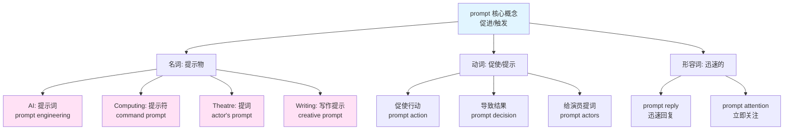
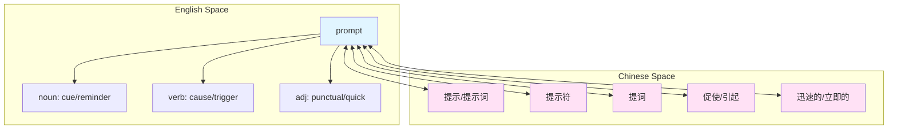
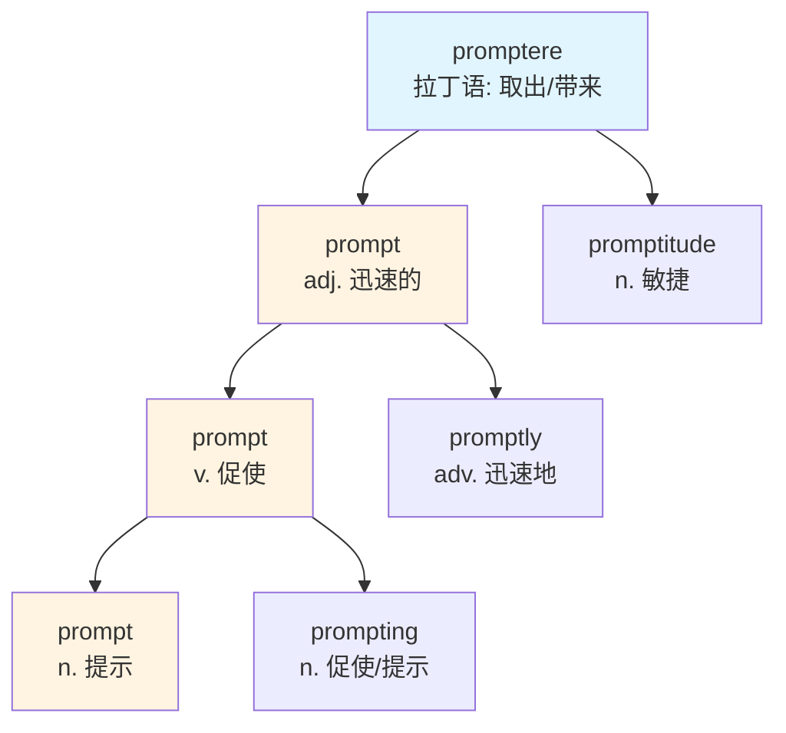

prompt :: 
<!--ID: 1767799200910-->

# prompt

## 基础信息

| 项目 | 内容 |
|------|------|
| **英文** | prompt |
| **音标** | /prɒmpt/ |
| **词性** | 名词 / 动词 / 形容词 |
| **中文** | 提示、提示词、促使、迅速的 |

## 概念分析

### 一词多义（跨词性）

**名词 (n.)**:
1. **提示/提示词** - Something that causes a response
   - *AI prompt* (AI 提示词)
   - *writing prompt* (写作提示)
2. **提示符** - Symbol on a screen
   - *command prompt* (命令提示符)
3. **提词** - Actor's reminder (theatre)
   - *He needed a prompt for his lines.*

**动词 (v.)**:
1. **促使/引起** - To cause or bring about
   - *prompt someone to action* (促使某人行动)
2. **提示/提词** - To remind actors
   - *prompt the actor* (给演员提词)
3. **促使/导致** - To lead to
   - *What prompted this decision?*

**形容词 (adj.)**:
1. **迅速的/敏捷的** - Done without delay
   - *a prompt reply* (迅速的回复)
2. **即时的** - Performed at once
   - *prompt attention* (立即处理)

### 同义词网络

| 词 | 细微差别 |
|-----|----------|
| **prompt** (v.) | 促使行动（强调触发） |
| **cause** | 导致（强调因果） |
| **provoke** | 激起（常带情绪） |
| **elicit** | 引出（回应） |
| **trigger** | 触发（类似机制） |
| **prompt** (adj.) | 迅速的（强调及时性） |
| **immediate** | 立即的（强调无延迟） |
| **quick** | 快的（通用） |
| **swift** | 迅速的（强调速度） |

### 反义词

- **delay** (推迟/延迟)
- **hesitate** (犹豫)
- **slow** (慢的)

## 关系图谱

### 多义词概念分支



### 英汉概念映射



## 英汉对比

| 特征 | 英语 | 汉语 |
|------|------|------|
| **词性转换** | prompt 跨三个词性 | 需不同词汇：提示/促使/迅速 |
| **AI 语境** | prompt 已成为术语 | 提示词（直译） |
| **语义扩展** | 从 theatre → computing → AI | 需分别造词 |
| **形容词用法** | prompt reply 迅速回复 | 需用"迅速的/及时的" |

## 实际应用

### 场景 1：AI 提示词（现代）

> **English**: Writing effective **prompts** is crucial for getting good results from AI.
>
> **中文**: 撰写有效的**提示词**对于从 AI 获得良好结果至关重要。

### 场景 2：促使某人行动

> **English**: The crisis **prompted** the government to take immediate action.
>
> **中文**: 危机**促使**政府立即采取行动。

### 场景 3：迅速的回复

> **English**: Thank you for your **prompt** response to my inquiry.
>
> **中文**: 感谢您对我询问的**迅速**回复。

### 场景 4：剧院提词

> **English**: The actor forgot his lines and needed a **prompt** from the sidelines.
>
> **中文**: 演员忘了台词，需要从场边得到**提词**。

### 场景 5：命令提示符（计算）

> **English**: Open the command **prompt** and enter the instruction.
>
> **中文**: 打开命令**提示符**并输入指令。

### 场景 6：导致的原因

> **English**: What **prompted** you to change your career path?
>
> **中文**: 是什么**促使**你改变职业道路的？

## 深度洞察

### 1. 语义演进：从舞台到 AI

**prompt** 的意义演变反映了技术发展：

```
Theatre (舞台提词)
    ↓
Computing (系统提示符)
    ↓
Creative Writing (写作提示)
    ↓
AI Era (提示词工程)
```

这种语义扩展是**隐喻性迁移**（metaphorical transfer）的典型案例：
- 核心含义：**"促发某事"** (eliciting a response)
- 从人际互动（演员）→ 人机互动（电脑）→ AI 互动（大模型）

### 2. 汉语的"提示词"借译

汉语"提示词"是近年来从英语 **prompt** 借译的新词：
- 传统汉语没有"提示词"这个说法
- 2020 年代 AI 热潮催生了这个新词
- 类似案例：**bug** → Bug (漏洞), **cache** → 缓存

### 3. 词性转换的语义保持

尽管 **prompt** 可以作名、动、形三种词性，但核心语义保持一致：
- **动词**：促使行动 (cause to happen)
- **名词**：促使的媒介 (something that causes)
- **形容词**：迅速响应 (ready to cause/response)

这种**词族语义连贯性**（semantic coherence across POS）在英语中很常见，汉语则需要不同词汇表达。

## 关键要点

### 选用决策树

```
需要表达 prompt?
├── AI/技术场景
│   └── prompt → 提示词
├── 计算机操作
│   └── prompt → 提示符
├── 导致某事发生
│   └── prompt (v.) → 促使/引起
├── 舞台/演讲
│   └── prompt → 提词
├── 强调及时性
│   └── prompt (adj.) → 迅速的/及时的
└── 创意写作
    └── prompt → 写作提示/题目
```

### 记忆口诀

```
名词提示或提词
动词促使引行动
形容词表快又准
AI 时代新意义
```

## 词源与构词

### 词源起源

```
Latin: promptus (brought forth, revealed)
    ↓
Old French: prompt
    ↓
Middle English: prompt (ready, quick)
    ↓
Modern English: prompt (cause/ready)
```

### 同根词族



### 衍生句组（理解转换）

> The crisis **prompted** immediate action from the government.
>
> 危机**促使**政府立即采取行动。

> She gave me a **prompt** reply to my question.
>
> 她对我的问题给出了**迅速的**回复。

> Writing a good AI **prompt** requires creativity and precision.
>
> 撰写好的 AI **提示词**需要创造力和精确性。

> The actor needed a **prompt** for his forgotten lines.
>
> 演员忘词时需要**提词**。

> What **prompted** you to make this decision?
>
> 是什么**促使**你做出这个决定的？

> The command **prompt** is waiting for your input.
>
> 命令**提示符**正在等待你的输入。

---

## 相关概念

🔗 **Related**: [[cue]], [[trigger]], [[cause]], [[immediate]], [[Vocabulary]]

📝 **Notes created**: 2026-01-07
