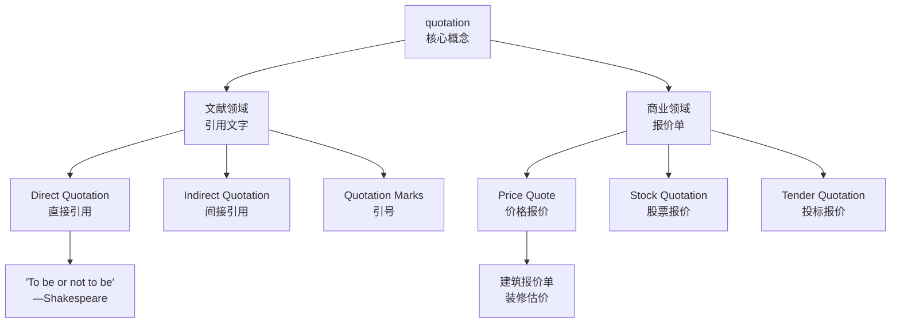

# quotation

## 1. 基础信息 (Basic Info)

**发音**：/kwəʊˈteɪʃən/ (UK) | /kwoʊˈteɪʃən/ (US)

**词性**：noun

**英文释义**：
1. A group of words taken from a text or speech and repeated by someone other than the original author or speaker
2. A formal statement setting out the estimated cost for a particular job or service

**中文释义**：
1. 引语，引文，语录
2. 报价，报价单，估价

---

## 2. 词源与演变 (Etymology & Evolution)

**词源**：
- 源自拉丁语 *quotare*（标记数字）
- 词根 *quot* = "how many"（多少）
- 15 世纪进入英语

**演变逻辑**：
1. **最初含义**：在引用书籍时，标记页数/章节数（counting pages）
2. **扩展含义**：引用文字本身（repeating words）
3. **商业用法**：标记价格数字（stating prices）

**词根联想**：
- *quote* (v.) - 引用
- *quotient* (n.) - 商数（数学）
- *quota* (n.) - 配额、定额

---

## 3. 核心概念图谱 (Concept Graph)



**概念关系**：
- **文献**：引用他人观点 → 学术、写作、演讲
- **商业**：正式价格声明 → 采购、销售、投标

---

## 4. 扩展词汇 (Vocabulary Expansion)

### 近义词 (Synonyms)

**文献语境**：
- **quote** (n.) - 简写形式，更口语化
  - *例：a quote from the book*
- **citation** (n.) - 学术引用，强调出处
  - *例：academic citations in research papers*
- **reference** (n.) - 参考，范围更广
  - *例：make reference to his work*
- **excerpt** (n.) - 摘录，强调片段性
  - *例：an excerpt from the novel*
- **passage** (n.) - 文章段落，不一定是引用
  - *例：read this passage aloud*

**商业语境**：
- **estimate** (n.) - 估价，通常非正式
  - *例：rough estimate vs formal quotation*
- **bid** (n.) - 出价、投标价
  - *例：submit a bid for the project*
- **tender** (n.) - 投标书（英式英语）
  - *例：submit a tender document*

**细微差别**：
| 词汇 | 正式程度 | 语境 |
|------|---------|------|
| quotation | ⭐⭐⭐⭐⭐ | 正式文档、合同 |
| quote | ⭐⭐⭐ | 口语、邮件 |
| estimate | ⭐⭐ | 初步评估 |
| citation | ⭐⭐⭐⭐⭐ | 学术论文 |

### 反义词 (Antonyms)

- **original text** - 原文
- **paraphrase** - 改写、转述
- **plagiarism** - 抄袭（错误引用）

### 派生词 (Derivatives)

- **quote** (v./n.) - 引用、报价（简写）
- **quotable** (adj.) - 值得引用的
- **quotably** (adv.) - 值得引用地
- **quoter** (n.) - 引用者

---

## 5. 搭配与用法 (Collocations & Usage)

### 高频搭配

**文献语境**：
- **verb + quotation**
  - *use a quotation* - 使用引用
  - *cite a quotation* - 引证
  - *memorize a quotation* - 背诵语录
  - *misquote a quotation* - 误引
  
- **adj + quotation**
  - *famous quotation* - 名言
  - *direct quotation* - 直接引用
  - *biblical quotation* - 圣经引用
  - *lengthy quotation* - 长篇引用

- **quotation + noun**
  - *quotation marks* - 引号
  - *quotation marks* - 引号（" "）
  - *quotation system* - 引用系统

**商业语境**：
- **verb + quotation**
  - *get a quotation* - 获得报价
  - *give/offer a quotation* - 提供报价
  - *accept a quotation* - 接受报价
  - *request a quotation* - 请求报价
  
- **adj + quotation**
  - *formal quotation* - 正式报价单
  - *written quotation* - 书面报价
  - *competitive quotation* - 有竞争力的报价
  - *firm quotation* - 固定报价（不可更改）

- **quotation + noun**
  - *quotation form* - 报价单表格
  *quotation sheet* - 报价表
  *stock quotation* - 股票报价

### 典型例句

**场景 1：学术写作**
> The essay includes **quotations from** various experts in the field.
> (文章引用了该领域多位专家的言论。)

**场景 2：演讲**
> She opened her speech with a **famous quotation** from Martin Luther King Jr.
> (她以马丁·路德·金的一句名言开始了演讲。)

**场景 3：商业采购**
> We need to get three **written quotations** before making a decision.
> (我们需要获得三份书面报价后再做决定。)

**场景 4：建筑装修**
> The contractor provided a **detailed quotation** for the renovation work.
> (承包商提供了装修工作的详细报价单。)

**场景 5：金融**
> You can check the latest **stock quotations** on the financial website.
> (你可以在财经网站上查看最新的股票报价。)

---

## 6. 易混淆点与辨析 (Analysis & Confusing Points)

### quotation vs quote

**关键区别**：
- **quotation** - 正式用语，强调"完整的引用内容"
- **quote** - 简写形式，更口语化，可作动词

**使用场景**：
```
✅ Formal: Please submit a formal quotation by Friday.
✅ Casual: Can you give me a quote for the repair?
❌ Academic: The quote from Shakespeare... (应用 quotation)
```

### quotation vs citation

**quotation** - 引用的**内容**（文字本身）
**citation** - 引用的**出处标注**（来源信息）

**对比**：
```
The quotation is "To be or not to be."
The citation is (Shakespeare, Hamlet, Act 3, Scene 1).
```

### quotation vs estimate

**quotation** - 正式报价，通常具有法律约束力
**estimate** - 估价，可能变化

**商业语境**：
- 建筑行业：quotation 是合同基础
- 装修服务：estimate 只是初步评估

### 发音注意

- **quotation** 重音在第二音节 /kwəʊˈteɪʃən/
- **quote** 单音节 /kwəʊt/
- ⚠️ 不要混淆发音

---

## 7. 总结与记忆 (Summary & Memory)

### 口诀 (Mnemonic)

**记忆歌诀**：
```
Quotation 两含义，
文献引用商业价。
Quote 是简写口语化，
Citation 是标出处查。
Marks 是引号别忘了，
商业报价要 formal！
```

**词根记忆**：
- *quot* = "how many"（多少）
- 数页码 → 引文字 → 报价格

### 决策树 (Decision Tree)

```
需要使用"引用/报价"？
├─ 学术论文/正式文档？
│  └─ ✅ quotation
├─ 口语/邮件/非正式？
│  └─ ✅ quote
├─ 只标注出处（不是引用内容）？
│  └─ ✅ citation
└─ 商业语境？
   ├─ 正式报价单？
   │  └─ ✅ written/formal quotation
   └─ 初步估价？
      └─ ✅ estimate
```

### 快速选择指南

| 语境 | 推荐用词 | 原因 |
|------|---------|------|
| 学术论文 | quotation | 正式、准确 |
| 日常对话 | quote | 简洁、自然 |
| 商业合同 | written quotation | 法律效力 |
| 初步评估 | estimate | 灵活、非约束 |
| 标注出处 | citation | 学术规范 |

---

## 相关词汇链接

- [[quote]]
- [[citation]]
- [[reference]]
- [[estimate]]
- [[plagiarism]]

---
# Related
![[Backlinks.base]]
