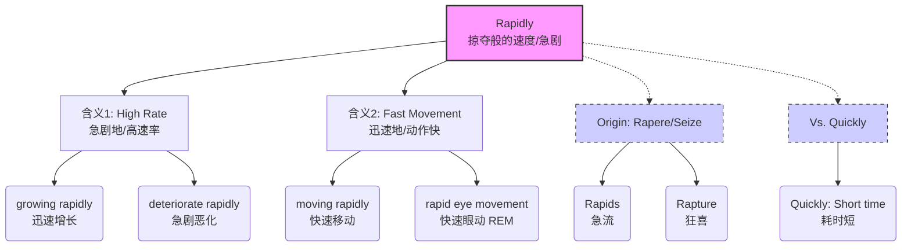

# rapidly

> [!info] 基础信息
> - **音标**: /ˈræpɪdli/
> - **词性**: adv.
> - **含义**: 迅速地；急剧地；很快地

## 词源演化 (Etymology)

源自拉丁语 *rapidus* (hasty, snatching)，词根是 *rapere* (to seize, snatch, 抓取/夺走)。
- **rap-** (抓/抢) → **rapids** (急流 - 把人冲走的水流)。
- **核心意象**: 像**抢夺**一样的速度；被一股力量**卷走**的感觉。
- **同根词**: *Rapture* (狂喜 - 被情绪抓走), *Velociraptor* (迅猛龙 - 敏捷的掠夺者)。
- **演变路径**: 抢夺 (Snatch) → 猛冲 (Rush) → 速度极快 (Moving with speed)。

## 概念分析 (Concept Analysis)

### 1. 核心概念：进程的高速率 (High Rate of Process)
Rapidly 通常用来描述**过程**、**变化**或**增长**的速率 (Rate)，而不仅仅是动作的敏捷。
- 它暗示了一个**持续的**、**短时间内发生大量变化**的过程。
- 常用语境：人口增长、病情恶化、经济发展、水流湍急。

### 2. 辨析：Rapidly vs. Quickly vs. Fast

| 词汇 | 侧重点 | 汉语对应 | 隐喻 |
| :--- | :--- | :--- | :--- |
| **Fast** | 通用词，指物理速度 | 快的 | 跑得快 (High speed) |
| **Quickly** | 强调**耗时短**，马上做完 | 赶快/没多久 | 动作利索 (Short duration) |
| **Rapidly** | 强调**变化率**大，正式用语 | 迅速/急剧 | 曲线陡峭 (High rate) |
| **Swiftly** | 强调**轻盈/顺滑**的速度 | 疾速/飞快 | 燕子掠过 (Smooth speed) |

*例句对比*:
- *Come here **quickly**!* (强调马上过来，别磨蹭 - Time elapsed is short)
- *The economy is growing **rapidly**.* (强调增长率高 - Rate of change is high)
- *He runs **fast**.* (强调物理速度 - Velocity is high)

## 关系图谱 (Relationship Graph)

## 英汉对比 (Comparative Analysis)

- **“急”与“快”**:
  - *Rapidly* 对应中文的“急” (急剧、急流) 和“迅” (迅速)。
  - 中文说“病情恶化很快”，英文常用 *deteriorate rapidly* (显得更专业/严重)。
- **正式程度**:
  - 口语常用 *fast/quick*。
  - 书面语、新闻、学术报告常用 *rapid/rapidly* (e.g., rapid transit 快速公交)。

## 场景应用 (Usage Scenarios)

### 1. 变化与趋势 (Trends)
> "Technology is changing **rapidly**."
> 科技正在**飞速**变化。

### 2. 医疗/状况 (Condition)
> "The patient's condition deteriorated **rapidly**."
> 病人的状况**急剧**恶化。

### 3. 商业/增长 (Growth)
> "We are expanding **rapidly** into new markets."
> 我们正在**迅速**扩张到新市场。

## 深度洞察 (Deep Insights)

1.  **Rapid Eye Movement (REM)**:
    - 快速眼动期。睡眠的一个阶段，眼球**迅速**转动，通常是做梦的时候。
2.  **Rapids (急流)**:
    - 河流中水流极快、有落差的地方。记住 *rapids* 就能记住 *rapid* 的“猛冲”感。
3.  **Velocity vs. Rate**:
    - *Fast* 描述 Velocity (速度)。
    - *Rapid* 描述 Rate (速率/比率)。所以凡是涉及“率”的（增长率、心率、呼吸频率）通常用 *rapid*。

## 关键要点 (Key Takeaways)

> [!tip] 决策树：用 Rapidly 还是 Quickly?
> - 是描述增长、下降、变化的过程吗？→ **Rapidly** (High rate)
> - 是正式的书面语吗？→ **Rapidly**
> - 是叫某人马上做完某事？→ **Quickly** (Short time)
> - 是单纯说跑得快？→ **Fast**

> [!example] 记忆口诀
> **Rap-** 是抢夺 **-id** 似，
> **Rapid** 猛冲如**急流**。
> 变化增长用**急剧**，
> **Quickly** 只是耗时休。
> 眼动睡眠 REM，
> 速率极高不回头。
