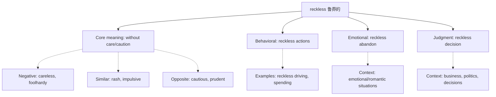

## Basic Info
- **English**: reckless /ˈrekləs/
- **Chinese**: 鲁莽的 (lǔmǎng de) / 轻率的 (qīngshuài de) / 不顾后果的 (bùgù hòuguǒ de)
- **Parts of Speech**: adjective
- **Primary Meanings**: careless, heedless, rash, impulsive; showing lack of consideration for consequences

## Semantic Evolution
The word "reckless" comes from Middle English "reckeles" where "reck" meant "care" or "heed" and the suffix "-less" indicated absence. Literally meaning "without care" or "without heed", it has maintained its negative connotation of acting without proper consideration throughout its evolution.

## Conceptual Analysis

### Polysemy (Multiple Related Meanings)
- **Behavioral**: acting without thought for consequences (reckless driving)
- **Emotional**: showing disregard for safety (reckless abandon)
- **Judgment**: lacking prudence or caution (reckless decision)
- **Intensity**: extreme or excessive (reckless courage - though paradoxical)

### Synonymy and Related Terms
- **Synonyms**: careless, imprudent, rash, foolhardy, headlong, precipitate
- **Antonyms**: cautious, prudent, careful, considerate, thoughtful
- **Near-synonyms**: venturesome, audacious (though less negative)

## Mermaid Relationship Graph

## Cross-linguistic Comparison Table
| Aspect | English "reckless" | Chinese Equivalents | Notes |
|--------|---------------------|-------------------|-------|
| **Connotation** | Negative, dangerous | 贬义 (biǎnyì) | Similar negative valence |
| **Scope** | Broad application | Context-dependent terms | Chinese uses different terms based on context |
| **Nuance** | Single word captures concept | Multiple options | English bundles various meanings |
| **Usage** | Adjective only | Flexible usage | Chinese allows more grammatical flexibility |

## Usage Examples

1. **Driving Context**: "His reckless driving endangered everyone on the road." → "他鲁莽的驾驶危及了路上每个人的安全。"
2. **Decision Context**: "It would be reckless to invest all your money in one stock." → "把所有钱投资于一只股票是轻率的。"
3. **Emotional Context**: "She threw herself into the relationship with reckless abandon." → "她不顾一切地投入到这段关系中。"

## Deep Insights

1. **Cultural/Linguistic Gap**: English "reckless" carries strong legal/behavioral connotations often absent in Chinese equivalents which may focus more on the judgment aspect.
2. **Semantic Precision**: English "reckless" specifically implies conscious disregard for consequences, while Chinese equivalents may emphasize more the lack of caution generally.
3. **Register Differences**: "Reckless" has formal/legal usage (reckless endangerment) that doesn't translate directly to Chinese legal terminology.

## Key Takeaways

### Decision Tree for Translation
- **If describing behavior/action**: → 鲁莽的 (lǔmǎng de)
- **If describing decision/judgment**: → 轻率的 (qīngshuài de) 
- **If describing emotional state**: → 不顾后果的 (bùgù hòuguǒ de)
- **If in legal context**: → 鲁莽的 or 轻率的 depending on context

### Memory Mnemonic
**"Reckless = Reck + Less"**: Remember the etymology - "reck" (care) + "less" (without) = "without care".

## Etymology Derivation
- Middle English "reckeles" ← "reck" (care, heed) + "-les" (without)
- Evolution: reck (care) → reckeles (without care) → reckless
- Shows semantic shift from "without care" to "acting without regard for consequences"