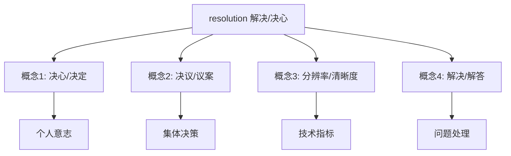
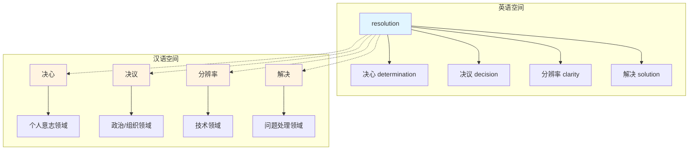

resolution :: 
<!--ID: 1769502992478-->


# Resolution

## 基础信息

**英文**：resolution /ˌrezəˈluːʃn/  
**中文**：决心 / 决议 / 分辨率 / 解决  
**词性**：名词

## 词义演化

**词源起源**：
- 拉丁语 *resolutio*（"松开、解开"）← *resolvere*（re- "再次" + solvere "松开"）
- 14世纪进入英语，最初指"分解成组成部分"的行为

**意义演变路径**：
1. **物理分解**（14世纪）：将复杂事物分解为简单元素
2. **问题解决**（15世纪）：通过分析达成解决方案 → "解决"
3. **心理决断**（16世纪）：内心冲突的"解开" → "决心"
4. **正式决定**（17世纪）：集体讨论后的"解决方案" → "决议"
5. **技术精度**（20世纪）：图像细节的"分解能力" → "分辨率"

**核心隐喻**：从"物理解开"到"心理/社会/技术层面的清晰化"

## 概念分析

### 一词多义



### 概念域映射

| 英语概念 | 汉语对应 | 语境特征 |
|---------|---------|---------|
| resolution (决心) | 决心 / 决定 | 个人意志：New Year's resolution |
| resolution (决议) | 决议 / 议案 | 正式文件：UN resolution |
| resolution (分辨率) | 分辨率 / 清晰度 | 技术参数：4K resolution |
| resolution (解决) | 解决 / 解答 | 问题处理：conflict resolution |

### 同义词网络

**决心义**：
- determination（坚定性）
- resolve（决断力）
- commitment（承诺性）

**决议义**：
- decision（决定）
- decree（法令）
- motion（动议）

**分辨率义**：
- clarity（清晰度）
- definition（清晰度）
- sharpness（锐度）

**解决义**：
- solution（解决方案）
- settlement（和解）
- answer（答案）

## 关系图谱



## 英汉对比

| 维度 | 英语 resolution | 汉语对应 |
|------|----------------|---------|
| **概念结构** | 单一词汇覆盖4个概念域 | 4个独立词汇：决心/决议/分辨率/解决 |
| **语义特征** | 抽象名词化，静态表达 | 保留动词性（解决）或需要语境（决心/决议） |
| **使用精细度** | 依赖上下文区分义项 | 词汇本身即明确概念域 |

## 实际应用

### 场景 1：个人发展（决心）
**English**: "My New Year's resolution is to exercise three times a week."  
**中文**："我的新年决心是每周锻炼三次。"  
**分析**：此处 resolution = 决心（个人承诺）

### 场景 2：国际政治（决议）
**English**: "The UN Security Council passed a resolution condemning the invasion."  
**中文**："联合国安理会通过了一项谴责入侵的决议。"  
**分析**：此处 resolution = 决议（正式文件）

### 场景 3：技术参数（分辨率）
**English**: "This monitor supports 4K resolution for crystal-clear images."  
**中文**："这款显示器支持4K分辨率，图像清晰锐利。"  
**分析**：此处 resolution = 分辨率（技术指标）

### 场景 4：冲突管理（解决）
**English**: "Mediation is often the best path to conflict resolution."  
**中文**："调解往往是冲突解决的最佳途径。"  
**分析**：此处 resolution = 解决（问题处理）

## 深度洞察

### 核心要点

1. **概念统一性 vs 词汇分化**  
   英语 resolution 通过词源隐喻（"解开"）统一4个概念，汉语则用4个独立词汇精确对应各领域。

2. **名词化倾向 vs 动词保留**  
   英语将动词 resolve 名词化为 resolution，汉语在"解决"义项中保留动词性，其他义项则发展为独立名词。

3. **语境依赖度差异**  
   英语 resolution 高度依赖上下文（New Year's / UN / 4K / conflict），汉语词汇本身即携带领域信息（决心→个人 / 决议→政治 / 分辨率→技术 / 解决→问题）。

## 关键要点

### 翻译决策树

```
resolution 出现时
├─ 前有 New Year's / make a → 决心
├─ 前有 UN / pass a / adopt a → 决议
├─ 前有 4K / high / screen → 分辨率
└─ 后有 of conflict / of problem → 解决
```

### 记忆口诀

**"决心决议分辨率，问题解决全靠它"**
- **决心**：个人承诺（New Year's resolution）
- **决议**：集体决定（UN resolution）
- **分辨率**：技术清晰（4K resolution）
- **解决**：问题处理（conflict resolution）

---

**关联概念**：[[Vocabulary]] | [[Polysemy]] | [[Nominalization]] | [[resolve]] | [[determination]] | [[decision]]