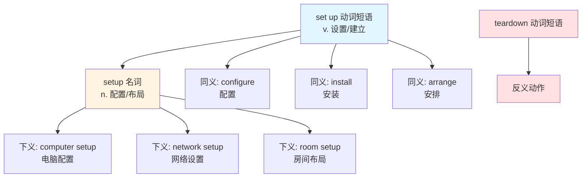
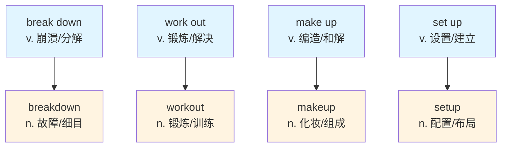
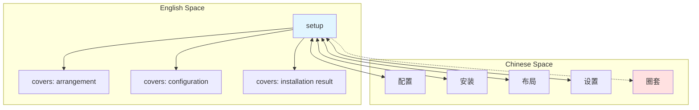
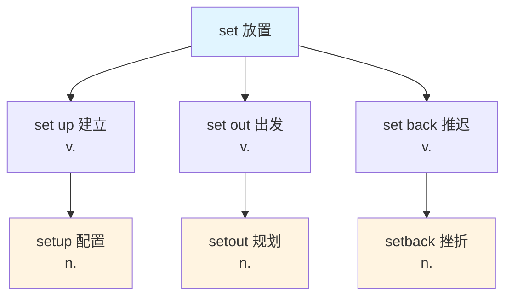

setup :: 
<!--ID: 1767799200914-->

# setup

## 基础信息

| 项目 | 内容 |
|------|------|
| **英文** | setup (名词) / set up (动词短语) |
| **音标** | /ˈsetʌp/ |
| **词性** | 名词 / 动词短语 |
| **中文** | 设置、安装、配置、布局、安排 |

## 概念分析

### 一词多义

**setup (名词，一个词)**:
1. **配置/安装** - The way something is organized or arranged
   - *computer setup* (电脑配置)
   - *network setup* (网络配置)
2. **布局/安排** - Organization or arrangement
   - *room setup* (房间布局)
   - *table setup* (桌台布置)
3. **情境/背景** - Set of circumstances (informal)
   - *a complicated setup* (复杂的情况)
4. **圈套/设局** - A trick or plot (slang)
   - *It was a setup!* (这是个圈套！)

**set up (动词短语，两个词)**:
- To arrange, organize, establish, or install something
- *I need to set up my computer.* (我需要设置电脑。)

### 同义词网络

| 词 | 细微差别 |
|-----|----------|
| **setup** | 名词，已完成的配置状态 |
| **configuration** | 名词，技术性的参数配置 |
| **installation** | 名词，软件/硬件的安装过程 |
| **set up** | 动词短语，设置的动作 |
| **arrange** | 动词，安排、整理（中性） |
| **organize** | 动词，组织、规划 |

### 反义词

- teardown (拆卸、拆除)
- dismantle (拆解)
- disorganize (打乱)

## 关系图谱

### 动词-名词转换



### 同类词族对比



### 英汉概念映射



## 英汉对比

| 特征 | 英语 | 汉语 |
|------|------|------|
| **词形区分** | setup (名) vs set up (动) | 无词形变化，靠语境 |
| **语义覆盖** | setup 一词覆盖多场景 | 需细分：配置/安装/布局/设置 |
| **动词化程度** | 动词短语→名词很常见 | 汉语动词可直接作名词用 |

## 实际应用

### 场景 1：技术配置

> **English**: The network setup was completed in under an hour.
>
> **中文**: 网络**配置**不到一小时就完成了。

### 场景 2：动作 vs 状态

> **English**: I need to **set up** my computer. / The **setup** was easy.
>
> **中文**: 我需要**设置**我的电脑。/**配置**很简单。

### 场景 3：活动布局

> **English**: The room setup for the conference looks perfect.
>
> **中文**: 会议室的**布局**看起来很完美。

### 场景 4：怀疑圈套（口语）

> **English**: Something's wrong here. It feels like a setup.
>
> **中文**: 这里有问题。感觉像个**圈套**。

### 场景 5：软件安装

> **English**: Follow the on-screen instructions to complete the setup.
>
> **中文**: 按照屏幕上的说明完成**安装**。

## 深度洞察

### 1. 动词短语名词化（Phrasal Verb Nominalization）

**setup** 是英语中动词短语转变为名词的典型案例：

| 动词短语 | 名词 | 意义 |
|---------|------|------|
| **set up** | **setup** | 设置 → 配置 |
| **break down** | **breakdown** | 崩溃 → 故障/细目 |
| **work out** | **workout** | 锻炼 → 训练 |
| **make up** | **makeup** | 编造 → 化妆/组成 |

**关键规则**：
- **动词形式**：两个词分开写 (set up)
- **名词形式**：合成一个词 (setup)

### 2. 汉语的词性模糊性

汉语没有明显的词形变化，动词和名词常共用同一形式：
- **设置** (可动可名)：我需要设置电脑 / 这个设置很好
- **安装** (可动可名)：安装软件 / 完成安装
- **布局** (可动可名)：布局房间 / 房间布局

英语通过 **set up** vs **setup** 明确区分词性，这是汉语缺乏的语法特征。

### 3. 语义场景的细微差异

**setup** 在不同场景下对应不同的汉语词汇：

| 场景 | setup 对应 | 示例 |
|------|-----------|------|
| 软件/硬件 | 配置/安装 | software setup |
| 物理空间 | 布局/安排 | room setup |
| 技术参数 | 设置 | camera setup |
| 阴谋语境 | 圈套/设局 | It's a setup! |

汉语需要根据语境选择精准词汇，而 **setup** 一词通用。

## 关键要点

### 选用决策树

```
需要表达"设置/配置"?
├── 强调动作过程
│   └── 用 set up (动词短语)
├── 强调结果状态
│   └── 用 setup (名词)
├── 软件/硬件场景
│   └── setup → 配置/安装
├── 空间/活动场景
│   └── setup → 布局/布置
└── 怀疑有诈
    └── setup → 圈套/设局
```

### 记忆口诀

```
动词分开 set up
名词合写 setup
配置安装布局广
圈套陷阱别上当
```

## 词源与构词

### 构词模式

```
set (放置) + up (向上/完成)
    ↓
set up (动词短语): 建立、设置
    ↓
setup (名词): 设置的结果/状态
```

### 同根词族对比



### 衍生句组（理解转换）

> I need to **set up** my new workstation before tomorrow.
>
> 我需要在明天之前**设置**好我的新工作站。

> The **setup** process took about 30 minutes to complete.
>
> **安装**过程大约花了 30 分钟完成。

> Someone **set up** a trap, and it was an obvious **setup**.
>
> 有人**设**了个圈套，这是个显而易见的**陷阱**。

> The room **setup** creates a collaborative environment.
>
> 房间**布局**营造了一个协作的环境。

---

## 相关概念

🔗 **Related**: [[configure]], [[install]], [[arrange]], [[breakdown]], [[Vocabulary]]

