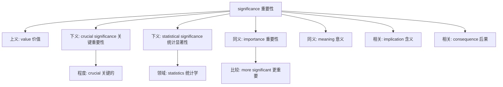

## significance (重要性/意义/显著性)

**英文**：significance [sɪɡˈnɪfɪkəns]
**中文**：重要性 / 意义 / 显著性
**词性**：名词 (noun)
**词源**：signify (表示重要性) + -ance (名词后缀)

---

## 概念分析

### 1. 一词多义 vs 一概念多词
- **英语**：significance → 重要性/意义/显著性
- **汉语**：重要性 → significance/importance
- **汉语**：意义 → significance/meaning
- **汉语**：显著性 → significance
- **分析**：英语一个词对应汉语多个概念，但汉语每个概念也有对应的英语词汇，属于中等程度的翻译不对称性

### 2. 上下义关系
- **上义词**：value (价值)
- **下义词**：crucial significance (关键重要性), statistical significance (统计显著性)
- **汉语表达**：重要性 → 需要上下文确定具体程度

### 3. 同义词网络
- **英语同义词**：importance, meaning, consequence
- **汉语近义词**：重要性, 意义, 价值, 影响
- **角度差异**：
  - importance：强调重要程度
  - meaning：强调含义、意义
  - significance：强调重要性+影响

---

## 关系图谱



**关系分析：**
- **层级清晰**：价值→核心概念→具体类型
- **多角度同义**：importance (程度), meaning (含义)
- **领域特化**：统计学中的特殊含义
- **相关扩展**：implication, consequence 等关联概念

---

## 英汉对比

| 特征 | 英语 | 汉语 | 洞察 |
|------|------|------|------|
| **概念细分** | significance/importance/meaning | 重要性/意义/显著性 | 英汉细分程度相当，各有侧重 |
| **表达习惯** | 独立词汇，词根变化 | 独立词汇，修饰词变化 | 一一对应，清晰明确 |
| **翻译对应** | 多义映射 | 多词对应 | 对称性较高，语境决定选择 |

**语言特征：**
- **静态 vs 动态**：英语名词化 (significance) vs 汉语名词化 (重要性) - 一致
- **独立 vs 组合**：英语独立词汇 vs 汉语独立词汇 - 一致
- **精细度**：英语细分程度高，汉语也有对应细分 - 平衡

---

## 实际应用

### 场景 1：学术研究（统计学）
**英文**：The study found results of high statistical significance (p < 0.01).
**中文**：该研究发现了具有高度统计显著性的结果 (p < 0.01)。
**分析**：此处 significance 专指统计学概念，必须翻译为"显著性"，不能用"重要性"或"意义"。

### 场景 2：日常生活（情感记忆）
**英文**：This moment has great significance for my personal growth.
**中文**：这个时刻对我的个人成长有重大意义。
**分析**：此处 significance 指情感/记忆的重要性，对应"意义"，强调个人价值。

### 场景 3：商业分析（影响程度）
**英文**：The economic significance of this policy is unclear at this stage.
**中文**：这项政策的经济重要性在现阶段尚不明确。
**分析**：此处 significance 指影响程度和价值，对应"重要性"，强调客观评估。

### 场景 4：科学研究（科学价值）
**英文**：The discovery has far-reaching significance for future research.
**中文**：这一发现对未来研究具有深远的意义。
**分析**：此处 significance 指科学价值和影响，对应"意义"，强调长远影响。

**学习建议：**
- **记忆策略**：significance = sign (标记/符号) + ify (使成为) + ance (状态) → 使有标记的状态 → 重要性
- **使用注意**：
  - 统计学语境：必须用"显著性"
  - 情感/记忆语境：用"意义"
  - 影响/价值语境：用"重要性"
- **关联词汇**：significant (adj.), significantly (adv.), signify (v.), insignificant (反义)

---

## 深度洞察

### 1. 语言特征
英语通过词根词缀变化 (signify → significance) 表达相关概念，汉语通过不同词汇 (重要性/意义/显著性) 区分细微差别。两者各有优势：英语强调词源逻辑，汉语强调语义清晰。

### 2. 概念映射规律
significance 在不同领域有不同侧重：
- **统计学**：significance = 显著性 (p值相关)
- **日常语言**：significance = 重要性/意义 (价值相关)
- **科学研究**：significance = 意义 (影响相关)

这种跨领域多义性是英语词汇的典型特征。

### 3. 学习策略建议
1. **词根记忆**：sign-标记 + ify-使成为 + ance-状态 = 使有标记 → 重要性
2. **语境区分**：根据使用场景选择对应中文翻译
3. **对比学习**：与 importance, meaning 进行对比，理解细微差别
4. **领域特化**：统计学中必须掌握"显著性"这一专有名词

---

## 关键要点总结

### 核心概念解释
- **基本含义**：重要性、意义、显著性
- **词源结构**：signify (表示重要性) + -ance (名词后缀)
- **多义特征**：日常用法 vs 专业术语（统计学）

### 翻译决策树
```
significance
├─ 统计学/科研语境 → 统计显著性
├─ 情感/记忆语境 → 意义
├─ 影响/价值语境 → 重要性
├─ 不确定语境 → 重要性（最通用）
└─ 学术写作 → 根据具体领域选择
```

### 常见错误避免
1. ❌ 混淆 significance (名词) 和 significant (形容词)
2. ❌ 在统计学中误用为"重要性"而非"显著性"
3. ❌ 忽略语境导致翻译不准确
4. ❌ 与 importance 完全等同（significance 更强调影响和含义）

### 记忆口诀
"sign-标记 + ify-使成为 + ance-状态 = 使有标记 → 重要性/意义/显著性"

**快速判断**：看到 significance，先判断语境：
- 有 p 值？→ 统计显著性
- 有情感？→ 意义
- 有影响？→ 重要性

---

## 相关词汇扩展

### 同根词
- **significant** (adj.)：重要的，显著的
- **significantly** (adv.)：显著地，重要地
- **signify** (v.)：表示，意味，预示
- **insignificant** (adj.)：不重要的，微不足道的

### 近义词对比
| 词汇 | 侧重点 | 常见搭配 |
|------|--------|----------|
| **significance** | 重要性+影响+含义 | statistical significance, historical significance |
| **importance** | 重要程度 | of great importance, attach importance to |
| **meaning** | 含义，意思 | meaning of life, word meaning |
| **consequence** | 后果，结果 | serious consequences, face consequences |

### 反义词
- **insignificance**：不重要，微不足道
- **triviality**：琐碎，平凡
- **unimportance**：不重要

---

## 学习要点检查

- [ ] 理解 significance 的三种主要含义
- [ ] 能根据语境选择正确中文翻译
- [ ] 掌握统计学中的"显著性"概念
- [ ] 能区分 significance 和 importance
- [ ] 了解词根词缀构成
- [ ] 能在写作中正确使用
- [ ] 理解相关词汇关系

---

**主题**：[[Vocabulary]] [[English learning]] [[Chinese learning]] [[Statistics]]
**难度**：中级
**领域**：通用/学术/统计学
