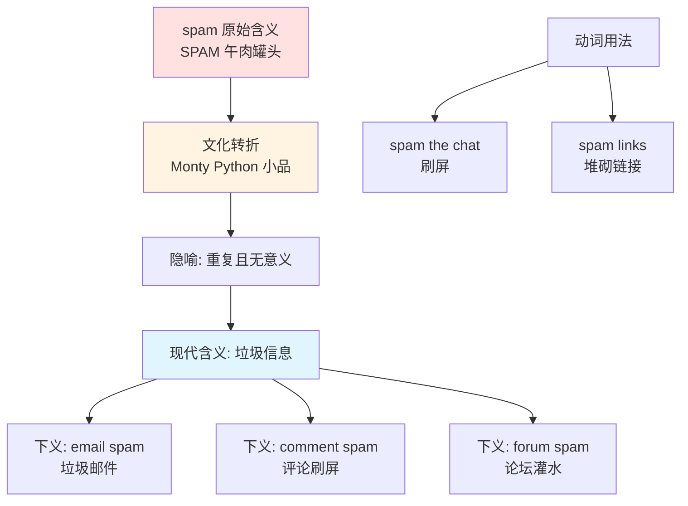
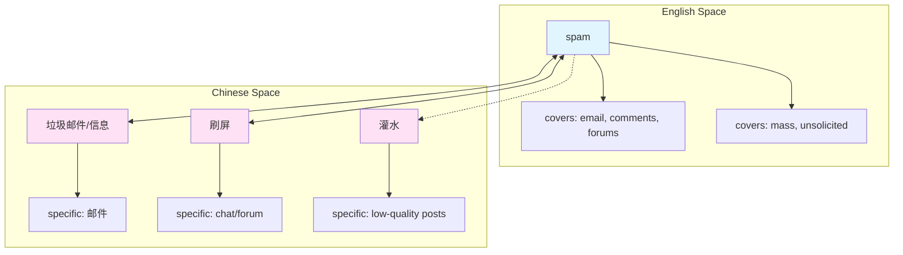

spam :: 
<!--ID: 1767799200917-->

# spam

## 基础信息

| 项目 | 内容 |
|------|------|
| **英文** | spam |
| **音标** | /spæm/ |
| **词性** | 名词 / 动词 |
| **中文** | 垃圾邮件、垃圾信息、刷屏 |

## 概念分析

### 一词多义（文化演变）

1. **原始含义** - SPAM 午肉罐头（商标名，Spiced Ham）
2. **现代含义** - 垃圾信息、未经请求的大量消息
   - *email spam* (垃圾邮件)
   - *comment spam* (评论垃圾信息)
3. **动词用法** - 大量发送垃圾信息、刷屏
   - *Don't spam the chat* (不要刷屏)

### 同义词网络

| 词 | 细微差别 |
|-----|----------|
| **spam** | 泛指所有未经请求的大批量消息 |
| **junk mail** | 偏向实体垃圾邮件或邮件 |
| **phishing** | 诈骗性垃圾信息（钓鱼） |
| **scam** | 欺诈性消息 |
| **flood** | 大量发送（中性或负面） |

### 反义词

- opt-in (订阅式)
- solicited (请求过的)
- legitimate (合法的)

## 关系图谱

### 概念演变



### 英汉概念映射



## 英汉对比

| 特征 | 英语 | 汉语 |
|------|------|------|
| **语义覆盖** | spam 一词覆盖所有场景 | 需细分：垃圾邮件、刷屏、灌水 |
| **文化来源** | 来自 Monty Python 小品 | 无文化渊源 |
| **词源演变** | 品牌→通用名（genericized） | 无对应现象 |

## 实际应用

### 场景 1：邮件安全

> **English**: Make sure your spam filter is working properly.
>
> **中文**: 确保你的**垃圾邮件**过滤器正常工作。

### 场景 2：网络聊天

> **English**: Stop spamming the channel with memes!
>
> **中文**: 别再**刷屏**发表情包了！

### 场景 3：内容审核

> **English**: We need to delete the spam comments on the blog.
>
> **中文**: 我们需要删除博客上的**垃圾评论**。

### 场景 4：SEO 警告

> **English**: Don't spam links in your content or you'll be penalized.
>
> **中文**: 不要在内容中**堆砌链接**，否则会被惩罚。

## 深度洞察

### 1. 品牌通用化（Genericization）

**Spam** 是品牌名变成通用词的典型案例：
- 原为 Hormel 公司的午餐肉商标（SPAM = Spiced Ham）
- 因 Monty Python 1970 年小品中反复出现 "spam" 而进入流行文化
- 隐喻"无处不在、重复且无意义"的内容
- 类似案例：**Xerox**（复印）、**Google**（搜索）、**Kleenex**（纸巾）

### 2. 文化特异性词汇

**spam** 是英语文化独有的词汇，汉语没有直接对等的文化词源：
- 汉语使用描述性词汇：垃圾邮件、刷屏、灌水
- 每个词针对特定场景（邮件 vs 聊天室 vs 论坛）
- 英语用 **spam** 统称，语境决定含义

### 3. 动词化的语域差异

作为动词使用时，**spam** 带有口语色彩：
- *"Don't spam"* (非正式，常用于游戏/聊天)
- *"Don't send unsolicited messages"* (正式，商务语境)
- 汉语"刷屏"同样偏向网络用语

## 关键要点

### 选用决策树

```
需要表达"垃圾信息"?
├── 邮件场景
│   └── 用 spam / junk email
├── 聊天/论坛大量发送
│   └── 用 spam (动词) / 刷屏
├── 评论灌水
│   └── 用 spam comments / 垃圾评论
└── 欺诈性信息
    └── 用 phishing / scam (更精准)
```

### 记忆口诀

```
垃圾信息用 spam
来自午餐肉罐头
刷屏灌水都能用
邮件评论全覆盖
```

## 词源与文化背景

### 起源：Monty Python 小品

1970 年，英国喜剧团体 Monty Python 在小品 "Spam Sketch" 中：
- 餐厅菜单每道菜都包含 SPAM 午肉
- 维京背景角色反复高唱 "Spam, Spam, Spam..."
- 营造出"重复且无法逃避"的氛围

### 进入互联网时代

1980-90 年代，早期互联网用户（USENET 新闻组）开始用 **spam** 形容：
- 重复发布的相同帖子
- 未经请求的商业消息
- 覆盖有价值内容的噪音

### 正式定义

- **1994年**: 第一封大规模商业垃圾邮件（"Green Card Spam"）
- **2003年**: 美国通过 CAN-SPAM 法案监管垃圾邮件
- **现代**: spam 泛指所有未经请求的大量数字信息

### 同源词对比

```mermaid
graph LR
    A[Spam 品牌] --> B[spam 通用词]
    C[Xerox 品牌] --> D[xerox 复印(动)]
    E[Google 品牌] --> F[google 搜索(动)]
    style A fill:#ffe1e1
    style C fill:#ffe1e1
    style E fill:#ffe1e1
    style B fill:#e1f5ff
    style D fill:#e1f5ff
    style F fill:#e1f5ff
```

### 衍生句组（理解用法）

> The email **spam** filter caught 50 junk messages today.
>
> 邮件**垃圾**过滤器今天拦截了 50 条垃圾信息。

> Stop **spamming** the chat with random links!
>
> 别再在聊天室里**刷屏**发随机链接了！

> His blog was full of **spam** comments promoting fake products.
>
> 他的博客里全是推销假货的**垃圾评论**。

---

## 相关概念

🔗 **Related**: [[phishing]], [[scam]], [[junk]], [[Vocabulary]]

📝 **Notes created**: 2026-01-07
