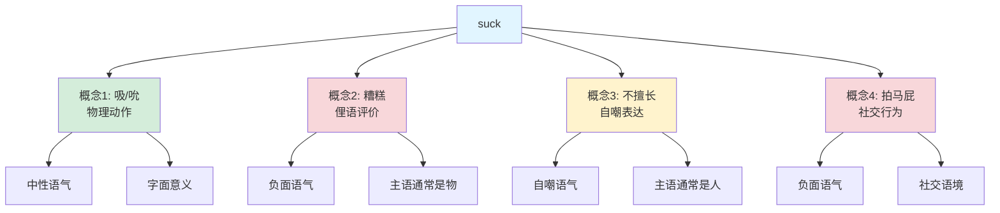
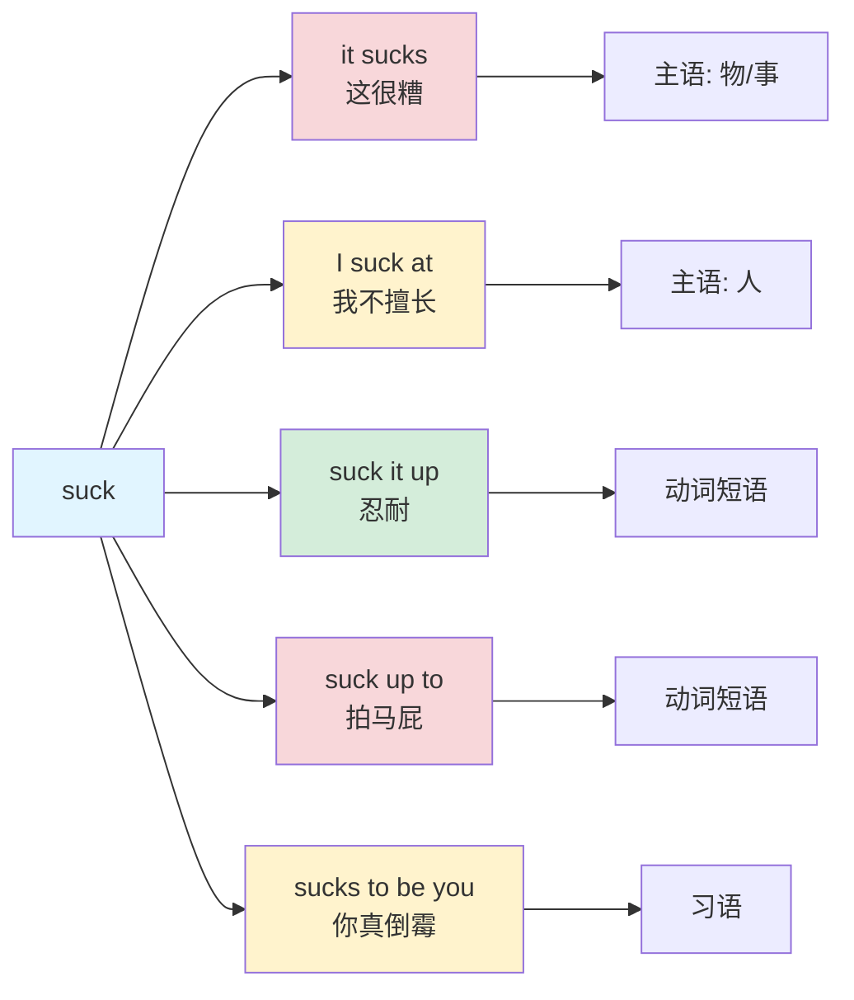

suck :: 
<!--ID: 1771725387960-->

# suck

## 📖 基础信息

**英音** `/sʌk/` | **美音** `/sʌk/`

**词性**: 动词 / 名词（非正式）

**中文对应**:
- 吸 / 吮（基本义）
- 糟糕 / 很烂（俚语）
- 讨厌 / 恶心（口语）

---

## 🌱 词义演化

**词源**: Old English "sūcan" - 吸吮（模仿吸吮声音）

**演变路径**:
```
古英语: 吸吮（母乳/液体）
  ↓
中世纪: 引申为"吸入"（空气/烟）
  ↓
19世纪: 俚语 "suck eggs"（做蠢事）
  ↓
20世纪60年代: 美国俚语 "it sucks"（很糟糕）
  ↓
现代: 多义融合 - 物理/俚语/口语
```

**文化转折点**:
- **1960s**: 美国反文化运动，"it sucks" 成为主流俚语
- **1980s-90s**: 通过电影/音乐传播到全球
- **21世纪**: 成为日常口语，语气强烈但不再特别粗俗

---

## 🔍 概念分析

### 一词多义映射

| 英文概念 | 中文对应 | 语气 | 示例 |
|---------|---------|------|------|
| **吸/吮** | 吸/吮 | 中性 | suck milk through a straw |
| **糟糕** | 糟糕/很烂 | 负面 | This movie sucks. |
| **讨厌** | 讨厌 | 负面 | I suck at math. |
| **恶劣** | 恶心/下流 | 粗俗 | suck it (粗俗表达) |

### 俚语短语

| 短语 | 中文 | 语气 | 使用场景 |
|------|------|------|---------|
| **it sucks** | 很糟糕 | 轻度负面 | 电影/天气/工作 |
| **I suck at** | 我不擅长 | 自嘲 | 能力评价 |
| **suck it up** | 忍耐/接受 | 口语 | 面对困难 |
| **suck up to** | 拍马屁 | 负面 | 社交行为 |
| **it sucks to be you** | 你真倒霉 | 讽刺 | 同情/嘲笑 |

### 上下义关系

```
上义词：draw (拉/吸)
  ↓
核心词：suck (吸/糟糕)
  ↓
下义词：
- inhale (吸入)
- absorb (吸收)
- blow (吹 - 反义)
```

### 同义词对比

| 同义词 | 差异点 | 语气 | 使用场景 |
|--------|--------|------|---------|
| **inhale** | 医学/正式 | 中性 | 呼吸/吸烟 |
| **draw** | 通用 | 中性 | 抽烟/吸取 |
| **absorb** | 引申义 | 中性 | 吸收知识/液体 |
| **suck** | 口语/俚语 | 负面 | 日常表达 |

---

## 🔗 关系图谱



### 俚语用法网络



---

## 🌏 英汉对比

| 维度 | 英语 | 汉语 | 差异洞察 |
|------|------|------|----------|
| **语体色彩** | 口语/俚语为主 | 对应词较少 | 英语更丰富 |
| **语气强度** | 轻度粗俗 → 日常 | 需根据语境判断 | 英语逐渐去污名化 |
| **语法功能** | 动词/短语丰富 | 多为动词 | 英语更灵活 |
| **文化接受度** | 年轻人常用 | 需谨慎使用 | 英语更普及 |
| **隐喻扩展** | 多个俚语短语 | 较少对应表达 | 英语更生动 |

---

## 💬 实际应用

### 场景 1: 日常抱怨（俚语）

**英文**: "This weather **sucks**."
**中文**: "这天气**太糟糕了**。"

**分析**:
- it sucks = 事情很糟
- 主语通常是物/事
- 语气：轻度抱怨

---

### 场景 2: 自嘲能力（口语）

**英文**: "I **suck at** math."
**中文**: "我数学**很烂**。"

**分析**:
- suck at = 不擅长
- 主语是人
- 语气：自嘲

---

### 场景 3: 建议/鼓励（口语）

**英文**: "Just **suck it up** and finish the work."
**中文**: "**忍一忍**，把工作做完。"

**分析**:
- suck it up = 忍耐/接受
- 常用于建议
- 语气：直接

---

### 场景 4: 负面社交行为（俚语）

**英文**: "He's always **sucking up to** the boss."
**中文**: "他总是**拍老板马屁**。"

**分析**:
- suck up to = 拍马屁/巴结
- 负面评价
- 语气：批评

---

## 🎯 深度洞察

### 1. 语气演变：从粗俗到日常

**20世纪60年代**:
- "it sucks" 被视为**粗俗表达**
- 来源于同性恋俚语（隐晦）
- 仅在边缘群体使用

**21世纪**:
- 已**去污名化**，成为日常口语
- 年轻人普遍使用
- 主流媒体不再避讳

**汉语对应**:
- 没有完全对应的"从粗俗到日常"演变
- "烂/糟" 一直相对中性
- 粗俗词汇（如"操/靠"）仍在非正式场合使用

---

### 2. 语法特征：主语决定含义

**主语是物/事** → "糟糕"
- "This movie sucks." = 这电影很烂
- "The weather sucks." = 天气很糟

**主语是人** → "不擅长/拍马屁"
- "I suck at math." = 我数学很差
- "He sucks up to her." = 他巴结她

**汉语区别**:
- 需要完全不同的词汇
- "糟糕" vs "不擅长" vs "拍马屁"
- 英语用一个词 + 搭配区分

---

### 3. 文化禁忌：使用场景受限

**避免使用**:
- ❌ 正式场合（会议/演讲）
- ❌ 上级/长辈对话
- ❌ 书面文档（除非引用）

**可以使用**:
- ✅ 朋友间交流
- ✅ 非正式社交媒体
- ✅ 自嘲/吐槽

**汉语对比**:
- "烂/糟" 适用范围更广
- 正式场合可用"不太好/欠佳"
- 不需要完全避免

---

## 📝 关键要点

### 使用决策树

```
遇到 suck 时：

1. 检查语境 → 是物理动作还是俚语？
   ├─ 物理动作 → "吸/吮" (suck milk)
   └─ 俚语 → 继续

2. 检查主语 → 是物还是人？
   ├─ 物/事 → "糟糕/很烂" (it sucks)
   └─ 人 → 继续

3. 检查搭配 → 具体短语？
   ├─ suck at → "不擅长" (I suck at math)
   ├─ suck up to → "拍马屁" (suck up to boss)
   └─ suck it up → "忍耐" (suck it up)
```

### 记忆口诀

```
suck 一词多义记，
吸吮基本物理义。
it sucks 糟糕事不妙，
I suck at 自嘲不擅长。

suck up to 拍马屁，
suck it up 忍耐扛。
主语是物表糟糕，
主语是人表不行。
```

---

## 🔖 常见搭配

### 动词短语

| 搭配 | 中文 | 语气 | 例句 |
|------|------|------|------|
| **suck at** | 不擅长 | 自嘲 | I suck at cooking. |
| **suck up to** | 拍马屁 | 负面 | Don't suck up to him. |
| **suck it up** | 忍耐 | 直接 | Suck it up and move on. |
| **suck in** | 吸入 | 中性 | suck in air |

### 形容词 + suck

| 搭配 | 中文 | 例句 |
|------|------|------|
| **totally suck** | 完全不行 | This totally sucks. |
| **really suck** | 真的很糟 | The service really sucks. |
| **pretty much suck** | 基本不行 | I pretty much suck at sports. |

### 习语

| 习语 | 中文 | 使用场景 |
|------|------|---------|
| **it sucks to be you** | 你真倒霉 | 讽刺/同情 |
| **suck it** | 忍着吧（粗俗） | 冲突场合 |
| **suck eggs** | 做蠢事（过时） | 老式俚语 |

---

## ⚠️ 使用注意

### 语气强度

| 场合 | 是否适合 | 替代表达 |
|------|---------|---------|
| 正式会议 | ❌ | "is not ideal" / "could be better" |
| 朋友聊天 | ✅ | "sucks" / "is terrible" |
| 社交媒体 | ✅ | "sucks" |
| 书面报告 | ❌ | "is suboptimal" / "needs improvement" |
| 上级对话 | ⚠️ 谨慎 | "is challenging" / "is difficult" |

### 文化差异

- **美国**: 完全日常化，年轻人常用
- **英国**: 也常用，但稍显"美国化"
- **非英语国家**: 学习者需谨慎使用，可能被视为粗鲁

---

## 📚 扩展阅读

### 相关概念

- **Blow** - 吹（suck 的反义词，也有俚语用法）
- **Inhale** - 吸入（正式/医学）
- **Absorb** - 吸收（引申义）
- **Blow it** - 搞砸（俚语）

### 词族扩展

```
suck (v.)
  ├─ sucker (n.) - 容易受骗的人/吸盘
  ├─ suckling (n.) - 乳儿/吮乳
  └─ suction (n.) - 吸力/抽吸
```

---

## 🎓 学习建议

1. **语境识别**: 根据主语判断是"糟糕"还是"不擅长"
2. **语气把握**: 正式场合避免使用，改用"not good/terrible"
3. **搭配记忆**: 重点记 suck at / suck up to / suck it up
4. **文化意识**: 了解从粗俗到日常的演变，避免误用

---

**创建时间**: 2026-02-20
**分析工具**: dict skill
**词性**: 动词 / 名词
**映射类型**: 一词多义 + 俚语扩展
**语气**: 口语/俚语（非正式）
