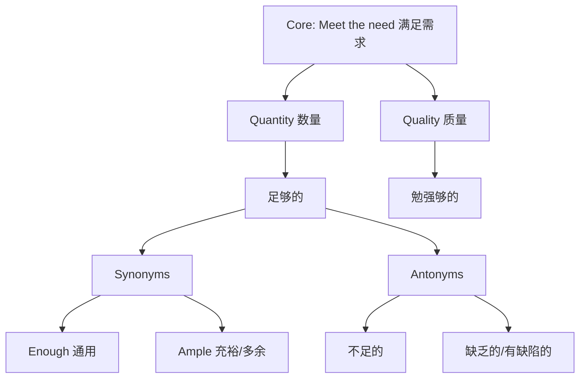

# sufficient

## 1. 基础信息 (Basic Info)

- **词性**: Adjective
- **音标**: /səˈfɪʃnt/
- **释义**:
    - **adj.**: 足够的，充足的 (enough for a particular purpose; as much as you need)

## 2. 词源与演变 (Etymology & Evolution)

- **词源**: 源自拉丁语 *sufficere* (to supply, suffice) -> *sub-* (under/up to) + *facere* (to make/do)。
- **核心逻辑**: **"Made up to the mark" (做到及格线)**。
- **演变路径**:
    - 最初指“提供所需之物” (Supply)。
    - 逐渐演变为“能够满足某个标准或需求” -> **足够的/充足的**。
    - 强调的是**满足特定目的** (for a purpose)，而不仅仅是数量多。

## 3. 核心概念图谱 (Concept Graph)

## 4. 扩展词汇 (Vocabulary Expansion)

### 近义词 (Synonyms)
- **Enough**: 最通用、最口语化。(*Have enough money*)
- **Adequate**: 强调“仅仅够用”，暗示质量一般或刚好达标。(*Adequate performance*)
- **Ample**: 强调“充裕”，比够用多一点，带有正面色彩。(*Ample time*)
- **Satisfactory**: 令人满意的，侧重于结果符合期望。

### 反义词 (Antonyms)
- **Insufficient**: 不足的 (正式)。
- **Deficient**: 缺乏的，有缺陷的 (侧重质量或要素缺失)。
- **Inadequate**: 不够的，不适当的 (能力/资源)。

### 派生词 (Derivatives)
- **Suffice** (v.): 足够，满足要求。(*One example will suffice.*)
- **Sufficiency** (n.): 足量，充足。
- **Self-sufficient** (adj.): 自给自足的。

## 5. 搭配与用法 (Collocations & Usage)

### 高频搭配 (Collocations)
- **Sufficient + Abstract Noun**:
    - *sufficient evidence* (充分的证据 - 法律高频)
    - *sufficient reason/cause* (充分的理由)
    - *sufficient time* (足够的时间)
- **Self-sufficient**:
    - *economically self-sufficient* (经济上自给自足)
- **Adverb + Sufficient**:
    - *barely sufficient* (勉强够)
    - *quite sufficient* (相当充足)

### 典型例句 (Examples)
- **正式/法律 (Formal/Legal)**:
    > "There is not **sufficient evidence** to secure a conviction."
    > 没有**充分的证据**来定罪。
- **日常/商务 (General)**:
    > "We have **sufficient funds** to complete the project."
    > 我们有**足够的资金**完成这个项目。
- **动词用法 (Suffice)**:
    > "A simple 'yes' will **suffice**."
    > 一个简单的“是”就**够了**。

## 6. 易混淆点与辨析 (Analysis & Confusing Points)

- **Sufficient vs. Enough**:
    - **Enough**: 放在名词前或形容词/副词后 (*Good enough*, *Enough money*)。口语首选。
    - **Sufficient**: 只能放在名词前 (*Sufficient money*)，不可放在形容词后。正式书面语首选。
    - *误区*: 不说 *good sufficient*。
- **Sufficient vs. Adequate**:
    - *Sufficient* 侧重**数量**满足特定需求。
    - *Adequate* 侧重**质量**或**程度**勉强过关 (Just okay)。
    - 例：*The food was sufficient* (管饱) vs *The food was adequate* (能吃，但不好吃)。

## 7. 总结与记忆 (Summary & Memory)

### 💡 口诀 (Mnemonic)
> **Enough 口语最常见，**
> **Sufficient 正式文书现。**
> **Adequate 勉强刚及格，**
> **Ample 充裕多一点。**

### 🌳 决策树 (Decision Tree)
- 是口语？ -> **Enough**。
- 是正式文书/法律？ -> **Sufficient**。
- 是“刚好够用/凑合”？ -> **Adequate**。
- 是“宽裕/充沛”？ -> **Ample**。
