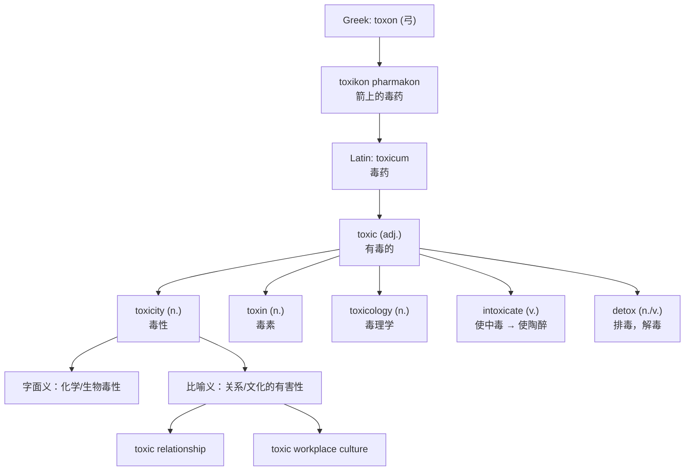

# toxicity

## 1. 基础信息 (Basic Info)

**音标**：英 /tɒkˈsɪsɪti/ 美 /tɑːkˈsɪsɪti/

**词性与释义**：

- **n.** the quality or degree of being toxic or poisonous — 毒性，毒力
- **n.** (figurative) the quality of being extremely harmful or unpleasant in a pervasive way — （比喻义）有害性，恶毒性

---

## 2. 词源与演变 (Etymology & Evolution)

**起源**：由形容词 **toxic** + 名词后缀 **-ity** 构成。

**词根追溯**：
- 希腊语 **τόξον**（toxon）= 弓（bow）
- 希腊语 **τοξικόν (φάρμακον)**（toxikon pharmakon）= 涂在箭上的毒药（poison for arrows）
- 拉丁语 **toxicum** = 毒药（poison）
- 晚期拉丁语 **toxicus** = 有毒的（poisoned）
- 1660年代经法语 *toxique* 进入英语，形成 **toxic**

**语义演变逻辑**：
古希腊人用紫杉木（拉丁语 *taxus*，yew）制弓，弓称为 *toxon*。希腊武士在箭头涂毒，这种"箭毒"被称为 *toxikon pharmakon*，后简化为 *toxikon*，原本与弓箭相关的含义逐渐消失，只保留了"毒"的语义。经拉丁语 *toxicum* 传入英语后，*toxic* 在17世纪进入英语，*toxicity* 随后作为其名词形式出现。

**现代语义扩展**：21世纪以来，*toxic* 及 *toxicity* 大规模用于比喻义——描述人际关系、职场文化、网络环境等的"有害性"。2018年 *toxic* 被牛津词典评为年度词汇。

---

## 3. 核心概念图谱 (Concept Graph)



---

## 4. 扩展词汇 (Vocabulary Expansion)

### 近义词 (Synonyms)

| 近义词 | 差异说明 |
|--------|---------|
| **poisonousness** | 最直接的同义词，但使用频率远低于 toxicity，且几乎不用于比喻义 |
| **virulence** | 侧重病原体的致病力或言辞的恶毒程度，比 toxicity 更强调攻击性 |
| **harmfulness** | 泛指"有害性"，语义更宽泛，不限于毒性 |
| **noxiousness** | 正式用语，强调"令人不快且有害"，常用于气体、气味等 |
| **malignancy** | 医学上指恶性（如肿瘤），比喻义强调"恶意"，比 toxicity 更阴暗 |

### 反义词 (Antonyms)

- **harmlessness** — 无害性
- **benignity** — 良性，温和
- **safety** — 安全性
- **wholesomeness** — 有益健康

### 派生词 (Derivatives)

| 派生词 | 词性 | 含义 |
|--------|------|------|
| **toxic** | adj. | 有毒的；有害的 |
| **toxin** | n. | 毒素（生物体产生的有毒物质） |
| **toxicant** | n./adj. | 有毒物质；有毒的 |
| **toxicology** | n. | 毒理学 |
| **toxicologist** | n. | 毒理学家 |
| **intoxicate** | v. | 使中毒；使陶醉，使喝醉 |
| **intoxication** | n. | 中毒；陶醉；醉酒 |
| **detox** | n./v. | 排毒，戒毒 |
| **detoxify** | v. | 解毒，去毒 |
| **antitoxin** | n. | 抗毒素 |
| **neurotoxin** | n. | 神经毒素 |
| **cytotoxic** | adj. | 细胞毒性的 |

---

## 5. 搭配与用法 (Collocations & Usage)

### 高频搭配 (Collocations)

**科学/医学语境**：
- acute / chronic toxicity — 急性/慢性毒性
- toxicity level / toxicity threshold — 毒性水平/毒性阈值
- drug toxicity / liver toxicity — 药物毒性/肝毒性
- assess / evaluate / measure toxicity — 评估/测量毒性
- reduce / minimize toxicity — 降低/最小化毒性
- low / high toxicity — 低/高毒性

**比喻/社会语境**：
- toxic masculinity — 有毒的男子气概
- toxic relationship — 有害的关系
- toxic workplace / toxic culture — 有毒的职场/文化
- online toxicity — 网络毒性（网络暴力/恶意行为）
- the toxicity of social media — 社交媒体的有害性

### 典型例句 (Examples)

1. **医学/科学**：The researchers measured the *toxicity* of the compound on human liver cells before proceeding to clinical trials.（研究人员在进入临床试验前测量了该化合物对人类肝细胞的毒性。）

2. **环境**：The *toxicity* of industrial waste in the river has reached alarming levels.（河流中工业废物的毒性已达到令人警惕的水平。）

3. **职场/社会**：Many employees left the company because of the sheer *toxicity* of the workplace culture.（许多员工因为职场文化的极端有害性而离开了公司。）

4. **网络**：Gaming platforms are investing heavily in AI tools to combat online *toxicity*.（游戏平台正大力投资AI工具来对抗网络恶意行为。）

5. **日常**：She finally recognized the *toxicity* of that friendship and decided to walk away.（她终于认识到那段友谊的有害性，决定离开。）

---

## 6. 易混淆点与辨析 (Analysis & Confusing Points)

### toxicity vs. poison vs. venom

三者都与"毒"相关，但指代不同。*Toxicity* 是抽象名词，描述"有毒的程度或性质"；*poison* 是具体名词，指任何能导致伤害或死亡的物质（被摄入、吸入或吸收）；*venom* 特指动物通过咬伤或蜇刺注入的毒液。简言之：poison 是你吃进去的，venom 是被注入的，toxicity 是衡量它们有多毒的。

### toxicity vs. virulence

*Toxicity* 侧重化学/物理层面的"毒性强度"，也广泛用于比喻义；*virulence* 侧重病原体（病毒、细菌）的"致病力"，比喻义中强调"恶毒、尖刻"的攻击性。

### toxic vs. poisonous vs. venomous

*Toxic* 是最通用的科学术语，可用于化学品、环境、比喻义；*poisonous* 更口语化，常描述植物、食物、蘑菇等；*venomous* 专指能主动注射毒液的动物（蛇、蜘蛛、蝎子）。

### 比喻义的时代特征

*Toxicity* 的比喻用法在2010年代后爆发式增长，尤其在描述人际关系（toxic relationship）、职场文化（toxic workplace）和网络环境（online toxicity）时。这一用法已完全融入日常英语，不再被视为修辞手法。

---

## 7. 总结与记忆 (Summary & Memory)

### 口诀 (Mnemonic)

> **"弓（toxon）上涂毒药 → toxic 有毒的 → toxicity 毒性有多大"**
> 想象古希腊战士在弓箭上涂毒药，箭越毒（toxic），毒性（toxicity）越强。从箭毒到化学毒性，再到"有毒的关系"——毒的概念一路扩展。

### 决策树 (Decision Tree)

```
想表达"毒"的概念？
├── 描述毒性的程度/性质 → toxicity
├── 描述具体的有毒物质
│   ├── 泛指毒药 → poison
│   ├── 动物注射的毒液 → venom
│   └── 生物体产生的毒素 → toxin
├── 形容"有毒的"
│   ├── 科学/通用/比喻 → toxic
│   ├── 口语/植物/食物 → poisonous
│   └── 动物能注毒的 → venomous
└── 描述致病力/恶毒 → virulence

toxicity 的语境？
├── 化学/药物/环境 → 字面义（毒性强度）
├── 人际关系/职场/网络 → 比喻义（有害性）
└── 医学检测/毒理学 → 专业术语
```
