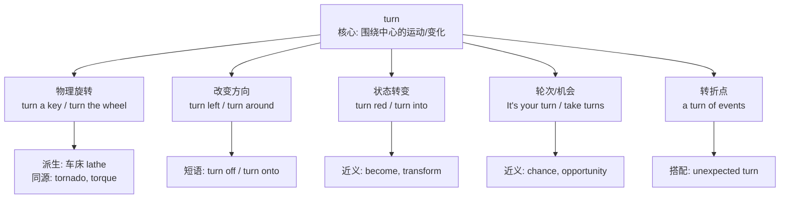

# Turn

## 1. 基础信息 (Basic Info)

- **发音**: /tɜːrn/ (US) /tɜːn/ (UK)
- **词性**: v. / n.
- **英文释义**:
  - **(v.)** to move or cause to move around a central point; to change direction or position; to change in nature, state, or form
  - **(n.)** an act of turning; a change of direction; an opportunity or obligation to do something in a sequence
- **中文翻译**: 转动，旋转；转弯；轮次，机会；变化，转变

---

## 2. 词源与演变 (Etymology & Evolution)

**turn** 源自古英语 *turnian* 和古法语 *torner*，最终追溯到拉丁语 **tornare**（用车床加工、使旋转），词根来自希腊语 **tornos**（车床、圆规）。

核心语义逻辑：**围绕一个中心点的旋转运动** → 由此引申出"改变方向"→"改变状态/性质"→"轮流的机会"。

演变路径：
- 物理旋转（turn a wheel）→ 方向改变（turn left）→ 状态转变（turn pale）→ 抽象的"轮次/机会"（It's your turn）→ 事件的"转折"（a turn of events）

---

## 3. 核心概念图谱 (Concept Graph)



---

## 4. 扩展词汇 (Vocabulary Expansion)

### 近义词 (Synonyms)

| 词汇 | 区别 |
|------|------|
| **rotate** | 强调围绕轴心的规律旋转（如地球自转），更科学/技术性 |
| **spin** | 强调快速旋转，常带有失控或轻快的感觉 |
| **revolve** | 强调围绕外部中心点公转，也用于抽象"围绕…展开" |
| **twist** | 强调扭曲、拧转，暗示形变 |
| **shift** | 侧重位置或状态的移动/转变，不强调旋转 |
| **become** | 仅对应"状态转变"义，无旋转含义 |

### 反义词 (Antonyms)

- **straighten**（与"转弯"相对：使变直）
- **remain / stay**（与"转变"相对：保持不变）

### 派生词 (Derivatives)

| 派生词 | 词性 | 含义 |
|--------|------|------|
| **turning** | n. / adj. | 转弯处；转折的 (turning point) |
| **turner** | n. | 翻转器；车床工 |
| **turnover** | n. | 营业额；人员流动率；翻转 |
| **turnaround** | n. | 转变；好转；周转时间 |
| **turnout** | n. | 出席人数；产量 |
| **return** | v./n. | 返回（re- + turn） |
| **overturn** | v. | 推翻；倾覆 |

---

## 5. 搭配与用法 (Collocations & Usage)

### 高频搭配 (Collocations)

**动词短语 (Phrasal Verbs)**:
- **turn on / turn off** — 打开/关闭（设备）
- **turn up / turn down** — 调大/调小；出现/拒绝
- **turn out** — 结果是；出席
- **turn into** — 变成
- **turn around** — 转身；扭转（局面）
- **turn over** — 翻转；移交
- **turn in** — 上交；上床睡觉

**名词搭配**:
- take turns — 轮流
- in turn — 依次；反过来
- a sharp/sudden turn — 急转弯
- a turn for the better/worse — 好转/恶化
- at every turn — 处处，每一步

### 典型例句 (Examples)

1. **日常**: Please **turn left** at the next intersection. — 请在下一个路口左转。
2. **商务**: The company managed to **turn around** its financial situation in just two quarters. — 公司仅用两个季度就扭转了财务状况。
3. **状态变化**: The leaves **turn** golden in autumn. — 秋天树叶变成金黄色。
4. **轮次**: It's **your turn** to present. — 轮到你来做展示了。
5. **学术**: The discovery marked a decisive **turning point** in modern physics. — 这一发现标志着现代物理学的一个决定性转折点。

---

## 6. 易混淆点与辨析 (Analysis & Confusing Points)

### turn vs. become vs. go vs. get（表"变成"时）

| 搭配规则 | 示例 |
|----------|------|
| **turn** + 颜色/年龄 | turn red, turn 30 |
| **become** + 名词/形容词（通用） | become a teacher, become famous |
| **go** + 负面变化 | go bad, go crazy, go blind |
| **get** + 比较级/常见形容词 | get better, get angry, get tired |

**关键区别**: turn 表"变成"时，通常暗示一种**明显的、可观察的变化**，尤其常与颜色搭配（turn pale/red/green）。become 更通用、更正式；go 偏向不可逆的负面变化；get 偏向渐进的日常变化。

### turn up vs. show up
两者都可表示"出现、到场"，但 turn up 更口语化，且常暗示**意外出现**（He turned up unannounced），而 show up 更中性。

### turn down vs. reject
turn down 语气更委婉、口语化（turn down an offer），reject 更正式、语气更强（reject a proposal）。

---

## 7. 总结与记忆 (Summary & Memory)

### 口诀 (Mnemonic)

> **Turn 像车轮转不停：转方向、转状态、转轮次、转乾坤。**

记住拉丁词根 **torn-**（车床旋转）：tornado（龙卷风）、torque（扭矩）都是"旋转"家族成员。

### 决策树 (Decision Tree)

```
需要表达"旋转/转动"？
├─ 物理旋转 → turn (通用) / rotate (规律轴转) / spin (快速)
├─ 改变方向 → turn left/right/around
├─ 状态变化 → turn + 颜色/年龄 | become (通用) | go (负面)
├─ 轮流/机会 → It's one's turn / take turns
└─ 转折 → a turn of events / turning point
```
