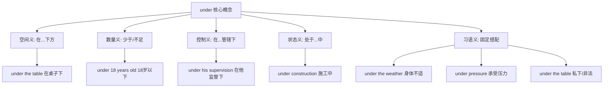
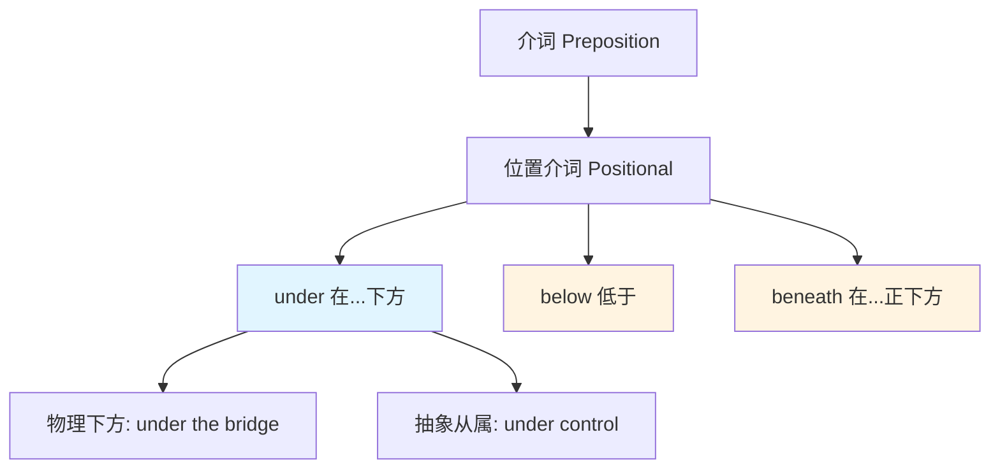
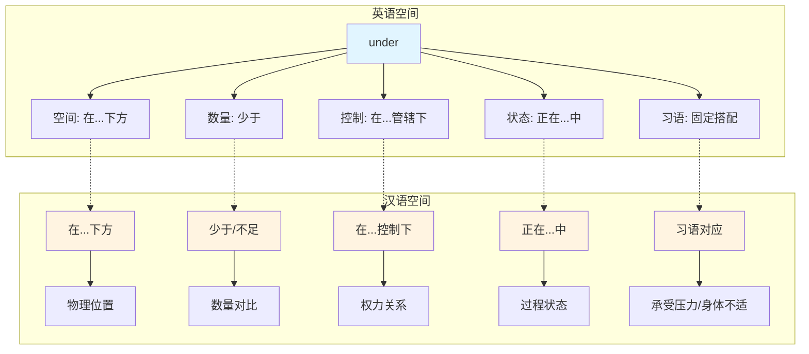
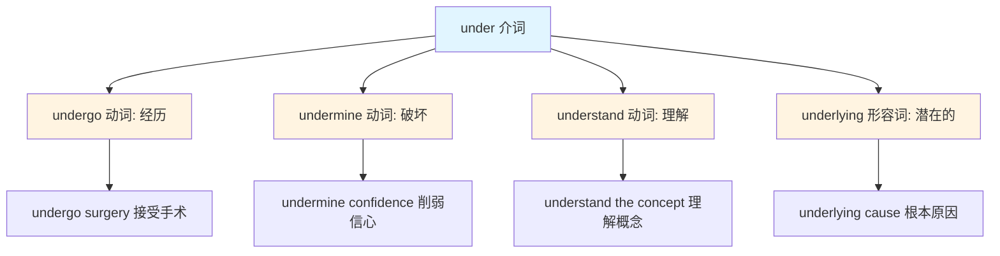

under  :: 
<!--ID: 1769502992322-->

# under

## 基础信息

**英文**: under  
**音标**: /ˈʌndər/  
**中文**: 在...下方；少于；在...控制下；正在进行中  
**词性**: 介词 (Preposition) / 副词 (Adverb)

---

## 词义演化

### 词源起源
- **古英语**: *under* ← 原始日耳曼语 *\*under* (在...之下)
- **印欧语根**: *\*n̥dʰer-* (下方、低于)
- **同源词**: German *unter*, Dutch *onder*, Latin *infra*

### 意义演变路径
1. **核心空间义** (Old English, 900s): 物理位置的"下方"
   - *under the tree* (在树下)
2. **抽象化：数量/程度** (1200s): 从空间"低于"→数量"少于"
   - *under 10 dollars* (少于10美元)
3. **权力/控制隐喻** (1300s): 空间"下方"→权力"从属"
   - *under the king's rule* (在国王统治下)
4. **状态/过程义** (1400s): 从"位置"→"状态"
   - *under construction* (正在建设中)
5. **习语固化** (1600s-present): 形成大量固定搭配
   - *under pressure* (承受压力), *under the weather* (身体不适)

---

## 概念分析

### 一词多义 (Polysemy)



### 上下义关系



### 同义词对比

| 词汇 | 核心含义 | 使用场景 | 中文对应 |
|------|----------|----------|----------|
| **under** | 在...下方（可接触/不接触） | 通用，可抽象化 | 在...下/少于/在...控制下 |
| **below** | 低于（强调位置，不接触） | 正式，多用于数值/位置 | 低于/在...下方 |
| **beneath** | 在...正下方（紧贴） | 文学性，强调直接下方 | 在...下面 |
| **underneath** | 在...底下（被覆盖） | 强调被遮盖/隐藏 | 在...底下 |

### 核心习语与功能性用法

#### 1. 状态/压力类
- **under pressure** - 承受压力
  - *He works well under pressure.* (他在压力下工作得很好)
- **under stress** - 处于压力之下
- **under the weather** - 身体不适（习语，非字面义）
  - *I'm feeling a bit under the weather today.* (我今天有点不舒服)

#### 2. 控制/管辖类
- **under control** - 在控制之下
  - *The situation is under control.* (情况在控制之中)
- **under surveillance** - 被监视
- **under investigation** - 正在调查中

#### 3. 过程/状态类
- **under construction** - 施工中
- **under development** - 开发中
- **under consideration** - 考虑中

#### 4. 社交/非正式用法
- **under the table** - 私下交易/非法（习语）
  - *They paid him under the table.* (他们私下付钱给他，暗指逃税或非法)
- **under one's nose** - 就在眼皮底下
  - *The answer was right under my nose.* (答案就在我眼前)

---

## 关系图谱：双语映射



---

## 英汉对比

| 维度 | 英语 under | 汉语对应 |
|------|-----------|----------|
| **概念特征** | 单一词汇，多义扩展（空间→抽象） | 需要不同词汇表达不同义项 |
| **语法功能** | 介词/副词，可独立使用 | 需要搭配动词/名词（在...下、少于、在...控制下） |
| **习语密度** | 高（under the weather, under pressure） | 需要意译（身体不适、承受压力） |

---

## 实际应用

### 场景 1：空间位置
**英文**: *The cat is hiding under the bed.*  
**中文**: 猫藏在床底下。  
**分析**: 物理空间的"下方"，中英文一一对应。

---

### 场景 2：数量/年龄限制
**英文**: *Children under 12 can enter for free.*  
**中文**: 12岁以下儿童可免费入场。  
**分析**: 从空间"低于"抽象化为数量"少于"。

---

### 场景 3：控制/管辖
**英文**: *The project is under her supervision.*  
**中文**: 这个项目在她的监督下进行。  
**分析**: 空间"下方"隐喻为权力"从属"。

---

### 场景 4：状态/过程
**英文**: *The website is currently under maintenance.*  
**中文**: 网站目前正在维护中。  
**分析**: 英语用 *under + 名词* 表示"正在进行的状态"，汉语需要"正在...中"。

---

### 场景 5：习语用法
**英文**: *He's been under a lot of pressure lately.*  
**中文**: 他最近承受了很大压力。  
**分析**: *under pressure* 是固定搭配，汉语需意译为"承受压力"。

---

### 场景 6：非正式/隐喻用法
**英文**: *They made a deal under the table.*  
**中文**: 他们私下达成了交易。（暗指非法/逃税）  
**分析**: *under the table* 习语化，表示"秘密/非法交易"，非字面义。

---

## 深度洞察

### 1. 概念映射类型：一词多义 + 隐喻扩展
- **英语**: *under* 从空间义出发，通过隐喻扩展到数量、控制、状态等抽象领域
- **汉语**: 需要不同词汇表达（在...下、少于、在...控制下、正在...中）
- **核心差异**: 英语通过单一介词的多义性实现概念整合，汉语通过不同词汇实现概念区分

### 2. 习语固化程度高
- **under the weather** (身体不适) - 非字面义，需整体记忆
- **under the table** (私下/非法) - 双重含义（字面 vs 习语）
- **under one's nose** (就在眼前) - 空间隐喻→认知隐喻

### 3. 语法功能的跨语言差异
- **英语**: *under* 可独立作介词/副词（*go under* = 沉没/破产）
- **汉语**: 需要完整结构（"在...下"需要名词，"少于"需要数量词）
- **翻译策略**: 根据语境选择对应词汇，不可机械对应

---

## 关键要点

### 翻译决策树

```
under + 名词
├─ 物理位置？
│  └─ YES → 在...下方 (under the table → 在桌子下)
├─ 数字/年龄？
│  └─ YES → 少于/不足 (under 18 → 18岁以下)
├─ 权力/控制？
│  └─ YES → 在...控制下 (under supervision → 在监督下)
├─ 过程/状态？
│  └─ YES → 正在...中 (under construction → 施工中)
└─ 固定搭配？
   └─ YES → 查习语词典
      ├─ under pressure → 承受压力
      ├─ under the weather → 身体不适
      └─ under the table → 私下/非法
```

### 记忆口诀

**空间下方数量少，控制从属状态中，习语固化需意译，语境决定选词用。**

---

## 词源衍生对比



### 衍生词连贯句组

1. **undergo** (经历): *She will undergo surgery next week.*  
   (她下周将接受手术。)

2. **undermine** (破坏): *His comments undermined her confidence.*  
   (他的评论削弱了她的信心。)

3. **understand** (理解): *I understand the underlying issues now.*  
   (我现在理解了潜在的问题。)

4. **underlying** (潜在的): *We need to address the underlying causes.*  
   (我们需要解决根本原因。)

---

**分析完成时间**: 2026-01-27  
**词汇类型**: 高频介词 + 习语密集型  
**核心特征**: 空间→抽象的隐喻扩展 + 大量固定搭配