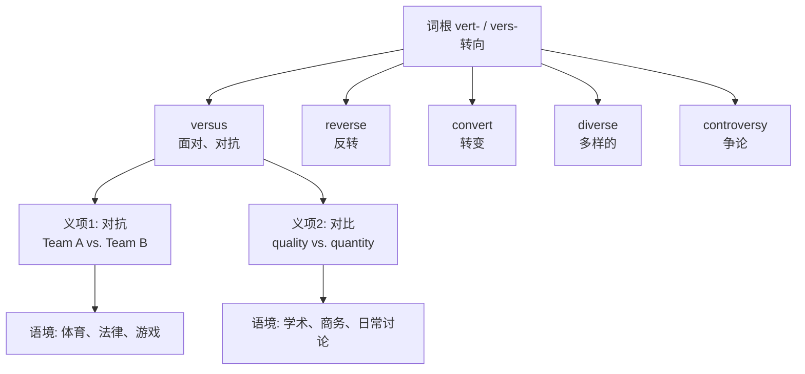

# Versus

## 1. 基础信息 (Basic Info)

- **发音**: /ˈvɜːrsəs/ (US) /ˈvɜːsəs/ (UK)
- **缩写**: **vs.** (美式) / **v** 或 **v.** (英式，尤其法律用语)
- **词性**: prep.
- **英文释义**:
  - against (used to indicate opposition or contrast between two parties, teams, ideas, etc.)
  - as compared to; in contrast with
- **中文翻译**: 对，对抗；与…相比，与…相对

---

## 2. 词源与演变 (Etymology & Evolution)

**versus** 直接来自拉丁语 **versus**，是动词 **vertere**（转向、转动）的过去分词，字面意思是"**turned toward / against**"（转向、面对）。

词根 **vert- / vers-**（转）是英语中极其高产的拉丁词根，衍生出大量词汇：
- **reverse**（re- 回 + vers- 转 → 反转）
- **convert**（con- 一起 + vert- 转 → 转变）
- **diverse**（di- 分开 + vers- 转 → 多样的）
- **universe**（uni- 一 + vers- 转 → 万物归一 → 宇宙）
- **version**（vers- 转 + -ion → 一种"转述" → 版本）
- **controversy**（contra- 相反 + vers- 转 → 争论）

演变路径：拉丁语"面对、朝向" → 中世纪法律用语"甲方 对 乙方" → 体育/辩论中的"对抗" → 日常用语中的"对比"。

---

## 3. 核心概念图谱 (Concept Graph)



---

## 4. 扩展词汇 (Vocabulary Expansion)

### 近义词 (Synonyms)

| 词汇 | 区别 |
|------|------|
| **against** | 最通用的"对抗"，可用于物理对抗、反对意见等，versus 更正式且专用于二元对立 |
| **as opposed to** | 强调对比/对立关系，语气更正式，常用于学术写作 |
| **compared to / with** | 侧重比较异同，不一定有对抗含义；versus 暗示二者是对立或竞争关系 |
| **in contrast to** | 强调差异和反差，学术色彩更浓 |

### 反义词 (Antonyms)

- **with / alongside**（与…一起，协同）— 与 versus 的对抗/对立语义相反
- **plus**（加上）— 表示联合而非对立

### 派生词 (Derivatives)

versus 本身无直接派生词，但同根词族（vert-/vers-）极为丰富：

| 同根词 | 词性 | 含义 |
|--------|------|------|
| **reverse** | v./n./adj. | 反转；相反 |
| **converse** | v./n./adj. | 交谈；相反的 |
| **inverse** | n./adj. | 逆；相反的 |
| **adverse** | adj. | 不利的（ad- 朝向 + vers- 转 → 转向你的 → 敌对的） |
| **averse** | adj. | 反感的（a- 离开 + vers- 转 → 转开 → 厌恶） |
| **versatile** | adj. | 多才多艺的（能灵活"转向"各方面） |
| **version** | n. | 版本 |
| **controversy** | n. | 争议 |
| **divert** | v. | 转移；使分心 |

---

## 5. 搭配与用法 (Collocations & Usage)

### 高频搭配 (Collocations)

**体育/竞赛**:
- Team A **versus** Team B — A 队对 B 队
- the match / game / fight of X **vs.** Y

**法律**:
- Smith **v.** Jones — 史密斯 诉 琼斯（法律案件名）
- Roe **v.** Wade — 罗伊 诉 韦德案

**对比/讨论**:
- quality **versus** quantity — 质量与数量之争
- nature **versus** nurture — 先天与后天
- risk **versus** reward — 风险与回报
- man **versus** machine — 人与机器

### 典型例句 (Examples)

1. **体育**: Tonight's game is the Lakers **versus** the Celtics — a classic rivalry. — 今晚是湖人对凯尔特人——经典对决。
2. **法律**: The landmark case of Brown **v.** Board of Education changed American history. — 布朗诉教育委员会案改变了美国历史。
3. **商务**: We need to weigh cost **versus** performance before making a decision. — 我们需要在做决定前权衡成本与性能。
4. **学术**: The debate of free will **versus** determinism has persisted for centuries. — 自由意志与决定论之争已持续数百年。
5. **日常**: It's always a struggle — sleeping in **versus** going to the gym. — 这永远是个纠结——赖床还是去健身房。

---

## 6. 易混淆点与辨析 (Analysis & Confusing Points)

### versus vs. against

两者都可表示"对抗"，但用法场景不同：
- **versus** 用于正式的二元对立结构（A vs. B），常见于体育、法律、学术对比。不能用作一般动词的介词宾语（不能说 *fight versus someone*）。
- **against** 更通用，可以跟在动词后（fight against, vote against, lean against），也可表示物理接触。

❌ We fought **versus** the enemy.
✅ We fought **against** the enemy.
✅ It was us **versus** the enemy.

### 缩写形式辨析

| 形式 | 使用场景 |
|------|----------|
| **versus** | 正式写作、学术论文 |
| **vs.** | 美式英语通用缩写，体育、日常 |
| **v.** | 英式英语法律案件引用（Brown v. Board） |
| **VS** / **vs** | 非正式场合、标题、游戏 |

### 注意：versus 不是动词

versus 只能作介词使用，不能当动词。不能说 *Team A versused Team B*。如需动词形式，应使用 **face, play against, compete with** 等。

---

## 7. 总结与记忆 (Summary & Memory)

### 口诀 (Mnemonic)

> **Vers- 就是"转"，versus 面对面——转身相对就是"VS"。**

记住词根 **vert-/vers- = turn**，versus 就是"转向对方"，所有同根词都围绕"转"展开：reverse 反转、diverse 转向不同方向、universe 万物归一转。

### 决策树 (Decision Tree)

```
需要表达"A 对 B"的关系？
├─ 正式二元对立/对比 → versus / vs.
│   ├─ 体育赛事 → Lakers vs. Celtics
│   ├─ 法律案件 → Smith v. Jones
│   └─ 学术讨论 → nature versus nurture
├─ 动词后的"对抗" → against (fight against, vote against)
├─ 强调差异对比 → as opposed to / in contrast to
└─ 中性比较 → compared to / compared with
```
