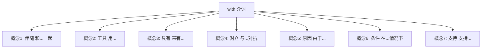
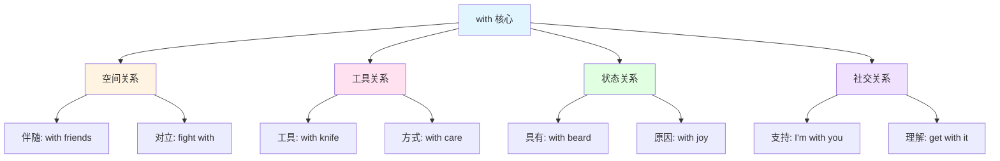
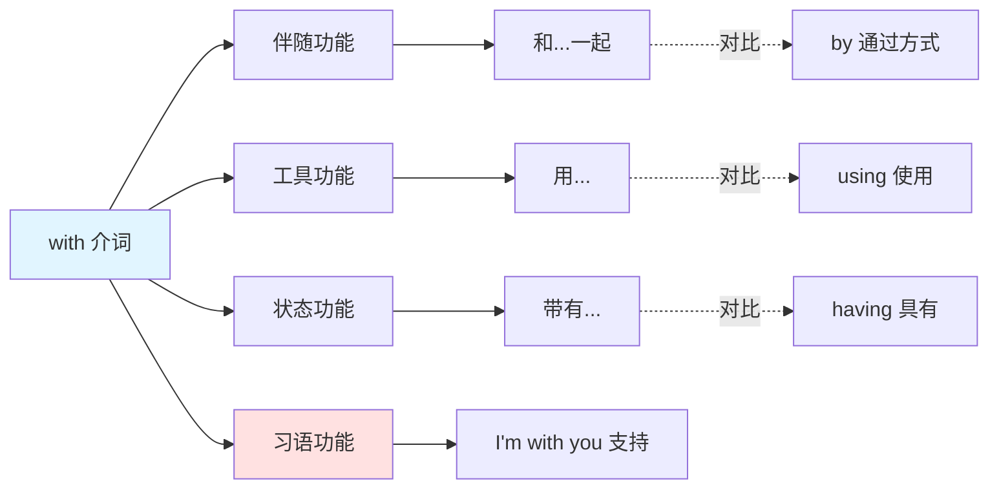

with :: 
<!--ID: 1769502992064-->

# with

## 基础信息

- **英文**：with /wɪð/ 或 /wɪθ/
- **中文**：和、用、带有、与、因
- **词性**：介词 (Preposition)

## 词义演化

**词源起源**：
- 古英语 "wið"，原意为 "against, opposite"（对抗、相对）
- 印欧语系词根 *wi-tero-（分离、相对）

**意义演变路径**：
1. **对立阶段**（古英语）：against（对抗）→ "fight with enemies"（与敌人战斗）
2. **伴随阶段**（中古英语）：alongside（伴随）→ "walk with friends"（和朋友同行）
3. **工具阶段**（现代英语）：by means of（通过）→ "cut with knife"（用刀切）
4. **状态阶段**（现代英语）：having（具有）→ "man with beard"（有胡子的人）

**核心转变**：从 "对立关系" 演变为 "伴随关系"，再扩展至 "工具/状态/方式" 等多重语义。

## 概念分析

### 一词多义



### 核心义项

| 义项 | 英文概念 | 中文对应 | 例句 |
|------|----------|----------|------|
| **伴随** | accompaniment | 和、与、同 | I went with him（我和他一起去） |
| **工具** | instrument | 用、以 | Cut it with scissors（用剪刀剪） |
| **具有** | possession | 带有、有 | A man with a hat（戴帽子的人） |
| **对立** | opposition | 与...对抗 | Fight with enemies（与敌人战斗） |
| **原因** | cause | 因、由于 | Shake with fear（因恐惧而颤抖） |
| **条件** | circumstance | 在...情况下 | With your help（在你的帮助下） |
| **支持** | agreement | 支持、赞同 | I'm with you（我支持你） |

### 核心习语与功能性用法

**社交/功能性用法**：
- **"I'm with you"** = 我支持你/我理解你（非字面"和你在一起"）
- **"with it"** = 时髦的、机敏的（俚语）
- **"What's with...?"** = ...怎么了？（口语质疑）
- **"down with..."** = 打倒...（政治口号）
- **"go with"** = 搭配、相配（审美判断）

**隐喻固化**：
- **"with child"** = 怀孕（古雅表达，现代少用）
- **"with respect to"** = 关于（学术用语）
- **"bear with me"** = 请耐心等待（礼貌请求）

**情感色彩**：
- **中性**：with friends（和朋友）
- **对抗**：argue with someone（与某人争论）
- **亲密**：sleep with（与...发生性关系，委婉语）

### 同义词对比

| 词汇 | 核心差异 | 使用场景 |
|------|----------|----------|
| **with** | 最通用，涵盖伴随/工具/状态 | 日常所有场景 |
| **by** | 强调方式/手段/被动施事者 | by car（乘车）、by John（由约翰） |
| **through** | 强调穿越/经由/完成 | through the door（穿过门） |
| **via** | 强调路径/媒介（正式） | via email（通过邮件） |
| **alongside** | 强调并列/平行 | work alongside（并肩工作） |

## 关系图谱

### 多义词概念分支



### 介词功能网络



## 英汉对比

| 维度 | 英语 with | 汉语对应 |
|------|-----------|----------|
| **概念范围** | 单一介词涵盖 7+ 概念 | 需 5+ 词汇分别表达（和/用/带/与/因） |
| **语法功能** | 介词短语修饰名词/动词 | 介词/动词/连词混合使用 |
| **习语密度** | 高频习语（with it, I'm with you） | 直译无法传达社交含义 |

**核心差异**：
- **英语特征**：with 是 "概念压缩器"，单词承载多重关系
- **汉语特征**：根据语境选择精确词汇，避免歧义
- **翻译挑战**：需判断 with 在句中的具体功能（伴随？工具？状态？）

## 实际应用

### 场景 1：伴随关系

**英文**：I went to the party **with** my colleagues.  
**中文**：我**和**同事一起去了派对。  
**分析**：with 表示伴随，汉语用 "和" 或 "与"。

### 场景 2：工具/方式

**英文**：She opened the door **with** a key.  
**中文**：她**用**钥匙开了门。  
**分析**：with 表示工具，汉语用 "用" 或 "以"。

### 场景 3：具有特征

**英文**：The man **with** glasses is my teacher.  
**中文**：**戴**眼镜的那个人是我的老师。  
**分析**：with 表示具有，汉语用 "戴" 或 "带有"。

### 场景 4：原因/情感

**英文**：She trembled **with** fear.  
**中文**：她**因**恐惧而颤抖。  
**分析**：with 表示原因，汉语用 "因" 或 "由于"。

### 场景 5：习语用法（社交支持）

**英文**：Don't worry, I'm **with** you on this.  
**中文**：别担心，这事我**支持**你。  
**分析**：习语 "I'm with you" 不是字面 "和你在一起"，而是 "支持/赞同"。

### 场景 6：习语用法（质疑）

**英文**：What's **with** all the noise?  
**中文**：这些噪音**是怎么回事**？  
**分析**：口语习语 "What's with..." 表示质疑或不解。

## 深度洞察

### 核心要点

1. **概念压缩 vs 精确表达**  
   英语 with 是 "万能介词"，单词承载空间、工具、状态、原因等多重关系；汉语则需根据语境选择 "和/用/带/与/因" 等不同词汇，避免歧义。

2. **词源的反转演变**  
   with 的词源本意是 "对抗"（against），但现代核心义是 "伴随"（alongside），体现了从 "对立" 到 "共存" 的语义演变，这种反转在印欧语系中较罕见。

3. **习语的社交功能**  
   "I'm with you"（支持你）、"What's with...?"（怎么回事）等习语已脱离字面意义，成为社交互动的固定表达。学习者需警惕：with 的习语密度极高，直译常导致误解。

## 关键要点

### 翻译决策树

```
遇到 with 时：
├─ 是否为习语？
│  ├─ 是 → I'm with you（支持）/ What's with（怎么回事）
│  └─ 否 → 继续判断
├─ 修饰名词？
│  ├─ 是 → 具有特征（man with hat = 戴帽子的人）
│  └─ 否 → 继续判断
├─ 跟在动词后？
│  ├─ 表工具 → 用（cut with knife）
│  ├─ 表伴随 → 和（go with friends）
│  ├─ 表对立 → 与...对抗（fight with）
│  └─ 表原因 → 因（shake with fear）
```

### 记忆口诀

**"和用带，因与对，习语功能要记牢"**

- **和**：伴随（with friends）
- **用**：工具（with knife）
- **带**：具有（with hat）
- **因**：原因（with joy）
- **与**：对立（with enemies）
- **对**：对比（compared with）
- **习语**：I'm with you（支持）、What's with（怎么回事）

### 学习者常见错误

| 错误类型 | 错误示例 | 正确表达 | 原因 |
|----------|----------|----------|------|
| **习语直译** | I'm with you = 我和你在一起 | 我支持你 | 忽略社交功能 |
| **工具误判** | I write with pen = 我写和笔 | 我用笔写 | 混淆伴随/工具 |
| **状态遗漏** | man with hat = 和帽子的人 | 戴帽子的人 | 未识别具有关系 |
| **原因忽略** | cry with sadness = 哭和悲伤 | 因悲伤而哭 | 未识别因果关系 |

---

**生成时间**：2026-01-27  
**主题标签**：[[Vocabulary]] [[Preposition]] [[Cross-linguistic Analysis]]  
**相关词汇**：[[by]] [[through]] [[via]] [[alongside]]